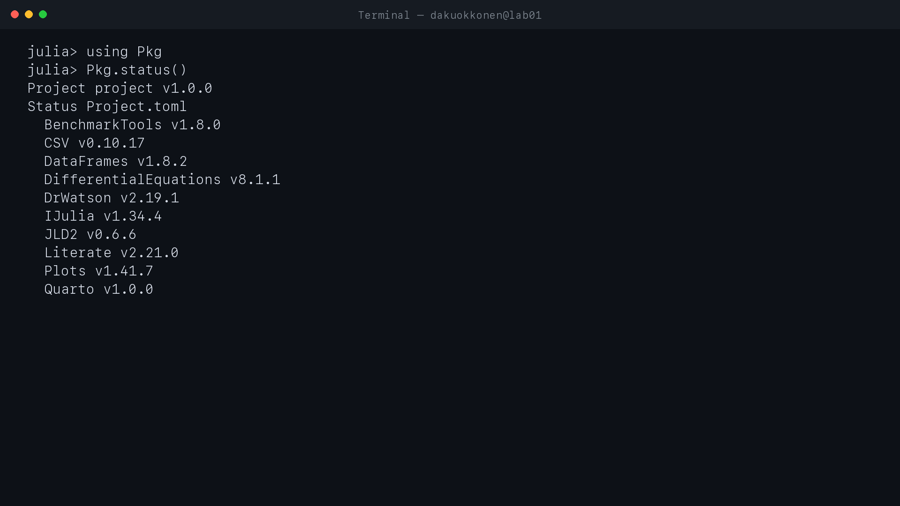
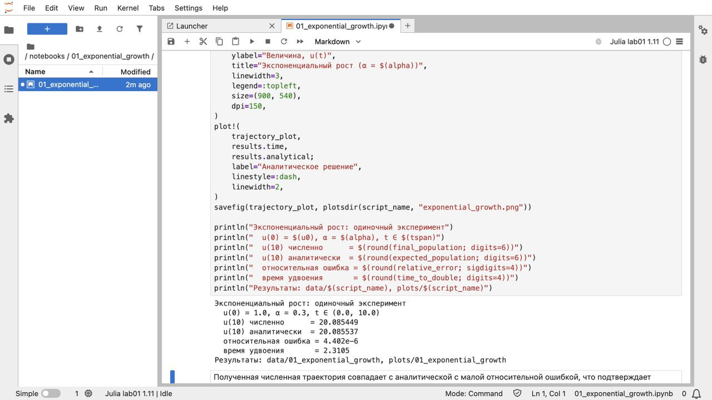
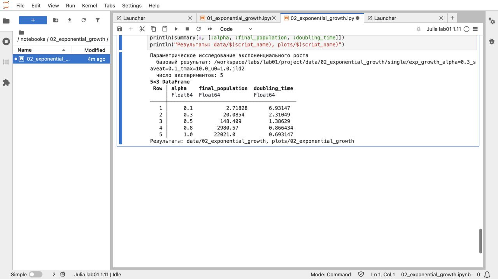
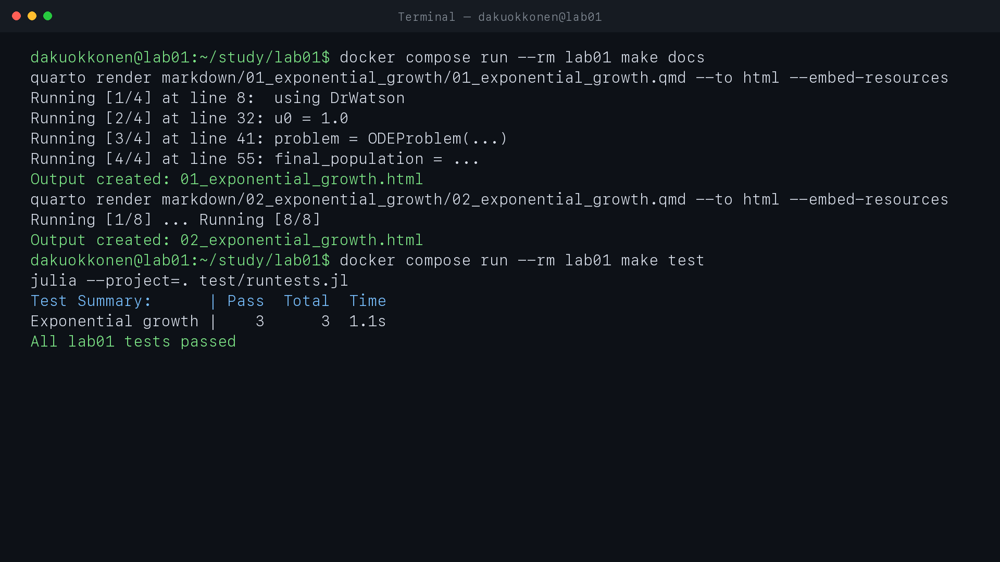

---
author:
  name: Куокконен Дарина Андреевна
  affiliation:
    - name: Российский университет дружбы народов имени Патриса Лумумбы
      country: Российская Федерация
      city: Москва
      address: ул. Миклухо-Маклая, д. 6
title: "Лабораторная работа № 1"
subtitle: "Модель экспоненциального роста"
institute: "НФИбд-01-23"
date: 2026-08-29
date-format: "YYYY-MM-DD"
lang: ru-RU
---

# Вводная часть

## Цель и задачи

**Цель:** исследовать модель экспоненциального роста и обеспечить
воспроизводимость вычислений в Julia.

- подготовить изолированную среду и закрепить зависимости;
- реализовать одиночный и параметрический эксперименты;
- сформировать скрипты, QMD и выполненные Jupyter-ноутбуки;
- проверить результат тестами и сохранить историю версий.

## Математическая модель

$$
\frac{du}{dt}=\alpha u, \qquad u(0)=u_0,
$$

$$
u(t)=u_0e^{\alpha t}, \qquad T_2=\frac{\ln 2}{\alpha}.
$$

$\alpha$ — постоянная скорость роста; $T_2$ — время удвоения моделируемой
величины.

# Выполнение работы

## Воспроизводимый вычислительный конвейер

`Literate.jl` → `Julia` → `Jupyter` → `Quarto` → `Git`

- `make tangle` создаёт Julia-скрипты, QMD и IPYNB;
- `make run` выполняет оба эксперимента;
- `make notebooks` выполняет ноутбуки;
- `make docs` собирает HTML;
- `make test` проверяет модель.

## Среда Julia и основные пакеты

:::::::::::::: {.columns align=center}
::: {.column width="64%"}

:::
::: {.column width="36%"}

- Julia 1.11.9
- DifferentialEquations.jl
- DrWatson.jl
- Literate.jl и IJulia
- Quarto

Версии закреплены в `Manifest.toml`.
:::
::::::::::::::

# Результаты

## Одиночный эксперимент

:::::::::::::: {.columns align=center}
::: {.column width="68%"}

:::
::: {.column width="32%"}

- $u(10)=20.0854485$;
- относительная ошибка $4.40\cdot10^{-6}$;
- $T_2=2.31049$.

Численная и аналитическая кривые практически совпадают.
:::
::::::::::::::

## Параметрическое исследование

:::::::::::::: {.columns align=center}
::: {.column width="68%"}

:::
::: {.column width="32%"}

| $\alpha$ | $u(10)$ |
|---:|---:|
| 0.1 | 2.7183 |
| 0.3 | 20.0854 |
| 0.5 | 148.4086 |
| 0.8 | 2 980.5736 |
| 1.0 | 22 021.0156 |

:::
::::::::::::::

## Время удвоения и производительность

:::::::::::::: {.columns}
::: {.column width="50%"}

$T_2=\ln(2)/\alpha$.
:::
::: {.column width="50%"}

Одно решение занимает около 6–8 мкс.
:::
::::::::::::::

## Jupyter-ноутбуки

:::::::::::::: {.columns}
::: {.column width="50%"}

Одиночный эксперимент.
:::
::: {.column width="50%"}

Параметрический эксперимент.
:::
::::::::::::::

## Проверка и публикация

:::::::::::::: {.columns}
::: {.column width="50%"}

Все 3 теста пройдены.
:::
::: {.column width="50%"}

GitHub и GitVerse содержат одинаковую ветку.
:::
::::::::::::::

# Заключение

## Выводы

- численное решение совпало с аналитическим с ошибкой порядка $10^{-6}$;
- исследована зависимость результата и времени удвоения от $\alpha$;
- подготовлены скрипты, графики, QMD и выполненные IPYNB;
- сборка воспроизводится командами Makefile в изолированной среде;
- результаты проверены тестами и сохранены в системе контроля версий.

**Лабораторная работа № 1 выполнена полностью.**
