# Содержание {.unnumbered}

1. Цель и постановка задачи
2. Теоретическая часть
3. Среда и организация проекта
4. Реализация модели
5. Производные форматы и ноутбуки
6. Проверка и управление версиями
7. Воспроизводимость
8. Выводы
9. Источники



# Цель и постановка задачи

Цель работы — подготовить воспроизводимое рабочее пространство для курса по
имитационному моделированию и исследовать простейшую динамическую модель
экспоненциального роста средствами Julia.

В соответствии с методическими указаниями требовалось:

1. создать каталог курса и отдельное рабочее пространство лабораторной работы;
2. установить пакеты для решения ОДУ, организации проекта, обработки данных,
   визуализации и литературного программирования;
3. реализовать модель для одного набора параметров и для сетки значений
   коэффициента роста;
4. получить из литературного исходного кода чистые скрипты, два
   Jupyter-ноутбука и два Quarto-документа;
5. выполнить оба ноутбука, проверить результаты и включить документацию в
   отчёт;
6. зафиксировать результат тестами, коммитами, тегом и релизом.

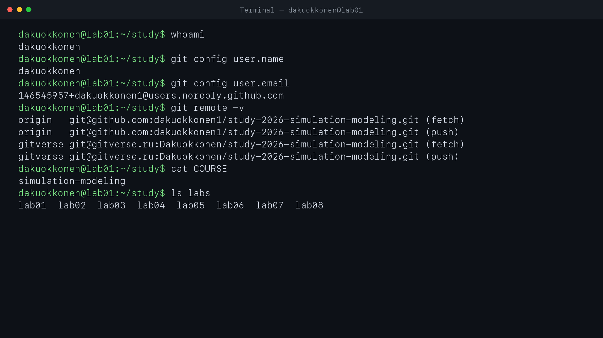{#fig-labs width=92%}

# Теоретическая часть

## Модель экспоненциального роста

Пусть $u(t)$ — моделируемая величина, а $\alpha$ — постоянная относительная
скорость её изменения. Модель задаётся задачей Коши

$$
\frac{du}{dt}=\alpha u, \qquad u(0)=u_0.
$$ {#eq-model}

Разделяя переменные и интегрируя, получаем

$$
\int \frac{du}{u}=\int \alpha\,dt,
\qquad
\ln u = \alpha t + C,
$$

откуда с учётом начального условия следует аналитическое решение

$$
u(t)=u_0e^{\alpha t}.
$$ {#eq-analytic}

При $\alpha>0$ величина растёт, при $\alpha=0$ остаётся постоянной, а при
$\alpha<0$ убывает. Время удвоения определяется из условия
$u(T_2)=2u_0$:

$$
T_2=\frac{\ln 2}{\alpha}.
$$ {#eq-doubling}

Модель применима для приближённого описания роста популяции при отсутствии
ограничений, сложного процента и начальной стадии эпидемии. Её ограничение —
неизменная относительная скорость роста: реальные системы обычно сталкиваются
с дефицитом ресурсов, поэтому на больших временах модель переоценивает рост.

## Численное решение

Задача оформлена как `ODEProblem`, а интегрирование выполнено методом `Tsit5`
из `DifferentialEquations.jl`. Численное решение сравнивается с формулой
(@eq-analytic) в каждой сохранённой точке. Контрольная величина — относительная
ошибка в момент $t=10$:

$$
\varepsilon_{rel}=
\frac{|u_{num}(10)-u_{exact}(10)|}{|u_{exact}(10)|}.
$$

# Среда и организация проекта

Работа выполнялась в изолированном Docker-контейнере от пользователя
`dakuokkonen`. Исходный образ основан на Julia 1.11, а зависимости закреплены в
`Project.toml` и `Manifest.toml`. Поэтому локальные настройки других проектов
не меняются, а результаты можно повторить на другом компьютере.

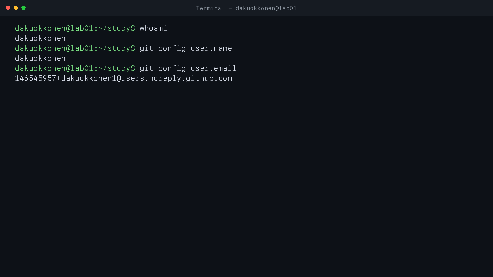{#fig-user width=92%}

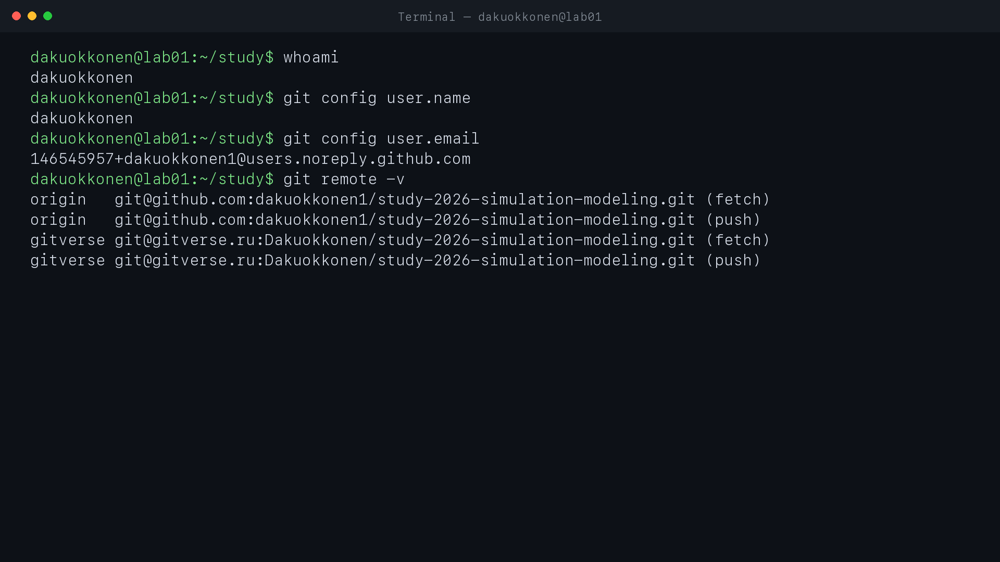{#fig-remotes width=92%}

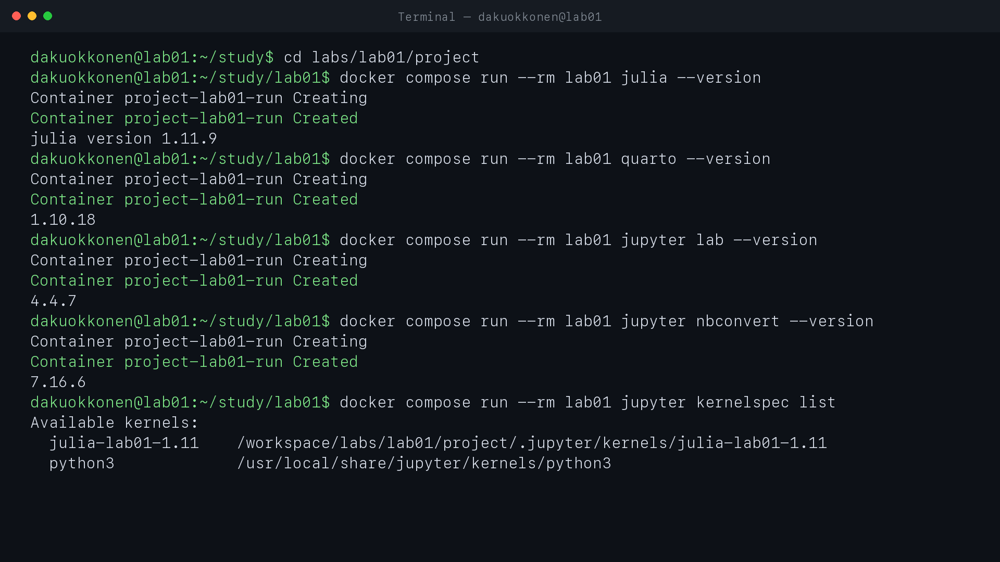{#fig-env width=92%}

Основные зависимости приведены в @tbl-deps.

| Пакет | Версия | Назначение |
|---|---:|---|
| `DifferentialEquations` | 8.1.1 | постановка и численное решение задачи Коши |
| `DrWatson` | 2.19.1 | структура проекта, пути и параметрические эксперименты |
| `DataFrames` | 1.8.2 | табличное представление результатов |
| `CSV` | 0.10.17 | сохранение сводных таблиц |
| `Plots` | 1.41.7 | построение и сохранение графиков |
| `JLD2` | 0.6.6 | сохранение объектов Julia |
| `Literate` | 2.21.0 | генерация скриптов, QMD и IPYNB |
| `IJulia` | 1.34.4 | ядро Julia для Jupyter |
| `BenchmarkTools` | 1.8.0 | воспроизводимое измерение времени |
| `Quarto` | 1.0.0 | программная сборка документации из Julia |

: Закреплённые версии основных пакетов {#tbl-deps}

{#fig-pkgs width=92%}

Структура `labs/lab01` разделяет модель, сценарии, данные, графики, ноутбуки,
документацию, тесты, отчёт и презентацию. Управляющие команды собраны в
`Makefile`; контейнер подключает только каталог текущего репозитория.

# Реализация модели

## Общий модуль

Повторяющиеся математические операции вынесены в `src/exponential_growth.jl`.
Правая часть ОДУ принимает как число, так и именованный кортеж параметров, что
позволяет использовать одну модель в обоих экспериментах.

Ключевые функции общего модуля приведены в листинге 1. Именно этот файл
подключается обоими вычислительными сценариями.

```julia
function exponential_growth!(du, u, p, t)
    alpha = p isa Number ? p : p.alpha
    du[1] = alpha * u[1]
    return nothing
end

analytic_solution(u0, alpha, t) = u0 * exp(alpha * t)
doubling_time(alpha) = log(2) / alpha
```

Листинг 1 — Общий модуль модели `src/exponential_growth.jl`

## Одиночный эксперимент

Для базового эксперимента использованы параметры $u_0=1$, $\alpha=0.3$,
$t\in[0,10]$, шаг сохранения $0.1$. Литературный скрипт одновременно содержит
объяснение и исполняемый Julia-код.

В листинге 2 показана основная вычислительная часть сценария: постановка задачи
Коши, решение методом `Tsit5`, формирование таблицы и сохранение графика. Полный
файл находится по пути `scripts/01_exponential_growth.jl`.

```julia
u0 = 1.0
alpha = 0.3
tspan = (0.0, 10.0)
saveat = 0.1

problem = ODEProblem(exponential_growth!, [u0], tspan, alpha)
solution = solve(problem, Tsit5(); saveat=saveat)

results = DataFrame(
    time=solution.t,
    numerical=first.(solution.u),
    analytical=analytic_solution.(u0, alpha, solution.t),
)
results.error = abs.(results.numerical .- results.analytical)

final_population = last(results.numerical)
expected_population = last(results.analytical)
relative_error = abs(final_population - expected_population) / expected_population

CSV.write(datadir(script_name, "trajectory.csv"), results)
trajectory_plot = plot(results.time, results.numerical;
    label="Численное решение", linewidth=3)
plot!(trajectory_plot, results.time, results.analytical;
    label="Аналитическое решение", linestyle=:dash)
savefig(trajectory_plot, plotsdir(script_name, "exponential_growth.png"))
```

Листинг 2 — Основная часть `scripts/01_exponential_growth.jl`

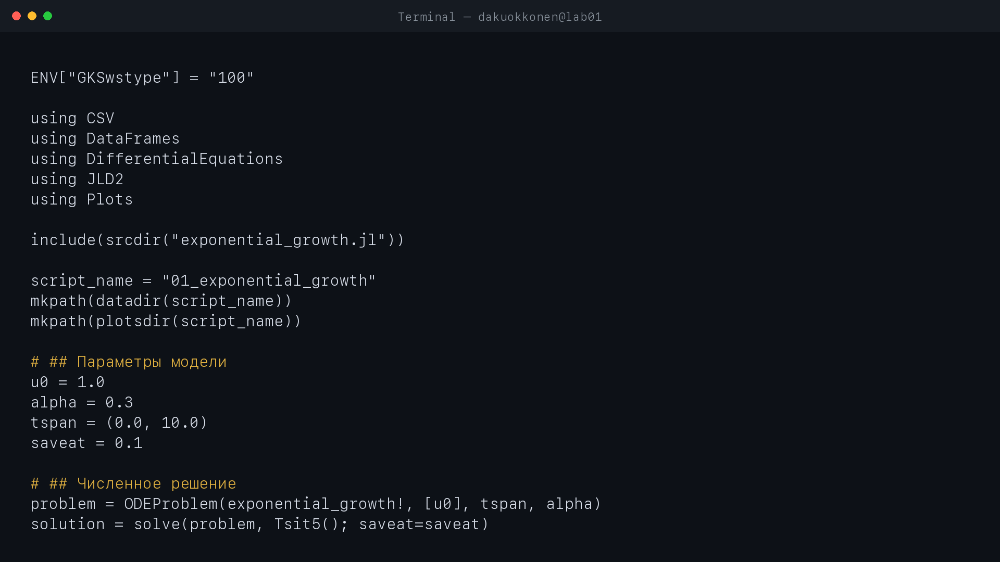{#fig-lit width=92%}

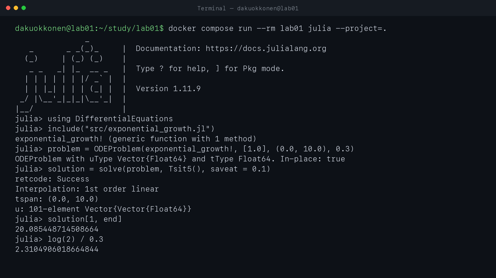{#fig-repl width=92%}

После запуска получена 101 точка траектории. В момент $t=10$ численное значение
равно $20.0854485$, аналитическое — $20.0855369$, абсолютная ошибка —
$8.84\cdot10^{-5}$, относительная ошибка — приблизительно
$4.40\cdot10^{-6}$. Теоретическое время удвоения равно $2.31049$.

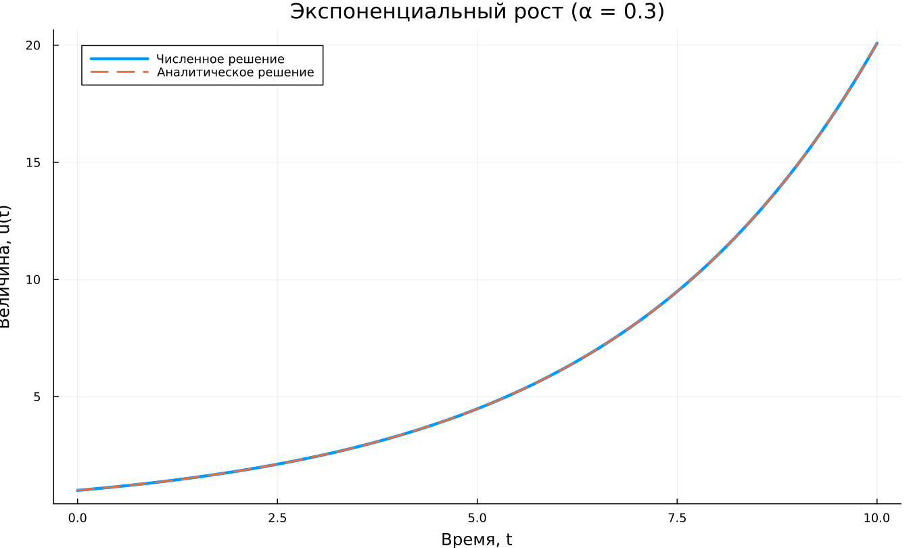{#fig-single width=82%}

## Параметрическое исследование

Вторая программа организует вычисления как набор экспериментов. Изменяется
$\alpha\in\{0.1,0.3,0.5,0.8,1.0\}$, а $u_0$, интервал времени, решатель и шаг
сохранения остаются постоянными. `DrWatson.produce_or_load` формирует имя файла
из параметров и повторно использует уже рассчитанный результат.

Функция одного запуска и обход сетки параметров приведены в листинге 3. Такое
разделение позволяет добавлять новые значения $\alpha$ без дублирования кода
численного решения.

```julia
function run_experiment(parameters::Dict)
    u0 = parameters[:u0]
    alpha = parameters[:alpha]
    tspan = (0.0, parameters[:tmax])

    problem = ODEProblem(
        exponential_growth!, [u0], tspan, (alpha=alpha,)
    )
    solution = solve(problem, Tsit5(); saveat=parameters[:saveat])

    return Dict(
        "time" => collect(solution.t),
        "population" => first.(solution.u),
        "final_population" => last(solution.u)[1],
        "doubling_time" => doubling_time(alpha),
    )
end

parameter_grid = Dict(
    :u0 => [1.0],
    :alpha => [0.1, 0.3, 0.5, 0.8, 1.0],
    :tmax => [10.0],
    :saveat => [0.1],
)

summary_rows = NamedTuple[]
for parameters in dict_list(parameter_grid)
    data, path = produce_or_load(
        datadir(script_name, "parametric_scan"),
        parameters,
        run_experiment;
        prefix="scan", tag=false, verbose=false,
    )
    push!(summary_rows, (
        alpha=parameters[:alpha],
        final_population=data["final_population"],
        doubling_time=data["doubling_time"],
        result_file=path,
    ))
end
```

Листинг 3 — Функция эксперимента и сетка параметров в `scripts/02_exponential_growth.jl`

| $\alpha$ | $u(10)$ | $T_2=\ln2/\alpha$ |
|---:|---:|---:|
| 0.1 | 2.7183 | 6.9315 |
| 0.3 | 20.0854 | 2.3105 |
| 0.5 | 148.4086 | 1.3863 |
| 0.8 | 2 980.5736 | 0.8664 |
| 1.0 | 22 021.0156 | 0.6931 |

: Сводные результаты параметрического сканирования {#tbl-param}

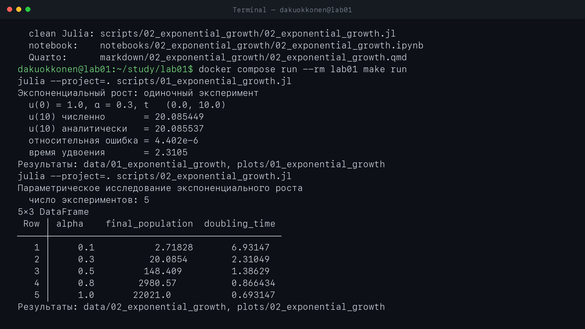{#fig-param-terminal width=92%}

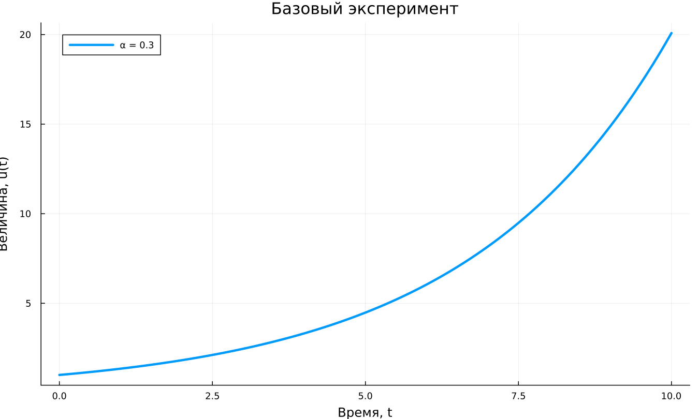{#fig-base width=82%}

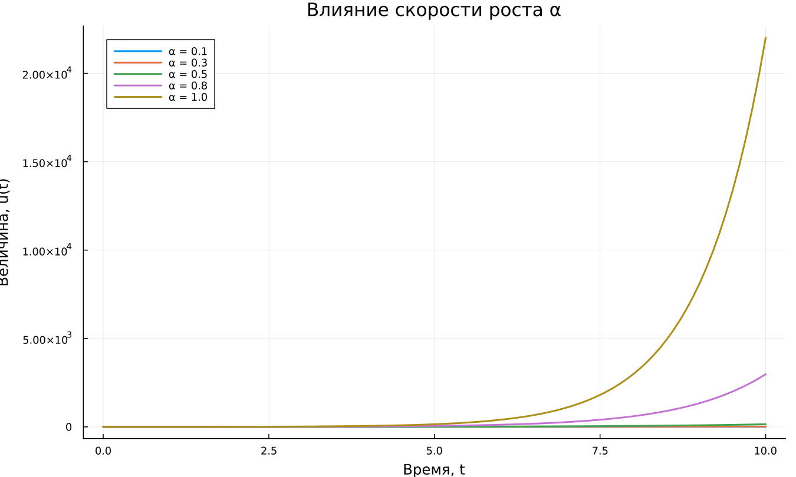{#fig-scan width=82%}

С ростом $\alpha$ итоговое значение меняется на несколько порядков, поэтому
линии больших $\alpha$ визуально доминируют на общей линейной шкале. Время
удвоения, напротив, монотонно уменьшается и точно следует обратной зависимости
(@eq-doubling).

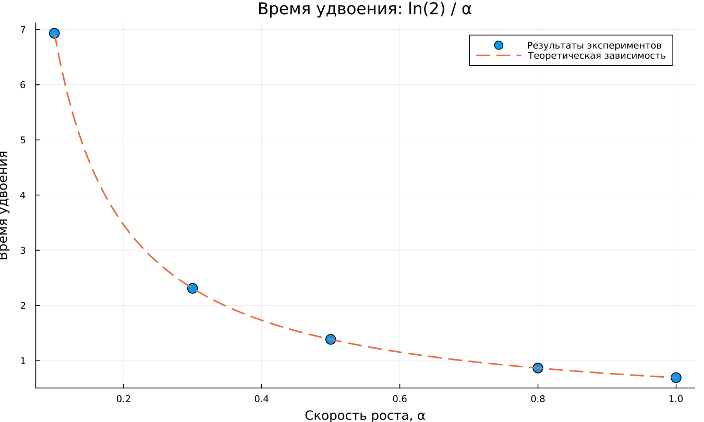{#fig-double width=82%}

Бенчмарк показал время одного решения порядка $6$–$8$ мкс. Небольшой разброс
между значениями $\alpha$ не образует устойчивого тренда: вычислительная
сложность на выбранном интервале определяется главным образом одинаковыми
настройками решателя и сохранения.

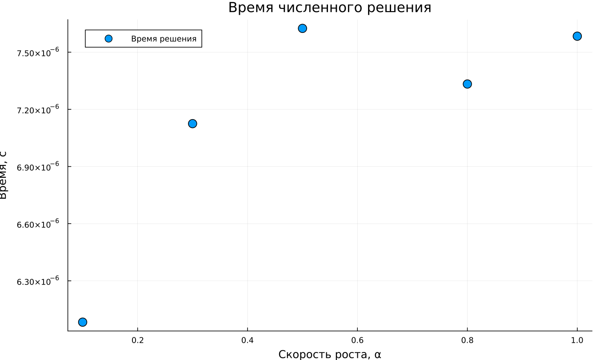{#fig-bench width=82%}

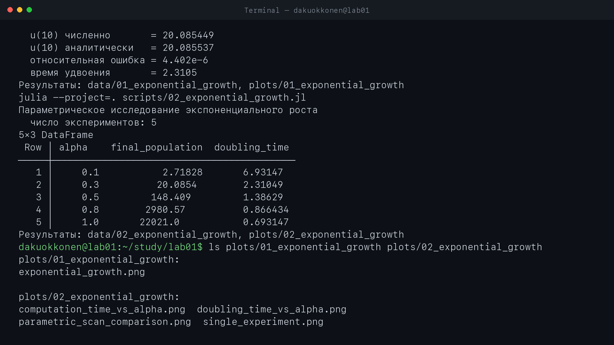{#fig-results width=92%}

# Производные форматы и ноутбуки

Сценарий `scripts/tangle.jl` обрабатывает каждый литературный исходник через
`Literate.jl` и создаёт три представления:

- чистый Julia-скрипт для пакетного запуска;
- Quarto-документ для читаемой HTML-документации;
- Jupyter-ноутбук для интерактивного воспроизведения.

В листинге 4 показано, как для каждого исходного файла создаются согласованные
версии Julia, IPYNB и QMD в предназначенных для них каталогах.

```julia
using DrWatson
@quickactivate "project"
using Literate

function generate_formats(source::AbstractString)
    isfile(source) || error("Source file not found: $(source)")

    script_name = splitext(basename(source))[1]
    clean_dir = scriptsdir(script_name)
    quarto_dir = projectdir("markdown", script_name)
    notebook_dir = projectdir("notebooks", script_name)

    mkpath(clean_dir)
    mkpath(quarto_dir)
    mkpath(notebook_dir)
    Literate.script(source, clean_dir;
        name=script_name, credit=false)
    Literate.notebook(source, notebook_dir;
        name=script_name, execute=false, credit=false)
    Literate.markdown(source, quarto_dir;
        name=script_name,
        flavor=Literate.QuartoFlavor(), credit=false)
end

foreach(generate_formats, ARGS)
```

Листинг 4 — Генератор производных форматов `scripts/tangle.jl`

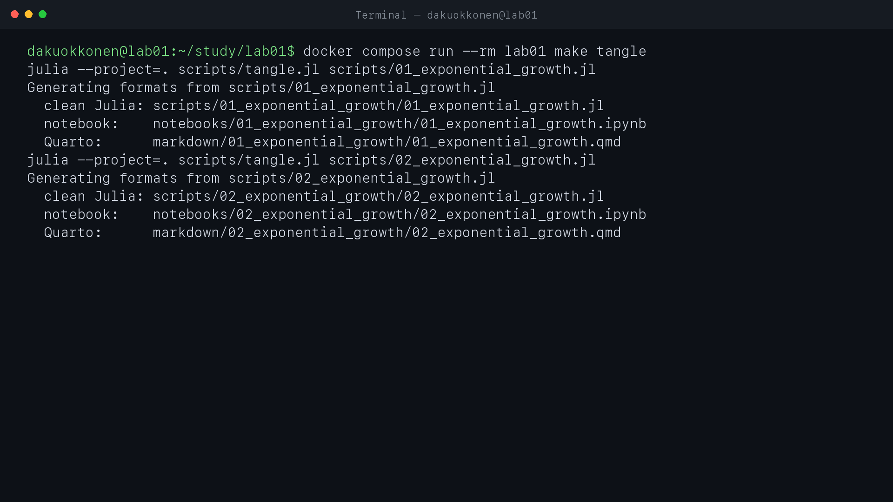{#fig-generated width=92%}

Оба ноутбука выполнены с ядром `julia-lab01-1.11`; результаты сохранены в
самих `.ipynb`. В первом ноутбуке заполнено 7 ячеек выполнения, во втором — 15.

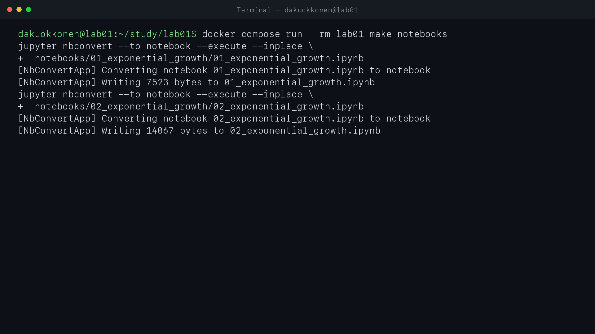{#fig-notebooks width=92%}

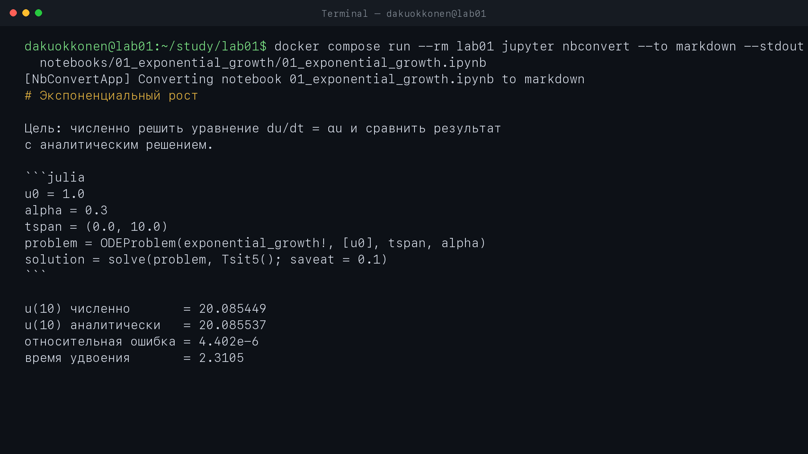{#fig-nb1-terminal width=92%}

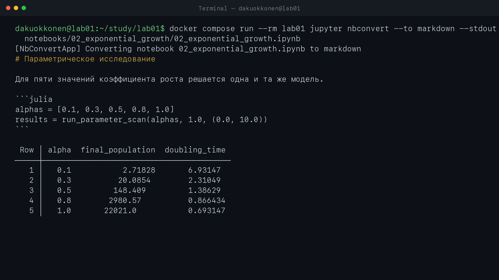{#fig-nb2-terminal width=92%}

{#fig-jupyter-start width=92%}

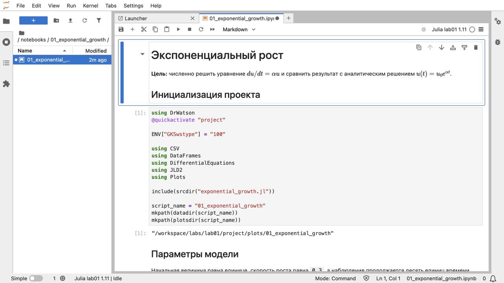{#fig-jupyter-open1 width=92%}

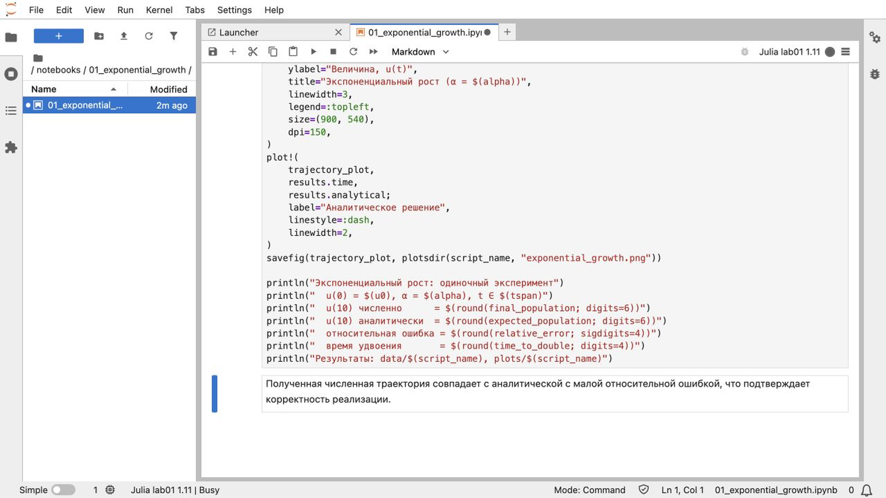{#fig-jupyter-run1 width=92%}

{#fig-jupyter-done1 width=92%}

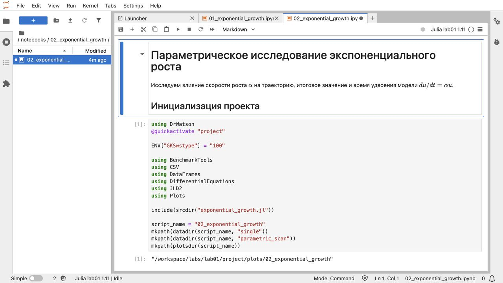{#fig-jupyter-open2 width=92%}

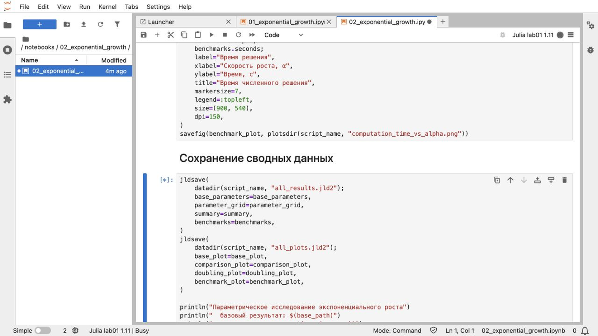{#fig-jupyter-run2 width=92%}

{#fig-jupyter-done2 width=92%}

Quarto-документы собраны в автономные HTML-файлы с внедрёнными ресурсами. Они
дают читаемое представление вычислений без запуска среды разработки.

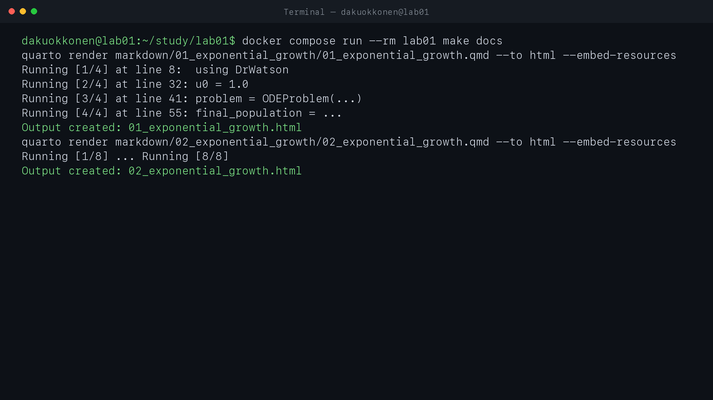{#fig-quarto width=92%}

# Проверка и управление версиями

Автоматические тесты проверяют правую часть ОДУ, аналитическое решение, время
удвоения и точность численного интегрирования. Полный набор тестов завершился
без ошибок.

{#fig-tests width=92%}

История изменений разделена на этапы: подготовка репозитория, реализация
модели, добавление воспроизводимых результатов и оформление релиза. Локально
установлен автор `dakuokkonen`; глобальные настройки Git других проектов не
изменялись.

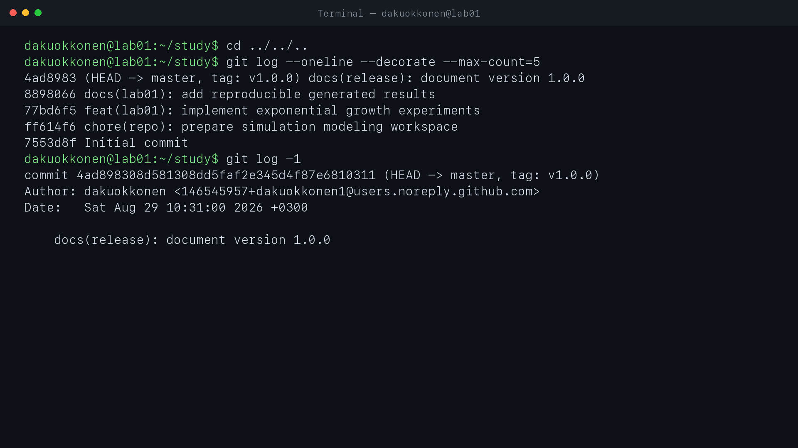{#fig-history width=92%}

Одинаковая ветка отправлена в два независимых удалённых репозитория: GitHub и
GitVerse. Для каждого сервиса используется отдельный SSH-псевдоним, поэтому
учётные данные не смешиваются с другими проектами.

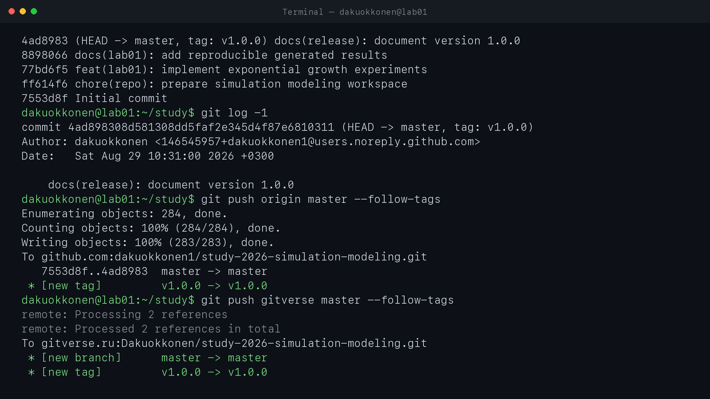{#fig-push width=92%}

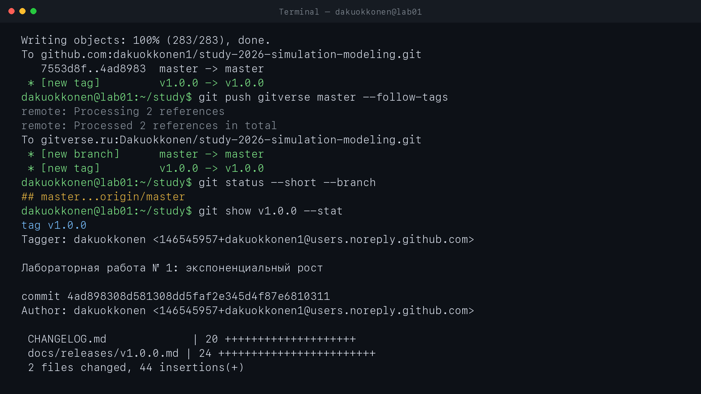{#fig-finish width=92%}

# Воспроизводимость

Минимальная последовательность команд для повторения работы:

```bash
cd labs/lab01/project
docker compose build
docker compose run --rm lab01 make setup
docker compose run --rm lab01 make all
```

Связь между отдельными этапами зафиксирована в `Makefile` (листинг 5). Цель
`all` последовательно генерирует форматы, выполняет расчёты и ноутбуки, собирает
документацию и запускает тесты.

```makefile
.PHONY: setup tangle run notebooks docs test all

setup:
	julia --project=. scripts/setup_environment.jl

tangle:
	julia --project=. scripts/tangle.jl scripts/01_exponential_growth.jl
	julia --project=. scripts/tangle.jl scripts/02_exponential_growth.jl

run:
	julia --project=. scripts/01_exponential_growth.jl
	julia --project=. scripts/02_exponential_growth.jl

notebooks:
	jupyter nbconvert --to notebook --execute --inplace \
		--ExecutePreprocessor.kernel_name=julia-lab01-1.11 \
		notebooks/01_exponential_growth/01_exponential_growth.ipynb
	jupyter nbconvert --to notebook --execute --inplace \
		--ExecutePreprocessor.kernel_name=julia-lab01-1.11 \
		notebooks/02_exponential_growth/02_exponential_growth.ipynb

docs:
	quarto render markdown/01_exponential_growth/01_exponential_growth.qmd --to html
	quarto render markdown/02_exponential_growth/02_exponential_growth.qmd --to html

test:
	julia --project=. test/runtests.jl

all: tangle run notebooks docs test
```

Листинг 5 — Основные цели `labs/lab01/project/Makefile`

Отдельные этапы доступны как цели `make tangle`, `make run`, `make notebooks`,
`make docs` и `make test`. Отчёт собирается командой `make` в каталоге
`labs/lab01/report`, презентация — командой `make` в каталоге
`labs/lab01/presentation`.

# Выводы

Создано изолированное и воспроизводимое пространство на Julia. Модель
экспоненциального роста реализована в виде общей функции, литературных
сценариев и двух типов эксперимента. Численное решение совпало с аналитическим
с относительной ошибкой порядка $10^{-6}$. Параметрическое исследование
подтвердило экспоненциальную чувствительность итогового значения к $\alpha$ и
обратную зависимость времени удвоения от этого параметра.

Полный конвейер — от исходного кода до данных, графиков, выполненных ноутбуков,
Quarto-документов, тестов, отчёта, презентации и релиза — управляется командами
и сохраняет результаты в предсказуемой структуре каталогов.

# Источники {.unnumbered}

1. *Имитационное моделирование: методические указания к лабораторным работам*.
   Раздел 1.10 «Модель экспоненциального роста», с. 70–86.
2. Rackauckas C., Nie Q. DifferentialEquations.jl — A Performant and
   Feature-Rich Ecosystem for Solving Differential Equations in Julia. *Journal
   of Open Research Software*. 2017. Vol. 5. No. 1.
3. JuliaLang. *The Julia Language Documentation*. <https://docs.julialang.org/>.
4. Datseris G. et al. DrWatson: the perfect sidekick for your scientific
   inquiries. *Journal of Open Source Software*. 2020. Vol. 5. No. 54.
5. Quarto. *Scientific and technical publishing system*.
   <https://quarto.org/docs/>.
