# Содержание {.unnumbered}

1. Цель и задание
2. Теоретическое введение
3. Организация вычислительного проекта
4. Исследование модели SIR
5. Исследование модели Лотки–Вольтерры
6. Производные форматы и Jupyter
7. Тестирование и контроль результатов
8. Выводы
9. Источники



# Цель и задание

Цель лабораторной работы — освоить численное исследование систем обыкновенных
дифференциальных уравнений на примере эпидемиологической модели SIR и модели
взаимодействия популяций Лотки–Вольтерры, а также подготовить воспроизводимый
вычислительный проект средствами Julia.

В ходе работы требовалось:

1. создать отдельный Julia-проект и закрепить версии зависимостей;
2. реализовать правые части обеих систем ОДУ в общем модуле;
3. решить базовую задачу SIR, вычислить $R_0$, момент и величину пика инфекции;
4. исследовать влияние среднего числа контактов на развитие эпидемии;
5. решить систему Лотки–Вольтерры, найти нетривиальное равновесие и оценить
   период колебаний;
6. построить семейство фазовых орбит и проверить сохранение первого интеграла;
7. сформировать CSV-данные, графики, QMD, выполненные IPYNB и HTML-документы;
8. проверить физические инварианты и численные свойства автоматическими
   тестами.

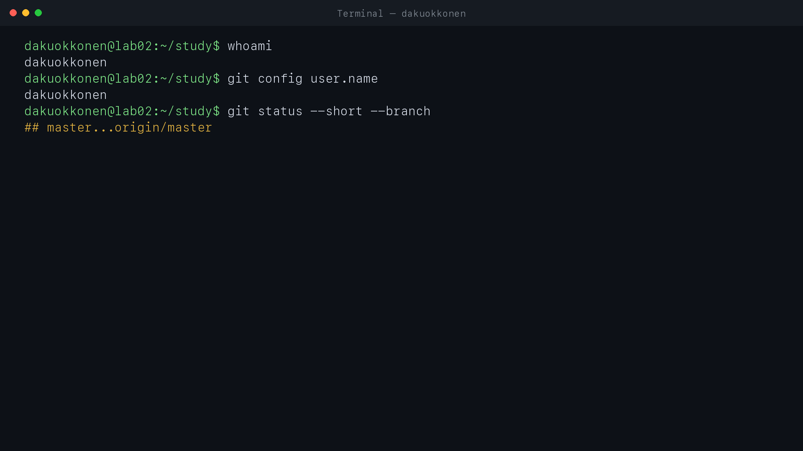{#fig-start width=94%}

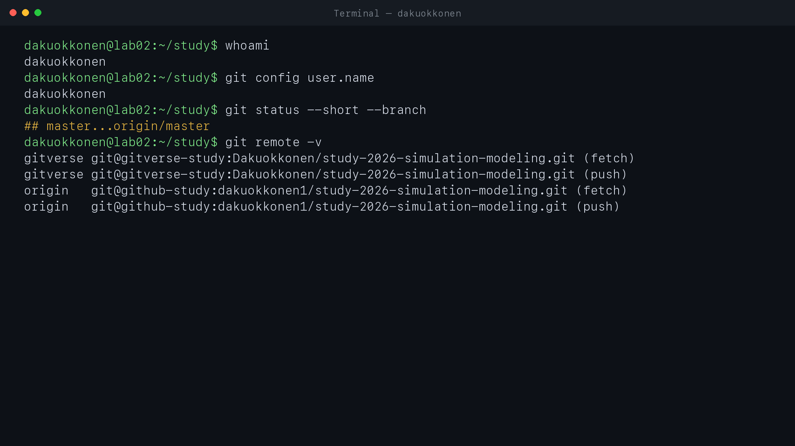{#fig-remotes width=94%}

# Теоретическое введение

## Эпидемиологическая модель SIR

Закрытая популяция постоянной численности $N$ разделяется на три группы:
$S(t)$ — восприимчивые к инфекции, $I(t)$ — инфицированные и способные
передавать заболевание, $R(t)$ — выздоровевшие и выбывшие из цепочки передачи.

Использована система

$$
\frac{dS}{dt}=-\beta c\frac{SI}{N},
$$ {#eq-sir-s}

$$
\frac{dI}{dt}=\beta c\frac{SI}{N}-\gamma I,
$$ {#eq-sir-i}

$$
\frac{dR}{dt}=\gamma I.
$$ {#eq-sir-r}

Здесь $\beta$ — вероятность передачи инфекции при одном контакте, $c$ —
среднее число контактов за единицу времени, $\gamma$ — интенсивность
выздоровления. Суммирование правых частей (@eq-sir-s)–(@eq-sir-r) даёт

$$
\frac{d}{dt}(S+I+R)=0,
$$

поэтому $S(t)+I(t)+R(t)=N$ является инвариантом модели.

Базовое репродуктивное число равно

$$
R_0=\frac{\beta c}{\gamma}.
$$ {#eq-r0}

При $R_0<1$ малое возмущение затухает, а при $R_0>1$ инфекция сначала
распространяется. С течением времени доля восприимчивых уменьшается, поэтому
используется эффективное репродуктивное число

$$
R_e(t)=R_0\frac{S(t)}{N}.
$$ {#eq-re}

Пик $I(t)$ достигается около момента, когда $R_e(t)$ пересекает единицу.

## Модель Лотки–Вольтерры

Пусть $x(t)$ — численность жертв, а $y(t)$ — численность хищников. Классическая
модель записывается как

$$
\frac{dx}{dt}=\alpha x-\beta xy,
$$ {#eq-lv-x}

$$
\frac{dy}{dt}=\delta xy-\gamma y.
$$ {#eq-lv-y}

Параметр $\alpha$ задаёт естественную скорость роста жертв, $\beta$ —
интенсивность их потерь при встрече с хищниками, $\delta$ — эффективность
преобразования потреблённой пищи в прирост хищников, $\gamma$ — естественную
смертность хищников.

Нетривиальное равновесие определяется из условия равенства нулю обеих правых
частей:

$$
x^*=\frac{\gamma}{\delta}, \qquad
y^*=\frac{\alpha}{\beta}.
$$ {#eq-equilibrium}

Для положительных решений сохраняется первый интеграл

$$
H(x,y)=\delta x-\gamma\ln x+\beta y-\alpha\ln y.
$$ {#eq-invariant}

Его численный дрейф служит чувствительным контролем качества интегрирования.
В отличие от SIR, система не стремится к конечному состоянию: в идеализированной
модели возникают замкнутые фазовые орбиты вокруг точки (@eq-equilibrium).

# Организация вычислительного проекта

Работа выполнена в той же изолированной среде, что и лабораторная №1:
Julia 1.11.9, Quarto 1.10.18 и JupyterLab 4.4.7. Зависимости закреплены в
`Project.toml` и `Manifest.toml`, а локальные каталоги пакетов исключены из Git.

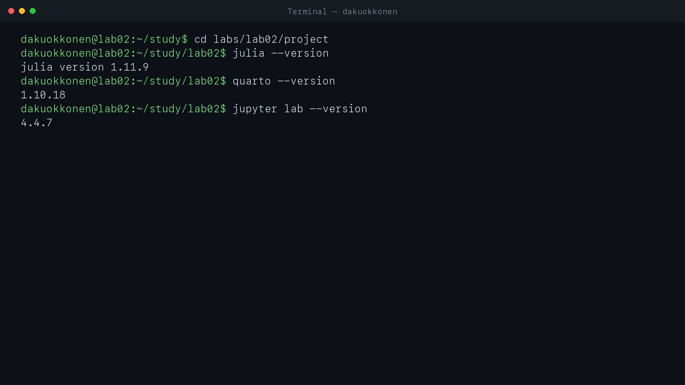{#fig-versions width=94%}

Основные компоненты среды приведены в @tbl-deps.

| Компонент | Назначение |
|---|---|
| `DifferentialEquations.jl` | постановка и решение систем ОДУ методом `Tsit5` |
| `DrWatson.jl` | организация путей, данных и активного проекта |
| `DataFrames.jl`, `CSV.jl` | табличные результаты и экспорт CSV |
| `Plots.jl` | построение временных и фазовых графиков |
| `JLD2.jl` | сохранение численных сводок вне публикуемого состава |
| `Literate.jl` | генерация Julia, QMD и IPYNB из литературного исходника |
| `IJulia.jl` | выполнение интерактивных блокнотов Julia |
| `Quarto` | формирование читаемой HTML-документации |

: Основные зависимости проекта {#tbl-deps}

В `src/epidemic_ecology.jl` собраны обе правые части, вычисление $R_0$,
$R_e(t)$, равновесия и первого интеграла. Благодаря этому сценарии и тесты
используют одну реализацию математических формул.

```julia
function sir!(du, u, p, t)
    susceptible, infected, recovered = u
    beta, contacts, gamma = p
    population = susceptible + infected + recovered
    incidence = beta * contacts * susceptible * infected / population
    du[1] = -incidence
    du[2] = incidence - gamma * infected
    du[3] = gamma * infected
    return nothing
end

function lotka_volterra!(du, u, p, t)
    prey, predator = u
    alpha, beta, delta, gamma = p
    du[1] = alpha * prey - beta * prey * predator
    du[2] = delta * prey * predator - gamma * predator
    return nothing
end
```

Листинг 1 — Правые части систем из `src/epidemic_ecology.jl`

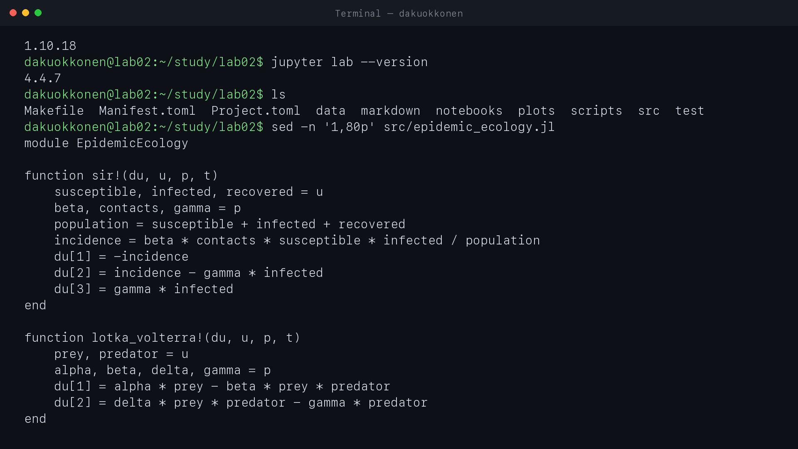{#fig-module width=94%}

Из литературных исходников автоматически создаются чистые скрипты, QMD и
IPYNB. Процесс выполнен отдельно для `01_sir.jl` и
`02_lotka_volterra.jl`.

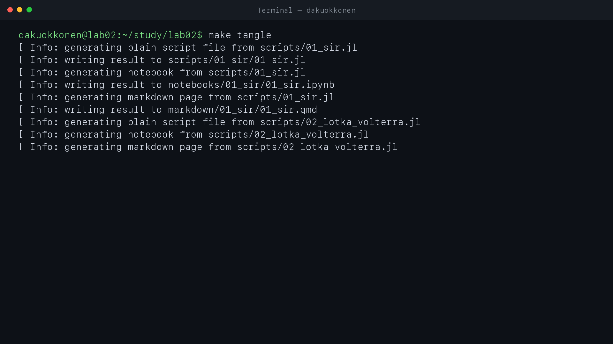{#fig-tangle width=94%}

# Исследование модели SIR

## Базовый сценарий

Начальные условия и параметры выбраны следующими:

$$
(S_0,I_0,R_0^{state})=(990,10,0),
$$

$$
\beta=0.05, \qquad c=10, \qquad \gamma=0.25,
\qquad t\in[0,80].
$$

Средняя продолжительность болезни равна $1/\gamma=4$ дня, а по
(@eq-r0) получаем $R_0=2$. Сценарий создаёт `ODEProblem`, решает его методом
`Tsit5`, формирует таблицу траектории и вычисляет диагностические показатели.

```julia
u0 = [990.0, 10.0, 0.0]
p = (beta=0.05, contacts=10.0, gamma=0.25)
tspan = (0.0, 80.0)

problem = ODEProblem(sir!, u0, tspan, (p.beta, p.contacts, p.gamma))
solution = solve(
    problem,
    Tsit5();
    saveat=0.1,
    reltol=1e-9,
    abstol=1e-11,
)

trajectory = DataFrame(
    time=solution.t,
    susceptible=getindex.(solution.u, 1),
    infected=getindex.(solution.u, 2),
    recovered=getindex.(solution.u, 3),
)
```

Листинг 2 — Постановка и решение базовой задачи в `scripts/01_sir.jl`

Результаты базового расчёта приведены в @tbl-sir-base.

| Показатель | Значение |
|---|---:|
| Базовое репродуктивное число $R_0$ | 2,0000 |
| Максимум $I(t)$ | 158,4512 |
| Время пика | 17,5 дня |
| Первое значение $t$, при котором $R_e<1$ | 17,6 дня |
| Число выздоровевших к 80-му дню | 800,1424 |
| Максимальный дрейф $S+I+R$ | $7,96\cdot10^{-13}$ |

: Численные характеристики базовой модели SIR {#tbl-sir-base}

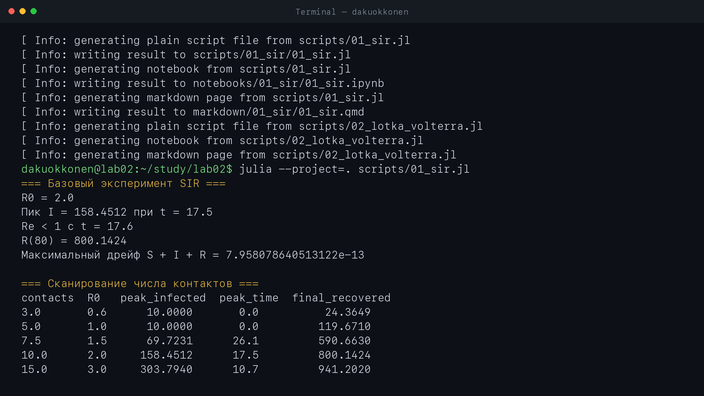{#fig-sir-output width=94%}

На @fig-sir-dynamics видно монотонное уменьшение $S(t)$, колоколообразную
кривую $I(t)$ и монотонный рост $R(t)$. Число инфицированных достигает максимума
после того, как запас восприимчивых сократился достаточно, чтобы $R_e$ приблизился
к единице.

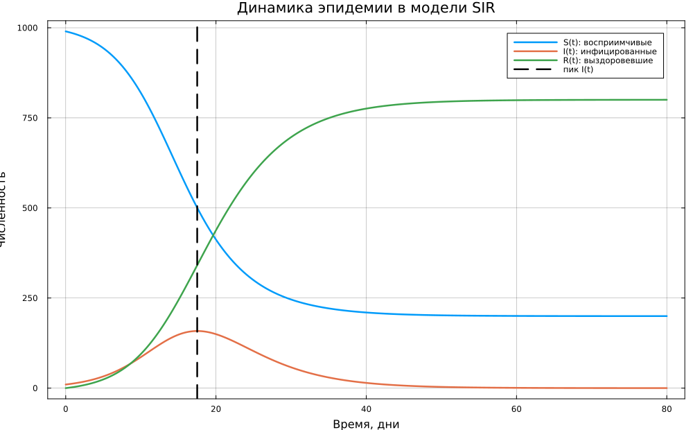{#fig-sir-dynamics width=84%}

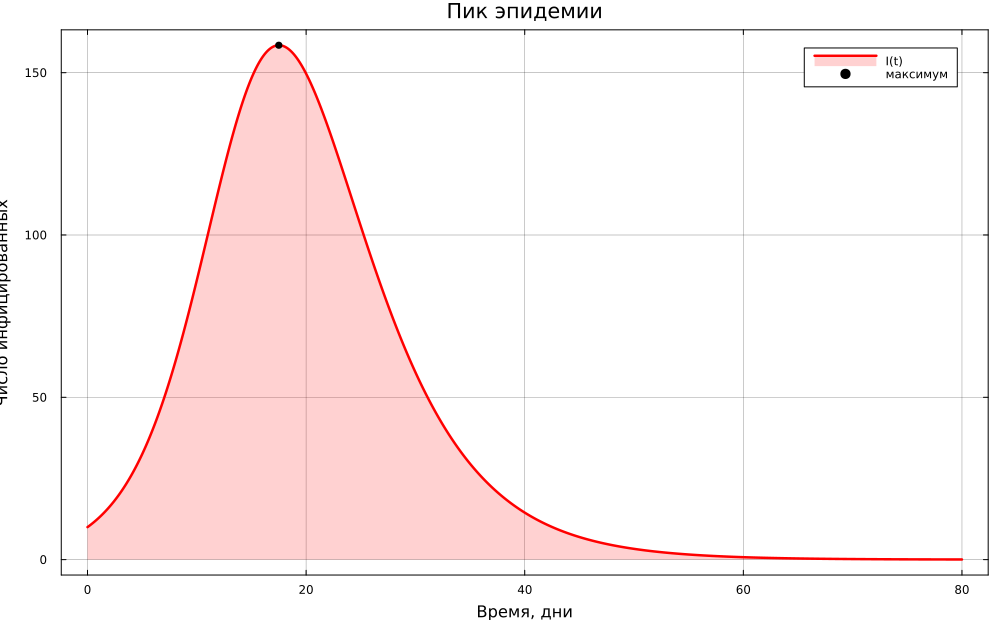{#fig-sir-peak width=84%}

График @fig-sir-re подтверждает пороговую интерпретацию: после пересечения
уровня $R_e=1$ производная $dI/dt$ становится отрицательной, и эпидемическая
волна затухает.

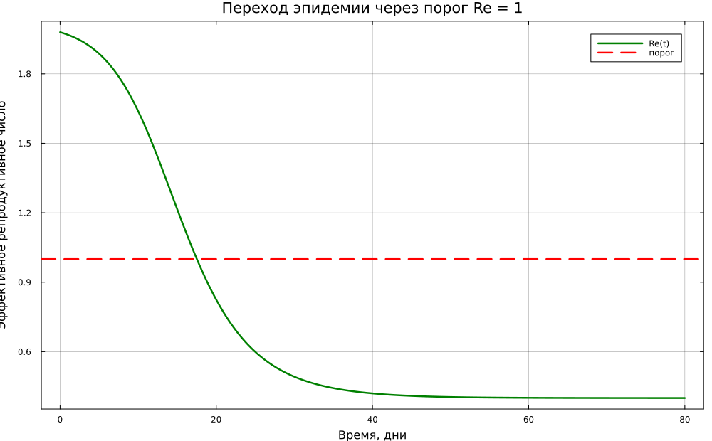{#fig-sir-re width=84%}

Фазовая траектория в координатах $(S,I)$ не замкнута. Восприимчивые только
убывают, поэтому система перемещается от начального состояния к области малого
числа инфицированных.

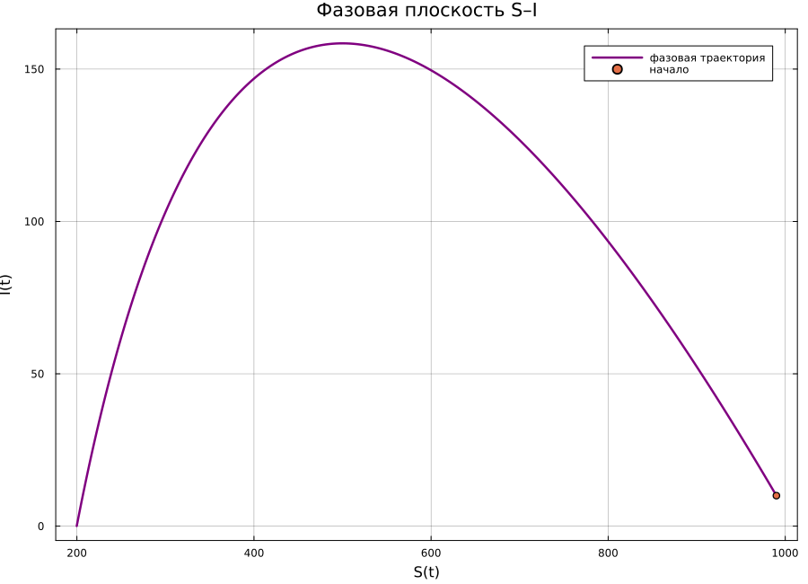{#fig-sir-phase width=78%}

## Исследование числа контактов

Параметр $c$ изменялся по сетке
$\{3;5;7{,}5;10;15\}$. Остальные параметры и начальные условия не менялись.
Результаты представлены в @tbl-sir-scan.

| $c$ | $R_0$ | Пик $I(t)$ | Время пика | $R(80)$ |
|---:|---:|---:|---:|---:|
| 3,0 | 0,6 | 10,0000 | 0,0 | 24,3649 |
| 5,0 | 1,0 | 10,0000 | 0,0 | 119,6710 |
| 7,5 | 1,5 | 69,7231 | 26,1 | 590,6630 |
| 10,0 | 2,0 | 158,4512 | 17,5 | 800,1424 |
| 15,0 | 3,0 | 303,7940 | 10,7 | 941,2020 |

: Влияние числа контактов на ход эпидемии {#tbl-sir-scan}

При $R_0=0{,}6$ инфекция затухает сразу. Пороговый режим $R_0=1$ также не
создаёт выраженного роста из-за того, что начальная доля восприимчивых меньше
единицы. При увеличении числа контактов пик становится выше и возникает раньше.

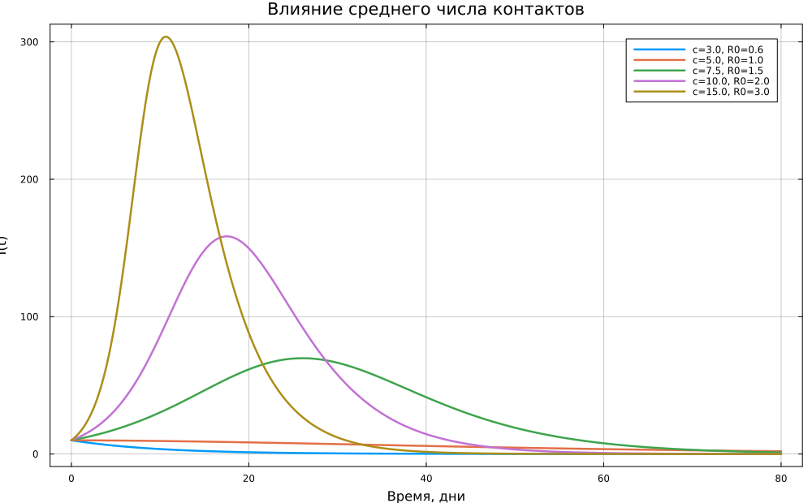{#fig-sir-scan width=86%}

# Исследование модели Лотки–Вольтерры

## Базовый сценарий

Для исследования выбраны параметры

$$
\alpha=0.1, \qquad \beta=0.02, \qquad
\delta=0.01, \qquad \gamma=0.3,
$$

начальное состояние $(x_0,y_0)=(40,9)$ и интервал $t\in[0,400]$. По
(@eq-equilibrium) стационарная точка равна

$$
(x^*,y^*)=(30,5).
$$

```julia
p = (alpha=0.1, beta=0.02, delta=0.01, gamma=0.3)
u0 = [40.0, 9.0]

problem = ODEProblem(
    lotka_volterra!,
    u0,
    (0.0, 400.0),
    (p.alpha, p.beta, p.delta, p.gamma),
)
solution = solve(
    problem,
    Tsit5();
    saveat=0.1,
    reltol=1e-10,
    abstol=1e-12,
)
```

Листинг 3 — Решение базовой системы в `scripts/02_lotka_volterra.jl`

Численные характеристики собраны в @tbl-lv-base.

| Показатель | Значение |
|---|---:|
| Равновесие жертв $x^*$ | 30,0000 |
| Равновесие хищников $y^*$ | 5,0000 |
| Диапазон $x(t)$ | 17,7539–46,8894 |
| Диапазон $y(t)$ | 1,8952–10,4148 |
| Оценка периода | 37,6889 |
| Дрейф первого интеграла | $1,82\cdot10^{-11}$ |

: Характеристики базовой модели Лотки–Вольтерры {#tbl-lv-base}

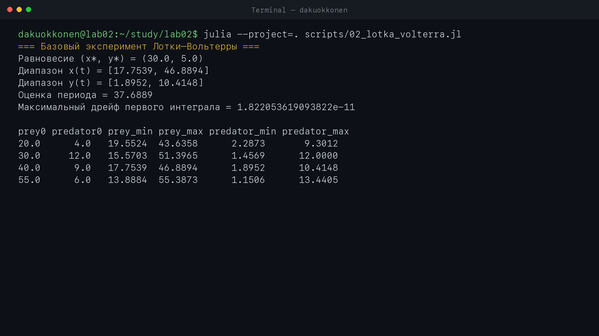{#fig-lv-output width=94%}

На временном графике @fig-lv-dynamics рост жертв предшествует росту хищников.
Увеличение числа хищников затем сокращает популяцию жертв, после чего из-за
недостатка пищи уменьшается и популяция хищников. Ослабление давления позволяет
жертвам восстановиться, и цикл повторяется.

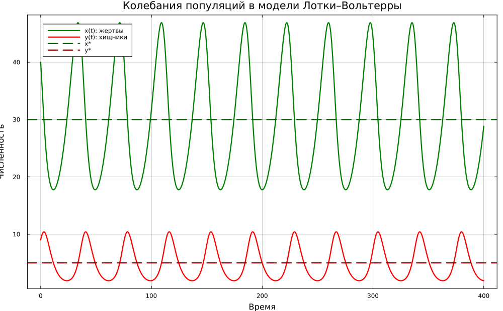{#fig-lv-dynamics width=86%}

Фазовая траектория замкнута и охватывает стационарную точку $(30,5)$. Начальное
состояние не лежит в равновесии, поэтому оно определяет конкретную орбиту.

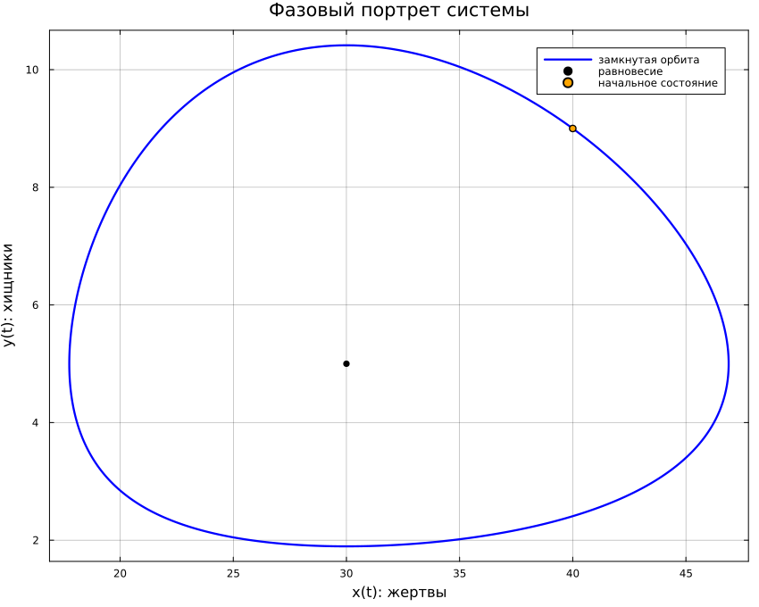{#fig-lv-phase width=78%}

## Контроль первого интеграла

Для каждой сохранённой точки вычислялось значение (@eq-invariant). Основная
часть проверки приведена в листинге 4.

```julia
trajectory.invariant = lotka_invariant.(
    trajectory.prey,
    trajectory.predator,
    p.alpha,
    p.beta,
    p.delta,
    p.gamma,
)

invariant_drift = maximum(
    abs.(trajectory.invariant .- first(trajectory.invariant))
)
```

Листинг 4 — Контроль первого интеграла в `scripts/02_lotka_volterra.jl`

Максимальное отклонение порядка $10^{-11}$ существенно меньше масштаба
самой функции $H(x,y)$. Следовательно, выбранные допуски решателя обеспечивают
высокую численную точность на длинном интервале.

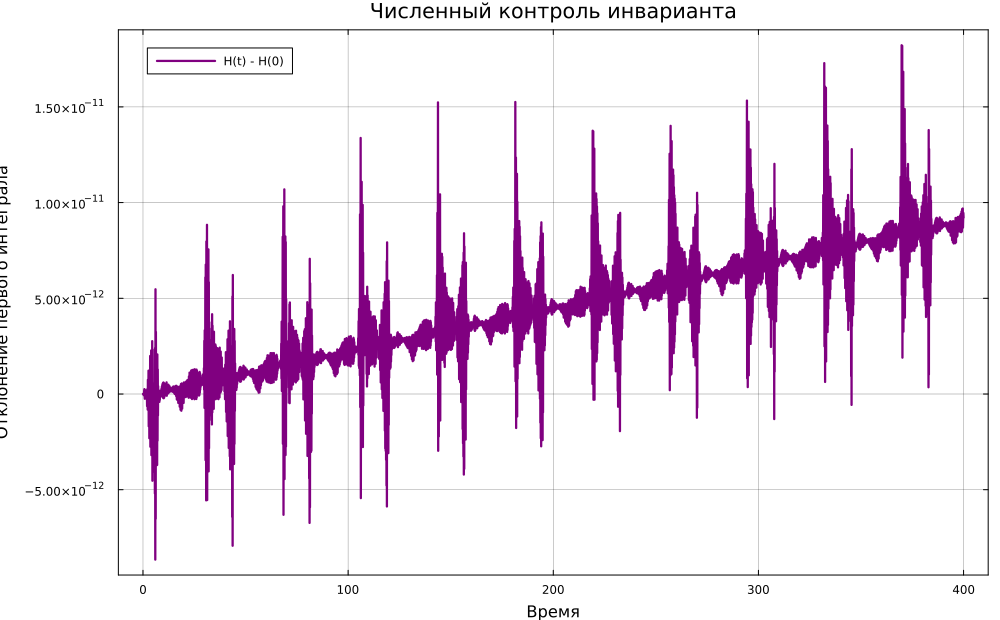{#fig-lv-invariant width=84%}

## Семейство начальных условий

Дополнительно исследованы четыре начальных состояния. Параметры модели были
одинаковыми, поэтому все орбиты окружают одну и ту же точку равновесия, но имеют
разные амплитуды.

| $x_0$ | $y_0$ | $x_{min}$ | $x_{max}$ | $y_{min}$ | $y_{max}$ |
|---:|---:|---:|---:|---:|---:|
| 20 | 4 | 19,5524 | 43,6358 | 2,2873 | 9,3012 |
| 30 | 12 | 15,5703 | 51,3965 | 1,4569 | 12,0000 |
| 40 | 9 | 17,7539 | 46,8894 | 1,8952 | 10,4148 |
| 55 | 6 | 13,8884 | 55,3873 | 1,1506 | 13,4405 |

: Диапазоны колебаний при разных начальных условиях {#tbl-lv-family}

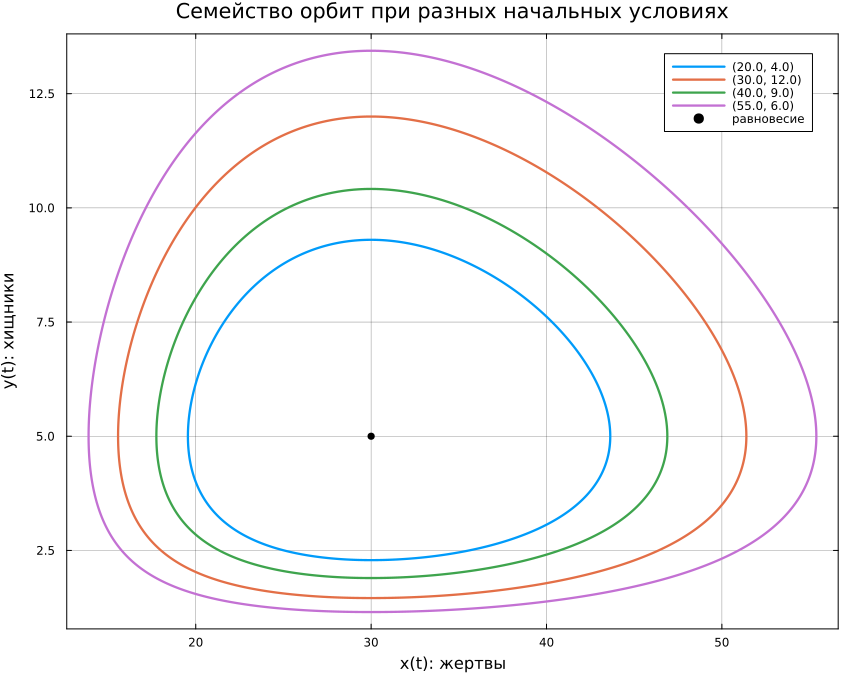{#fig-lv-family width=80%}

# Производные форматы и Jupyter

После `make tangle` для каждого литературного исходника созданы три согласованных
представления: исполняемый `.jl`, документ `.qmd` и блокнот `.ipynb`. Команда
`make notebooks` выполнила оба блокнота с ядром Julia; номера выполнения и
текстовые результаты сохранены внутри файлов.

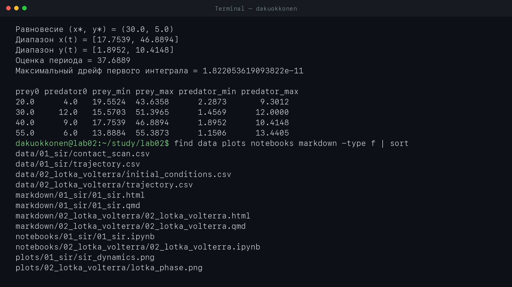{#fig-files width=94%}

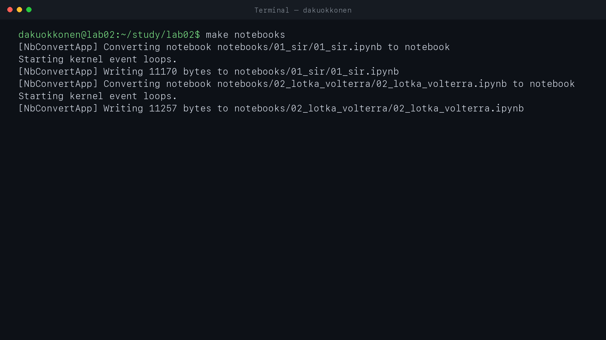{#fig-nb-run width=94%}

JupyterLab распознаёт специальное ядро лабораторной №2 и показывает все
каталоги проекта.

{#fig-jupyter-launcher width=94%}

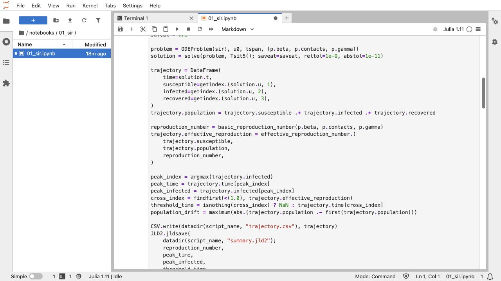{#fig-jupyter-sir width=94%}

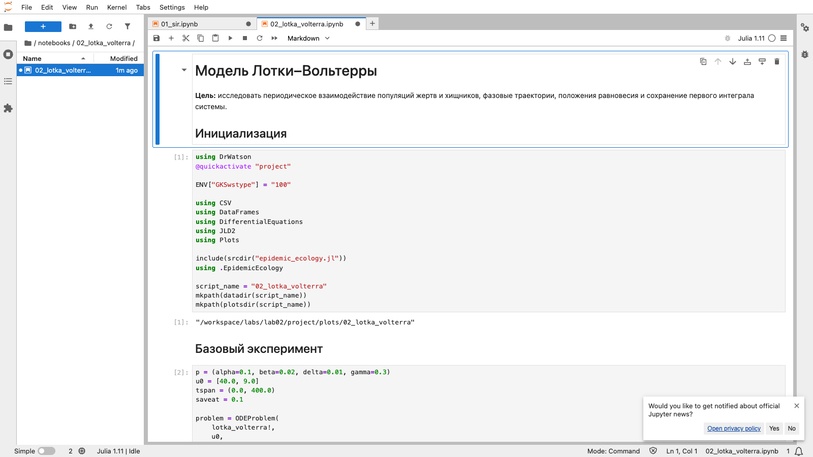{#fig-jupyter-lv width=94%}

# Тестирование и контроль результатов

Автоматические тесты проверяют не только отдельные функции, но и свойства
численных траекторий:

- сумма правых частей SIR равна нулю;
- $S+I+R$ сохраняется с точностью лучше $10^{-7}$;
- все компоненты SIR неотрицательны;
- при $R_0=2$ число инфицированных действительно растёт выше начального;
- аналитическое равновесие Лотки–Вольтерры равно $(30,5)$;
- в равновесии обе производные равны нулю;
- траектория остаётся в положительном квадранте;
- первый интеграл сохраняется с точностью лучше $10^{-7}$.

```julia
@test maximum(abs.(totals .- first(totals))) < 1e-7
@test minimum(minimum.(solution.u)) >= -1e-8

@test collect(equilibrium) ≈ [30.0, 5.0]
@test maximum(abs.(values .- first(values))) < 1e-7
@test minimum(minimum.(solution.u)) > 0.0
```

Листинг 5 — Проверки численных инвариантов в `test/runtests.jl`

Всего выполнено 10 проверок: шесть для SIR и четыре для системы
Лотки–Вольтерры. Все тесты завершились успешно.

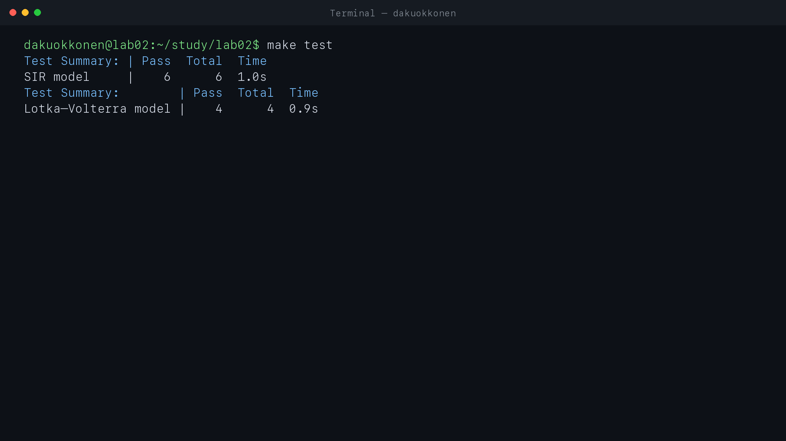{#fig-tests width=94%}

Перед фиксацией результатов дополнительно выполняется `git diff --check`,
проверяется состав лабораторной и отсутствие локальных служебных файлов в Git.

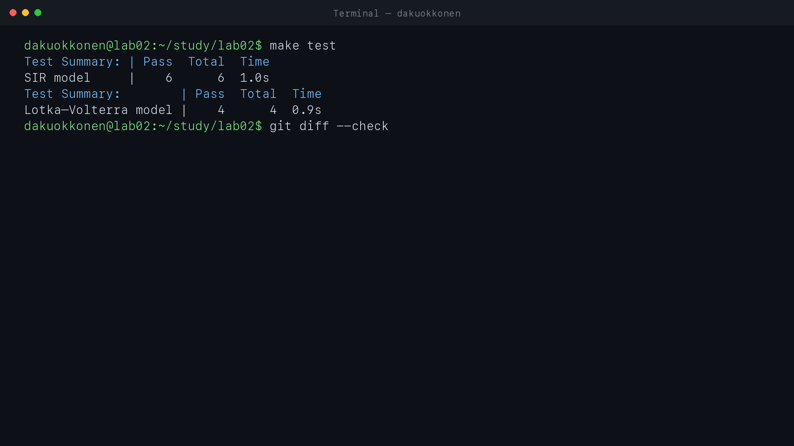{#fig-diff-check width=94%}

# Выводы

В лабораторной работе реализованы и исследованы две нелинейные модели.

Для SIR подтверждён пороговый характер распространения инфекции. В базовом
случае $R_0=2$, максимум числа инфицированных равен приблизительно 158,45 и
достигается на 17,5-й день. Сканирование числа контактов показало, что при
$R_0\leq1$ выраженный пик отсутствует, а рост $R_0$ приводит к более ранней и
высокой эпидемической волне. Суммарная численность сохраняется с дрейфом менее
$10^{-12}$.

Для модели Лотки–Вольтерры найдена стационарная точка $(30,5)$, построены
временные и фазовые траектории, оценён период колебаний 37,6889. Разные
начальные условия создают семейство замкнутых орбит вокруг общего равновесия.
Первый интеграл сохраняется с максимальным отклонением порядка $10^{-11}$.

Проект содержит литературные и чистые Julia-скрипты, CSV-данные, графики,
QMD-документы, выполненные IPYNB и автоматические тесты. Все десять проверок
пройдены, поэтому вычислительные результаты согласуются с теоретическими
свойствами обеих моделей.

# Источники {.unnumbered}

1. Kermack W. O., McKendrick A. G. A Contribution to the Mathematical Theory
   of Epidemics // Proceedings of the Royal Society A. 1927. Vol. 115.
   P. 700–721. DOI: 10.1098/rspa.1927.0118.
2. Lotka A. J. Elements of Physical Biology. Baltimore: Williams & Wilkins,
   1925.
3. Volterra V. Fluctuations in the Abundance of a Species considered
   Mathematically // Nature. 1926. Vol. 118. P. 558–560.
4. SciML. DifferentialEquations.jl Documentation.
   <https://docs.sciml.ai/DiffEqDocs/stable/>.
5. DrWatson.jl Documentation. <https://juliadynamics.github.io/DrWatson.jl/>.
6. Literate.jl Documentation. <https://fredrikekre.github.io/Literate.jl/>.
7. Quarto Documentation. <https://quarto.org/docs/>.
