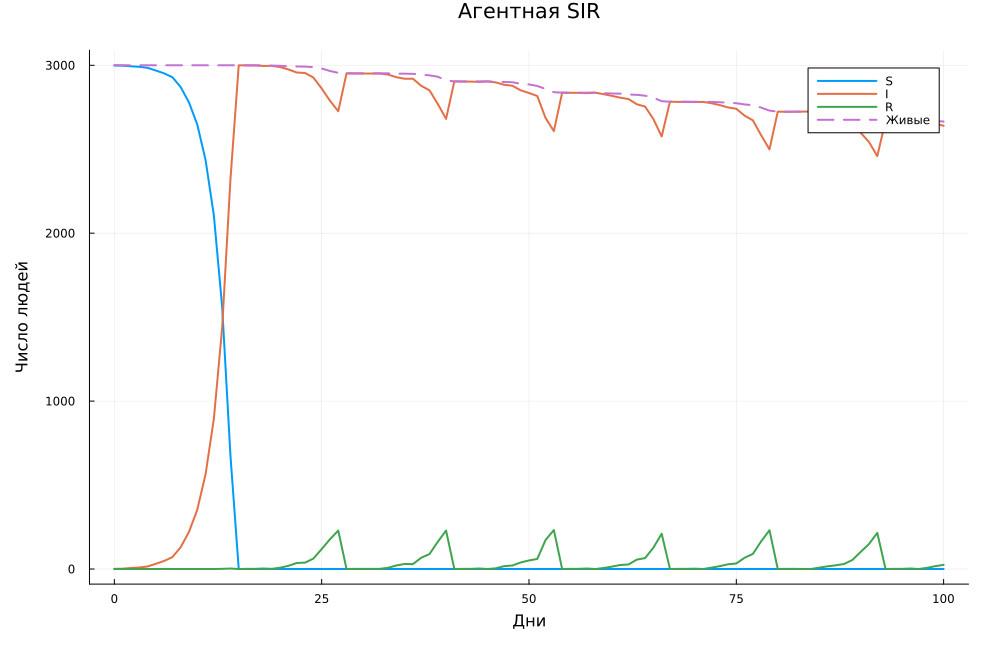
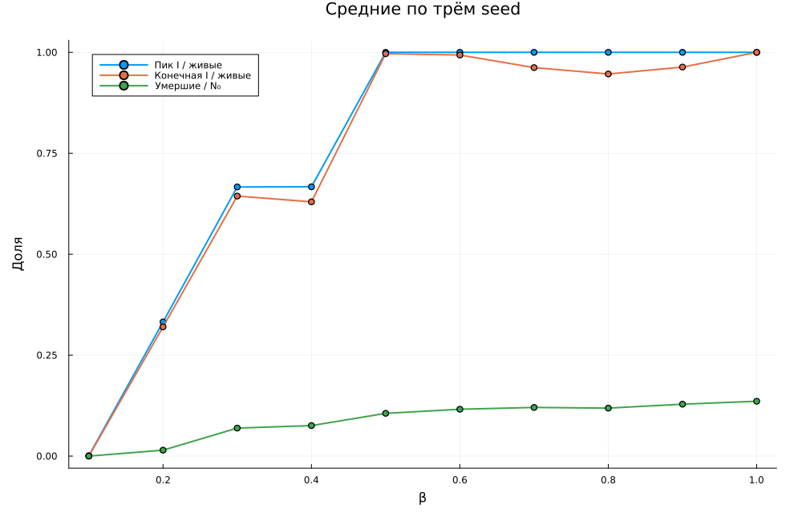
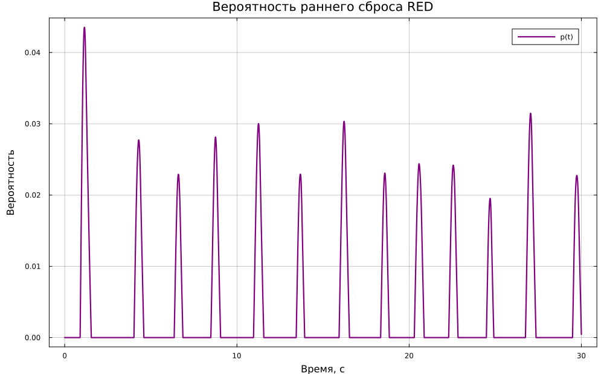
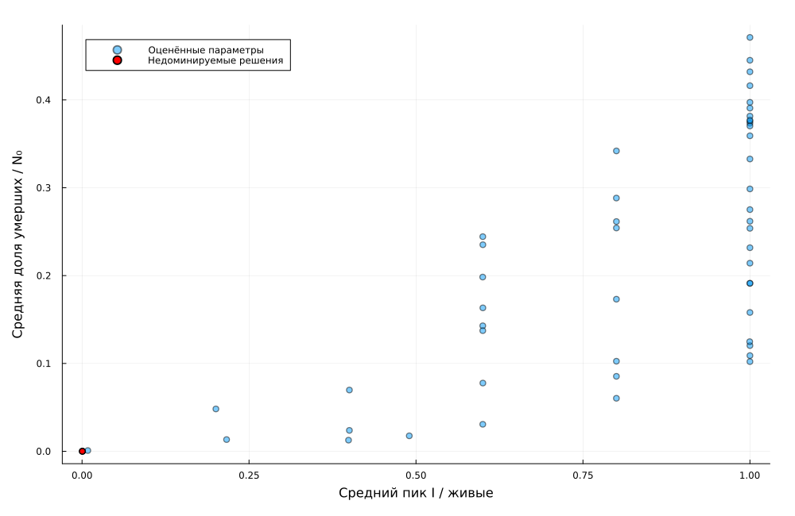
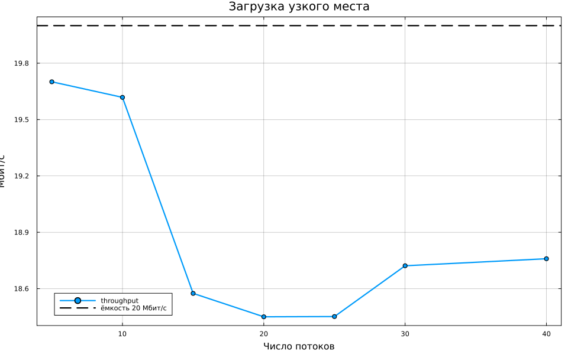
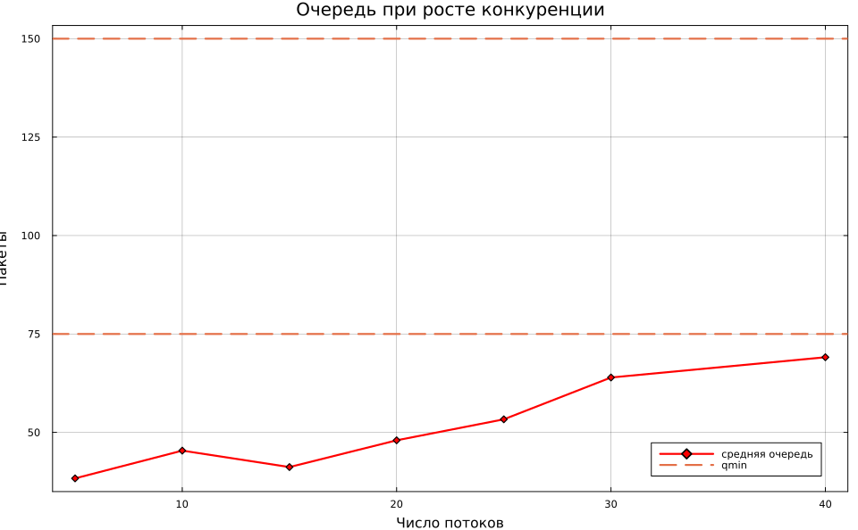

# Содержание {.unnumbered}

1. Цель и задание
2. Механизмы TCP/Reno и RED
3. Структура модели
4. Базовый эксперимент
5. Исследование числа потоков
6. Воспроизводимость и проверка
7. Выводы



# Цель и задание

Цель работы — исследовать совместную динамику алгоритма управления перегрузкой
TCP/Reno и активного управления очередью RED в многопоточной сети.

Выполнены следующие задачи:

1. построена схема с 25 источниками, двумя маршрутизаторами и узким местом;
2. реализованы медленный старт, аддитивное увеличение и мультипликативное
   уменьшение окна TCP;
3. реализовано экспоненциальное сглаживание очереди и ранний сброс RED;
4. построены графики окна, очереди, вероятности сброса и throughput;
5. исследовано влияние количества конкурирующих потоков;
6. подготовлены данные, блокноты, документация и тесты.

# Механизмы TCP/Reno и RED

TCP/Reno управляет окном перегрузки $cwnd$. При отсутствии потерь окно растёт:
быстро в фазе slow start и примерно на один пакет за RTT в режиме congestion
avoidance. Сигнал перегрузки вызывает мультипликативное уменьшение

$$
cwnd \leftarrow \max\left(\frac{cwnd}{2},1\right).
$$ {#eq-aimd}

RED принимает решение по сглаженной очереди

$$
\bar q_{k+1}=(1-w_q)\bar q_k+w_q q_k.
$$ {#eq-ewma}

Вероятность раннего сброса задаётся кусочно-линейно:

$$
p(\bar q)=
\begin{cases}
0, & \bar q<q_{min},\\
p_{max}\dfrac{\bar q-q_{min}}{q_{max}-q_{min}},
& q_{min}\le\bar q<q_{max},\\
p_{max}, & \bar q\ge q_{max}.
\end{cases}
$$ {#eq-red}

За счёт (@eq-ewma) алгоритм не реагирует на единичные всплески, но начинает
сигнализировать о перегрузке до заполнения физического буфера.

# Структура модели

Моделируется «гантелеобразная» топология: источники подключены к первому
маршрутизатору быстрыми линиями, между маршрутизаторами находится узкое место,
после второго маршрутизатора трафик поступает получателям.

| Параметр | Значение |
|---|---:|
| Число TCP/Reno-потоков | 25 |
| Пропускная способность узкого места | 20 Мбит/с |
| Задержка линии между маршрутизаторами | 15 мс |
| Размер пакета | 500 байт |
| Базовый RTT | 118 мс |
| Буфер | 300 пакетов |
| $q_{min}$ / $q_{max}$ | 75 / 150 пакетов |
| $w_q$ | 0,002 |
| $p_{max}$ | 0,1 |
| Время моделирования | 30 с |

: Параметры базового эксперимента {#tbl-params}

В каждый момент скорость потока оценивается как $cwnd/RTT$, где RTT включает
задержку накопленной очереди. Принятые пакеты добавляются в буфер, после чего
обслуживаются с физической скоростью линии. Для каждого потока независимо
разыгрывается сигнал RED.

```julia
rtt = propagation_rtt + queue / service_rate
sent = cwnd ./ rtt .* dt
p = red_probability(qavg, red)

if rand(rng) < 1 - (1 - p)^sent[i]
    cwnd[i] = max(cwnd[i] / 2, 1.0)
else
    cwnd[i] += dt / rtt
end
```

Листинг 1 — Обновление окна одного TCP-потока

# Базовый эксперимент

После переходного процесса средние показатели составили:

| Показатель | Значение |
|---|---:|
| Среднее окно одного потока | 24,5234 пакета |
| Средняя мгновенная очередь | 58,7519 пакета |
| Средняя EWMA-очередь | 56,4558 пакета |
| Средняя пропускная способность | 18,7654 Мбит/с |
| Число сигналов потери | 446 |

: Результаты базового эксперимента {#tbl-base}

Окно первого потока демонстрирует характерную пилообразную динамику AIMD:
плавный рост чередуется с быстрым делением пополам. Усреднение по потокам
сглаживает индивидуальные потери.

{#fig-cwnd width=90%}

Мгновенная очередь изменяется быстрее EWMA. В базовом режиме среднее значение
остаётся ниже $q_{min}$, однако всплески и накопленная сглаженная оценка
периодически активируют ранний сброс.

{#fig-queue width=90%}

{#fig-drop width=88%}

Линия большую часть времени используется почти полностью. Краткие провалы
связаны с синхронной реакцией части потоков на сигналы перегрузки.

{#fig-throughput width=90%}

# Исследование числа потоков

Число соединений изменялось от 5 до 40. Для каждого варианта использовалось
отдельное фиксированное начальное число генератора.

| Потоки | Throughput, Мбит/с | Средняя очередь | Среднее окно | Потери |
|---:|---:|---:|---:|---:|
| 5 | 19,7009 | 38,3260 | 124,0190 | 10 |
| 10 | 19,6181 | 45,3713 | 62,4388 | 53 |
| 15 | 18,5747 | 41,1950 | 39,3207 | 157 |
| 20 | 18,4500 | 47,9929 | 29,6584 | 277 |
| 25 | 18,4514 | 53,3248 | 23,9354 | 456 |
| 30 | 18,7217 | 63,9456 | 20,5946 | 646 |
| 40 | 18,7592 | 69,0914 | 15,6248 | 1063 |

: Влияние числа конкурирующих потоков {#tbl-scan}

{#fig-flow-throughput width=88%}

С ростом конкуренции индивидуальное окно уменьшается, а число сигналов потери
растёт. RED удерживает среднюю очередь существенно ниже предела 300 пакетов.

{#fig-flow-queue width=88%}

# Воспроизводимость и проверка

Проект закреплён файлами `Project.toml` и `Manifest.toml`. Литературные
сценарии порождают Julia, QMD и IPYNB; CSV и PNG пересоздаются командой
`make all`.

Тесты проверяют кусочно-линейную функцию RED, границы очереди и вероятности,
минимальное окно TCP, ограничение throughput физической ёмкостью, наличие
доставленных пакетов и появление потерь в нагруженном режиме. Пройдено 10
проверок.

# Выводы

Построена воспроизводимая модель TCP/Reno с RED. В режиме 25 потоков узкое
место обеспечивает в среднем 18,77 Мбит/с, а очередь остаётся значительно ниже
физического лимита. Наблюдается ожидаемая пилообразная динамика окна AIMD.
Параметрический эксперимент показал уменьшение индивидуального окна и рост
числа сигналов перегрузки при увеличении конкуренции, при этом RED предотвращает
неограниченное накопление пакетов.
