Российский университет дружбы народов имени Патриса Лумумбы.\
Учебная группа НФИбд-01-23.

# Содержание {.unnumbered}

1. Цель и состав задания
2. Агентная модель
3. Реализация и вычислительная среда
4. Основные эксперименты
5. Параметрические варианты
6. Дополнительные задания
7. Литературное программирование и Jupyter
8. Тестирование и воспроизведение
9. Выводы
10. Источники



# Цель и состав задания

Цель — освоить исследование стохастической агентной SIR в пространстве графа,
сравнить влияние заражения и миграции и выполнить оптимизацию параметров.
Источник содержания — глава 4 практикума А. В. Корольковой и Д. С. Кулябова,
стр. 137–164. Это агентная модель с индивидуальными состояниями людей,
а не численное решение системы обыкновенных дифференциальных уравнений.

| Файл в `scripts/` | Самостоятельный опыт |
|---|---|
| `sir_run_basic.jl` | базовые S, I, R и число живых |
| `sir_scan_beta.jl` | 10 значений β × 3 seed |
| `sir_migration_effect.jl` | 6 интенсивностей миграции × 3 seed |
| `sir_optimize_parameters.jl` | два критерия, BorgMOEA, 5 повторов |
| `sir_visualize_dynamics.jl` | отдельный анализ сохранённого CSV |
| `sir_run_basic__param.jl` | длительность инфекции 10 и 14 дней |
| `sir_scan_beta__param.jl` | выявление на 3-й и 7-й день |
| `sir_migration_effect__param.jl` | равные и разные населения городов |
| `sir_optimize_parameters__param.jl` | оптимизация на другом наборе seed |
| `sir_extra_1_2_3.jl` | R₀, порог, гетерогенность городов |
| `sir_extra_4_5.jl` | скорость распространения и карантин |
| `sir_extra_6.jl` | смертность при пике ниже 30% |

: Двенадцать сценариев работы {#tbl-scripts}

Первые пять сценариев соответствуют стр. 144–163, параметрические расширения —
итоговому заданию § 4.2, дополнительные задания — § 4.1.12 на стр. 163.
Общие модули, тесты и генерируемые форматы не увеличивают это число.



# Агентная модель

## Люди и города

Полный граф из трёх вершин задаёт города. Каждый агент `Person` хранит номер
города, число дней после заражения и состояние `:S`, `:I` или `:R`.
Умерший агент удаляется. Поэтому число живых $N(t)=S(t)+I(t)+R(t)$ может
уменьшаться, а число умерших равно $D(t)=N_0-N(t)$.

| Параметр | Базовое значение |
|---|---:|
| Население каждого города | 1000 |
| Начальные инфицированные | [0, 0, 1] |
| Интенсивность до / после выявления | 0,5 / 0,05 |
| Длительность инфекции | 14 дней |
| Время выявления | 7 дней |
| Вероятность смерти при завершении инфекции | 0,02 |
| Вероятность повторного заражения выздоровевшего | 0,1 |
| Seed | 42 |
| Горизонт базового опыта | 100 дней |

: Базовые параметры модели {#tbl-base}

Это учебные параметры, а не калибровка конкретного заболевания. Результаты
не предназначены для медицинских или эпидемиологических рекомендаций.

## Перемещения и контакты

При базовой инициализации ненормированная матрица миграции определяется
через населения: $\widetilde M_{ij}=(N_i+N_j)/N_i$. Каждая строка делится
на свою сумму. Для равных городов получаем $M_{ij}=1/3$, включая вероятность
остаться в своём городе.

Для управляемого эксперимента с интенсивностью $m$ используется другая матрица:

$$
M_{ii}=1-m,\qquad M_{ij}=\frac{m}{C-1},\quad i\ne j.
$$

Различие важно: базовый опыт не соответствует нулевой миграции. На каждом
агентном шаге сначала выбирается новый город. Для инфицированного человека
интенсивность контактов определяется числом дней болезни:

$$
\beta(d)=\begin{cases}
\beta_{\mathrm{und}},&d<t_{\mathrm{det}},\\
\beta_{\mathrm{det}},&d\ge t_{\mathrm{det}}.
\end{cases}
$$

Число возможных заражений разыгрывается из распределения Пуассона с параметром
$\beta(d)$. Жители текущего города перебираются в случайном порядке. Агент S
заражается, агент R допускает повторное заражение с вероятностью 0,1. Перебор
останавливается, когда выполнено разыгранное число заражений или закончились
доступные люди. Счётчик уменьшается после успешного заражения, а не после
любой встречи; это правило программного примера практикума существенно
отличается от модели с фиксированным числом попыток контакта.

## Обновление и завершение инфекции

После заражений счётчик дней увеличивается. При достижении длительности
инфекции агент либо удаляется с вероятностью `death_rate`, либо переходит
в R. Агентные обновления последовательны: вновь заражённый человек может
успеть передать инфекцию в том же общем шаге, если его очередь ещё не пришла.
В сочетании с повторным заражением это допускает очень большие пиковые доли I.

Для наблюдений различаются два знаменателя:

$$
p_{\max}=\max_t\frac{I(t)}{N(t)},\qquad
d_{\mathrm{final}}=\frac{D(T)}{N_0}.
$$

Пик и конечные SIR-доли считаются среди живых. Смертность относится к
начальной популяции. Пустая популяция обрабатывается без деления на ноль.

# Реализация и вычислительная среда

Основная реализация находится в `src/sir_model.jl`. Agents.jl предоставляет
`GraphSpace` и планировщик; Distributions — распределение Пуассона; BlackBoxOptim —
методы оптимизации; Plots, DataFrames и CSV — представление результатов.
DrWatson и Literate обеспечивают организацию проекта и производные форматы.

```bash
cd /workspace/labs/lab04/project
julia --project=. -e 'using Pkg; Pkg.instantiate()'
make test
```

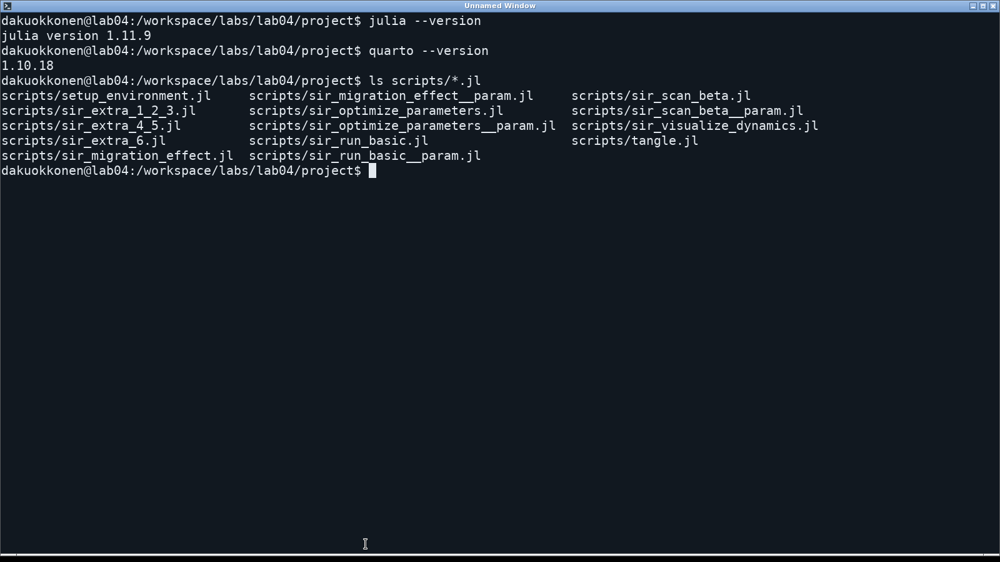{#fig-environment width=94%}

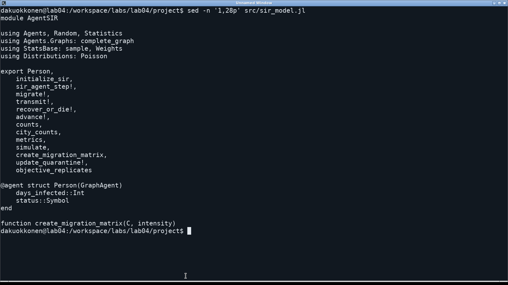{#fig-source width=94%}

## Полный модуль модели

```julia
module AgentSIR

using Agents, Random, Statistics
using Agents.Graphs: complete_graph
using StatsBase: sample, Weights
using Distributions: Poisson

export Person,
    initialize_sir,
    sir_agent_step!,
    migrate!,
    transmit!,
    recover_or_die!,
    advance!,
    counts,
    city_counts,
    metrics,
    simulate,
    create_migration_matrix,
    update_quarantine!,
    objective_replicates

@agent struct Person(GraphAgent)
    days_infected::Int
    status::Symbol
end

function create_migration_matrix(C, intensity)
    C > 1 || throw(ArgumentError("at least two cities required"))
    0 <= intensity <= 1 ||
        throw(ArgumentError("intensity outside [0,1]"))
    M = fill(intensity / (C-1), C, C)
    for i in 1:C
        M[i, i] = 1 - intensity
    end
    M
end

function initialize_sir(;
    Ns = [1000, 1000, 1000],
    migration_rates = nothing,
    β_und = [0.5, 0.5, 0.5],
    β_det = [0.05, 0.05, 0.05],
    infection_period = 14,
    detection_time = 7,
    death_rate = 0.02,
    reinfection_probability = 0.1,
    Is = [0, 0, 1],
    seed = 42,
    n_steps = 100,
    quarantine_threshold = Inf,
)
    C = length(Ns)
    C >= 2 && all(>(0), Ns) ||
        throw(ArgumentError("invalid city populations"))
    length(Is) == length(β_und) == length(β_det) == C ||
        throw(ArgumentError("parameter lengths must equal city count"))
    all(0 .<= Is .<= Ns) ||
        throw(ArgumentError("invalid initial infections"))
    all(>=(0), β_und) && all(>=(0), β_det) ||
        throw(ArgumentError("negative infection rate"))
    infection_period > 0 && detection_time >= 1 ||
        throw(ArgumentError("invalid duration"))
    0 <= death_rate <= 1 && 0 <= reinfection_probability <= 1 ||
        throw(ArgumentError("invalid probability"))
    quarantine_threshold >= 0 ||
        throw(ArgumentError("invalid quarantine threshold"))
    M = if isnothing(migration_rates)
        matrix = [(Ns[i]+Ns[j])/Ns[i] for i in 1:C, j in 1:C]
        matrix ./ sum(matrix; dims = 2)
    else
        Float64.(copy(migration_rates))
    end
    size(M) == (C, C) &&
    all(isfinite, M) &&
    all(>=(0), M) &&
    all(isapprox.(vec(sum(M; dims = 2)), 1.0; atol = 1e-12)) || throw(
        ArgumentError(
            "migration rows must be probability distributions",
        ),
    )
    properties = Dict{Symbol,Any}(
        :Ns=>copy(Ns),
        :β_und=>copy(β_und),
        :β_det=>copy(β_det),
        :migration_rates=>M,
        :infection_period=>infection_period,
        :detection_time=>detection_time,
        :death_rate=>death_rate,
        :reinfection_probability=>reinfection_probability,
        :C=>C,
        :initial_population=>sum(Ns),
        :tick=>0,
        :quarantine_threshold=>quarantine_threshold,
        :closed=>falses(C),
    )
    model = StandardABM(
        Person,
        GraphSpace(complete_graph(C));
        properties,
        rng = Xoshiro(seed),
        agent_step! = sir_agent_step!,
        model_step! = sir_model_step!,
        agents_first = false,
        scheduler = Schedulers.fastest,
    )
    for city in 1:C
        for _ in 1:Ns[city]
            add_agent!(city, model, 0, :S)
        end
        ids = sample(
            abmrng(model),
            collect(ids_in_position(city, model)),
            Is[city];
            replace = false,
        )
        for id in ids
            model[id].status = :I
            model[id].days_infected = 1
        end
    end
    model
end

function migrate!(agent, model)
    target = sample(
        abmrng(model),
        1:model.C,
        Weights(view(model.migration_rates, agent.pos, :)),
    )
    target == agent.pos || move_agent!(agent, target, model)
end

function transmit!(agent, model)
    rate =
        agent.days_infected < model.detection_time ?
        model.β_und[agent.pos] : model.β_det[agent.pos]
    remaining = rand(abmrng(model), Poisson(rate))
    remaining == 0 && return
    contacts = [
        id for id in ids_in_position(agent.pos, model) if id != agent.id
    ]
    shuffle!(abmrng(model), contacts)
    for id in contacts
        contact = model[id]
        susceptible =
            contact.status == :S || (
                contact.status == :R &&
                rand(abmrng(model)) < model.reinfection_probability
            )
        if susceptible
            contact.status = :I
            contact.days_infected = 1
            remaining -= 1
            remaining == 0 && break
        end
    end
    nothing
end

function recover_or_die!(agent, model)
    if agent.status == :I &&
       agent.days_infected >= model.infection_period
        if rand(abmrng(model)) < model.death_rate
            remove_agent!(agent, model)
        else
            agent.status = :R
            agent.days_infected = 0
        end
    end
    nothing
end

function sir_agent_step!(agent, model)
    migrate!(agent, model)
    if agent.status == :I
        transmit!(agent, model)
        agent.days_infected += 1
    end
    recover_or_die!(agent, model)
end

function city_counts(model, city)
    S=0
    I=0
    R=0
    for agent in agents_in_position(city, model)
        S += agent.status == :S
        I += agent.status == :I
        R += agent.status == :R
    end
    (;
        time = model.tick,
        city,
        susceptible = S,
        infected = I,
        recovered = R,
        total = S+I+R,
    )
end

function counts(model)
    S=0
    I=0
    R=0
    for agent in allagents(model)
        S += agent.status == :S
        I += agent.status == :I
        R += agent.status == :R
    end
    (;
        time = model.tick,
        susceptible = S,
        infected = I,
        recovered = R,
        total = S+I+R,
        deaths = model.initial_population-S-I-R,
    )
end

function update_quarantine!(model)
    isfinite(model.quarantine_threshold) || return
    for city in 1:model.C
        c = city_counts(model, city)
        if !model.closed[city] &&
           c.total > 0 &&
           c.infected/c.total > model.quarantine_threshold
            model.migration_rates[city, :] .= 0.0
            model.migration_rates[city, city] = 1.0
            model.closed[city] = true
        end
    end
    nothing
end

function sir_model_step!(model)
    update_quarantine!(model)
    model.tick += 1
end

advance!(model, n = 1) = Agents.step!(model, n)

function metrics(model; n_steps = 100)
    initial = counts(model)
    peak = initial.infected / max(initial.total, 1)
    peak_time = 0
    for day in 1:n_steps
        advance!(model)
        c = counts(model)
        fraction = c.infected / max(c.total, 1)
        if fraction > peak
            peak = fraction
            peak_time = day
        end
    end
    c = counts(model)
    (;
        peak,
        peak_time,
        final_inf = c.infected/max(c.total, 1),
        final_rec = c.recovered/max(c.total, 1),
        deaths = c.deaths,
        death_fraction = c.deaths/model.initial_population,
    )
end

function simulate(; n_steps = 100, kwargs...)
    model = initialize_sir(; kwargs...)
    global_rows = [counts(model)]
    city_rows = [city_counts(model, i) for i in 1:model.C]
    for _ in 1:n_steps
        advance!(model)
        push!(global_rows, counts(model))
        append!(city_rows, [city_counts(model, i) for i in 1:model.C])
    end
    (; model, global_rows, city_rows)
end

function objective_replicates(
    x;
    seeds = 43:47,
    n_steps = 100,
    Ns = [1000, 1000, 1000],
)
    rows = [
        metrics(
            initialize_sir(;
                Ns,
                β_und = fill(x[1], 3),
                β_det = fill(x[1]/10, 3),
                detection_time = round(Int, x[2]),
                death_rate = x[3],
                seed,
            );
            n_steps,
        ) for seed in seeds
    ]
    (;
        peak = mean(r.peak for r in rows),
        death_fraction = mean(r.death_fraction for r in rows),
        max_peak = maximum(r.peak for r in rows),
    )
end

end
```

## Общие функции экспериментов

Функции `beta_scan`, `migration_scan` и `optimize_sir` сохраняют каждый повтор,
а затем формируют агрегаты. В каждом повторе оптимизации создаётся новая
модель и заново вычисляется пик. Это исправляет перенос накопленного пика
между повторами из демонстрационного кода практикума. Координаты оптимизации
однозначны: β, время выявления, вероятность смерти.

```julia
using DrWatson,
    Agents, CSV, DataFrames, Statistics, Random, JLD2, BlackBoxOptim
ENV["GKSwstype"] = "100"
using Plots
include(joinpath(@__DIR__, "sir_model.jl"))
using .AgentSIR
default(
    fontfamily = "DejaVu Sans",
    linewidth = 2,
    size = (1000, 650),
    margin = 6Plots.mm,
)

imagefile(name) =
    (mkpath(projectdir("..", "image")); projectdir("..", "image", name))
datafile(name, file) = (mkpath(datadir(name)); datadir(name, file))

function basic_experiment(name = "sir_run_basic"; kwargs...)
    result = simulate(; kwargs...)
    df, cities =
        DataFrame(result.global_rows), DataFrame(result.city_rows)
    CSV.write(datafile(name, "trajectory.csv"), df)
    CSV.write(datafile(name, "cities.csv"), cities)
    agent_df = select(df, :time, :susceptible, :infected, :recovered)
    model_df = select(df, :time, :total, :deaths)
    jldsave(datafile(name, "sir_basic_agent.jld2"); agent_df)
    jldsave(datafile(name, "sir_basic_model.jld2"); model_df)
    fig = plot(
        df.time,
        [df.susceptible df.infected df.recovered];
        label = ["S" "I" "R"],
        xlabel = "Дни",
        ylabel = "Число людей",
        title = "Агентная SIR",
    )
    plot!(fig, df.time, df.total; label = "Живые", linestyle = :dash)
    (; df, cities, fig)
end

function beta_scan(
    name = "sir_scan_beta";
    infection_period = 14,
    betas = 0.1:0.1:1.0,
    seeds = [42, 43, 44],
    kwargs...,
)
    rows = NamedTuple[]
    for beta in betas, seed in seeds
        model = initialize_sir(;
            β_und = fill(beta, 3),
            β_det = fill(beta/10, 3),
            seed,
            infection_period,
            kwargs...,
        )
        push!(
            rows,
            merge((; beta, seed, infection_period), metrics(model)),
        )
    end
    df = DataFrame(rows)
    CSV.write(datafile(name, "beta_scan_all.csv"), df)
    grouped = combine(
        groupby(df, :beta),
        :peak=>mean=>:peak,
        :final_inf=>mean=>:final_inf,
        :final_rec=>mean=>:final_rec,
        :deaths=>mean=>:deaths,
        :death_fraction=>mean=>:death_fraction,
    )
    CSV.write(datafile(name, "summary.csv"), grouped)
    fig = plot(
        grouped.beta,
        [grouped.peak grouped.final_inf grouped.death_fraction];
        label = ["Пик I / живые" "Конечная I / живые" "Умершие / N₀"],
        xlabel = "β",
        ylabel = "Доля",
        marker = :circle,
        title = "Средние по трём seed",
    )
    (; df, grouped, fig)
end

function migration_scan(
    name = "sir_migration_effect";
    threshold = Inf,
    intensities = 0.0:0.1:0.5,
    seeds = [42, 43, 44],
    kwargs...,
)
    rows = NamedTuple[]
    for intensity in intensities, seed in seeds
        model = initialize_sir(;
            migration_rates = create_migration_matrix(3, intensity),
            Is = [1, 0, 0],
            seed,
            quarantine_threshold = threshold,
            kwargs...,
        )
        push!(
            rows,
            merge((; intensity, seed), metrics(model; n_steps = 150)),
        )
    end
    df = DataFrame(rows)
    CSV.write(datafile(name, "migration_scan_all.csv"), df)
    grouped = combine(
        groupby(df, :intensity),
        :peak_time=>mean=>:peak_time,
        :peak=>mean=>:peak,
    )
    CSV.write(datafile(name, "summary.csv"), grouped)
    p1 = plot(
        grouped.intensity,
        grouped.peak_time;
        label = "Время пика",
        xlabel = "Интенсивность миграции",
        ylabel = "Дни",
        marker = :circle,
    )
    p2 = plot(
        grouped.intensity,
        grouped.peak;
        label = "Доля I среди живых в пике",
        xlabel = "Интенсивность миграции",
        ylabel = "Доля",
        marker = :circle,
    )
    (;
        df,
        grouped,
        fig = plot(p1, p2; layout = (2, 1), size = (1000, 850)),
    )
end

function optimize_sir(
    name = "sir_optimize_parameters";
    budget = 120.0,
    seeds = 43:47,
)
    rows = NamedTuple[]
    function cost(x)
        result = objective_replicates(x; seeds)
        push!(
            rows,
            (
                beta = x[1],
                detection_time = round(Int, x[2]),
                death_rate = x[3],
                peak = result.peak,
                death_fraction = result.death_fraction,
            ),
        )
        (result.peak, result.death_fraction)
    end
    cost([0.5, 7.0, 0.02])
    Random.seed!(202604)
    result = bboptimize(
        cost;
        Method = :borg_moea,
        FitnessScheme = ParetoFitnessScheme{2}(is_minimizing = true),
        SearchRange = [(0.1, 1.0), (3.0, 14.0), (0.01, 0.1)],
        NumDimensions = 3,
        MaxTime = budget,
        TraceMode = :silent,
    )
    best, fitness = best_candidate(result), best_fitness(result)
    df = DataFrame(rows)
    frontier = [
        i for i in 1:nrow(df) if !any(
            j ->
                df.peak[j]<=df.peak[i] &&
                df.death_fraction[j]<=df.death_fraction[i] &&
                (
                    df.peak[j]<df.peak[i] ||
                    df.death_fraction[j]<df.death_fraction[i]
                ),
            1:nrow(df),
        )
    ]
    pareto = unique(df[frontier, :])
    CSV.write(datafile(name, "evaluations.csv"), df)
    CSV.write(datafile(name, "pareto.csv"), pareto)
    jldsave(
        datafile(name, "optimization_result.jld2");
        best,
        fitness,
        seeds = collect(seeds),
        budget,
        evaluations = nrow(df),
    )
    fig = scatter(
        df.peak,
        df.death_fraction;
        label = "Оценённые параметры",
        alpha = 0.5,
        xlabel = "Средний пик I / живые",
        ylabel = "Средняя доля умерших / N₀",
    )
    scatter!(
        fig,
        pareto.peak,
        pareto.death_fraction;
        label = "Недоминируемые решения",
        color = :red,
    )
    (; df, pareto, best, fitness, fig)
end

function comprehensive_analysis(
    path = datafile("sir_scan_beta", "beta_scan_all.csv"),
)
    isfile(path) ||
        error("Run sir_scan_beta.jl before analysing its saved CSV")
    df = CSV.read(path, DataFrame)
    grouped = combine(
        groupby(df, :beta),
        :peak=>mean=>:peak,
        :final_inf=>mean=>:final_inf,
        :deaths=>mean=>:deaths,
        :final_rec=>mean=>:final_rec,
    )
    p1 = plot(
        grouped.beta,
        [grouped.peak grouped.final_inf];
        label = ["Пик" "Конечная I"],
        ylabel = "Доля среди живых",
    )
    p2 = plot(
        grouped.beta,
        grouped.deaths;
        label = "Умершие",
        ylabel = "Число людей",
    )
    p3 = plot(
        grouped.beta,
        grouped.final_rec;
        label = "Выздоровевшие",
        ylabel = "Доля среди живых",
        xlabel = "β",
    )
    (;
        grouped,
        fig = plot(p1, p2, p3; layout = (3, 1), size = (1000, 1050)),
    )
end
```

# Основные эксперименты

## Базовая динамика SIR



{#fig-basic width=100%}

| День | S | I | R | Живые | Умершие |
| --- | --- | --- | --- | --- | --- |
| 0 | 2 999 | 1 | 0 | 3 000 | 0 |
| 10 | 2 647 | 353 | 0 | 3 000 | 0 |
| 15 | 0 | 3 000 | 0 | 3 000 | 0 |
| 30 | 0 | 2 951 | 1 | 2 952 | 48 |
| 60 | 0 | 2 818 | 14 | 2 832 | 168 |
| 100 | 0 | 2 640 | 25 | 2 665 | 335 |

: Контрольные точки базовой траектории {#tbl-basic}

Пик 100% среди живых впервые достигается на 15-й день. К дню 100 остаётся 2665 человек, из них I = 2640 и R = 25; умерло 335 человек (11,167% от N₀). Высокий пик согласуется с реализованным алгоритмом повторного заражения и последовательных контактов, а не с ошибкой округления долей.

Базовую динамику (@fig-basic) нельзя трактовать как обычную SIR без повторного заражения:
R здесь не является необратимо выбывшей группой. Уменьшение числа живых
проверяется отдельным балансом, а не требованием постоянства $S+I+R$.

## Сканирование интенсивности заражения

Использована сетка β = 0,1; 0,2; …; 1,0. Для каждого значения выполнены
три независимых запуска с seed 42, 43, 44; интенсивность после выявления
равна β/10. Горизонт каждого запуска — 100 дней. Сохранены все 30 строк
и средние по β, а не только график.



{#fig-beta width=100%}



| β | Средний пик | Конечная I | Конечная R | Умершие |
| --- | --- | --- | --- | --- |
| 0,1 | 0,000889 | 0 | 0,001111 | 0 |
| 0,2 | 0,332206 | 0,319967 | 0,01381 | 44 |
| 0,3 | 0,666659 | 0,643955 | 0,022823 | 208 |
| 0,4 | 0,666889 | 0,629722 | 0,037167 | 226,667 |
| 0,5 | 1 | 0,996625 | 0,003375 | 317,667 |
| 0,6 | 1 | 0,993352 | 0,006648 | 348 |
| 0,7 | 1 | 0,962127 | 0,037873 | 361,333 |
| 0,8 | 1 | 0,946348 | 0,053652 | 356,333 |
| 0,9 | 1 | 0,963478 | 0,036522 | 385,667 |
| 1 | 1 | 1 | 0 | 407,333 |

: Средние результаты 30 запусков {#tbl-beta}

Ступенчатые средние не означают детерминированный порог. При одном исходном
инфицированном отдельная стохастическая цепочка может рано погаснуть;
в других повторах с той же β развивается вспышка. Три повтора позволяют
увидеть это различие, но недостаточны для точной оценки вероятности эпидемии.

## Влияние миграции

Начальная инфекция в этом опыте помещена в первый город: `Is=[1,0,0]`.
Проверены m = 0; 0,1; …; 0,5, по три seed, горизонт увеличен до 150 дней.
Сравниваются время первого максимума и пиковая доля заражённых.



{#fig-migration width=90%}

| m | Средний день пика | Средний пик |
| --- | --- | --- |
| 0 | 15 | 0,333259 |
| 0,1 | 22 | 1 |
| 0,2 | 16 | 1 |
| 0,3 | 17 | 1 |
| 0,4 | 19 | 1 |
| 0,5 | 20 | 1 |

: Миграционная серия: по три seed {#tbl-migration}

Среди ненулевых интенсивностей наименьшее среднее время пика в данной сетке имеет m = 0,2: 16 дней. Монотонное ускорение с ростом m не наблюдается. При нулевой миграции пик охватывает приблизительно треть исходного населения, тогда как в ненулевых вариантах инфекция достигает всех городов.

При m = 0 инфекция остаётся в исходном городе. Малое время локального
максимума нельзя автоматически считать наиболее быстрым распространением
по всем трём городам: величины охваченных популяций различаются.

## Многокритериальная оптимизация

Минимизируются средний пиковый уровень инфекции и средняя доля умерших.
Поиск BorgMOEA изменяет β ∈ [0,1; 1,0], время выявления от 3 до 14 дней
и вероятность смерти от 0,01 до 0,10. Время округляется до целого дня.
Каждая оценка использует пять независимых моделей с seed 43–47. Для
оптимизатора задан `MaxTime=120` секунд; загрузка, прогрев и начальная
оценка популяции могут увеличивать общее время запуска сценария.



{#fig-pareto width=100%}

Сохранено 53 оценок, включая прогрев. Недоминируемых уникальных строк: 1.



| β | Выявление | Вероятность смерти | Средний пик | Смертность |
| --- | --- | --- | --- | --- |
| 0,104035 | 4 | 0,083815 | 0,0004 | 0 |

: Недоминируемые оценённые параметры {#tbl-pareto}

Недоминируемый набор построен по фактически оценённым кандидатам: решение
исключается, если другое не хуже по обоим критериям и строго лучше хотя бы
по одному. Это приближённый результат ограниченного по времени поиска,
а не доказанный глобальный фронт. При раннем затухании цепочки обе цели
могут почти обнулиться, поэтому подобный результат не доказывает уникальность
найденных параметров.

## Анализ ранее сохранённых данных

`sir_visualize_dynamics.jl` читает CSV сканирования и строит три панели:
пиковая и конечная инфекция, число умерших и конечная доля выздоровевших.
Повторного моделирования этот сценарий не выполняет.



{#fig-csv width=85%}

# Параметрические варианты

## Длительность инфекции

Сравниваются 10 и 14 дней при одинаковых остальных параметрах и seed.
Изменение длительности влияет не только на продолжительность заразности,
но и на число циклов повторного заражения за фиксированный горизонт.



{#fig-period width=100%}

## Выявление инфекции

Повторено полное сканирование β для обнаружения на 3-й и 7-й день:
два варианта по 30 запусков. Уменьшение периода высокой интенсивности
до выявления меняет вероятность устойчивой цепочки заражений.



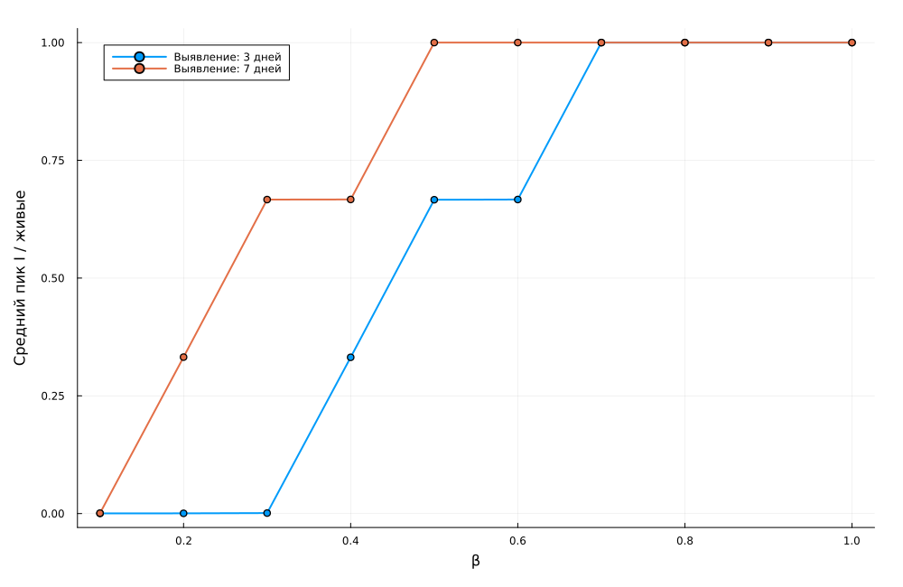{#fig-detection width=100%}

## Неодинаковые города

Сравниваются населения [1000,1000,1000] и [500,1000,1500]. Общее N₀ равно
3000 в обоих случаях. Для каждого варианта повторяется серия из 18 запусков
с той же сеткой миграции и тремя seed.



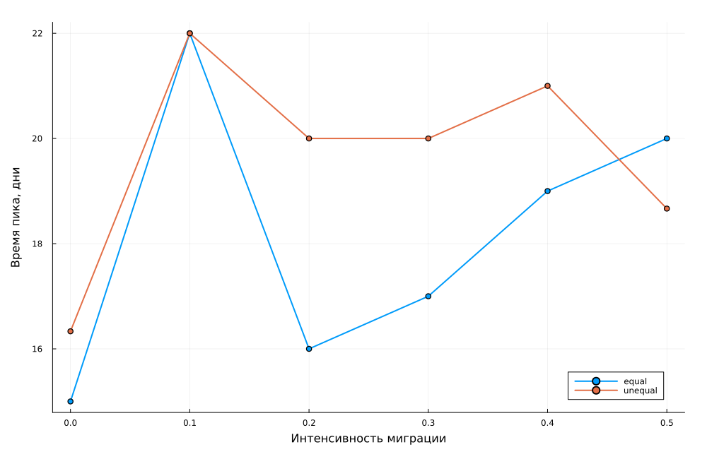{#fig-populations width=100%}

## Устойчивость оптимизации к набору повторов

Второй поиск использует seed 143–147 при прежних диапазонах параметров и
том же временном бюджете. Это независимая проверка чувствительности цели
к случайным траекториям, а не повтор первого опыта с новым именем файла.



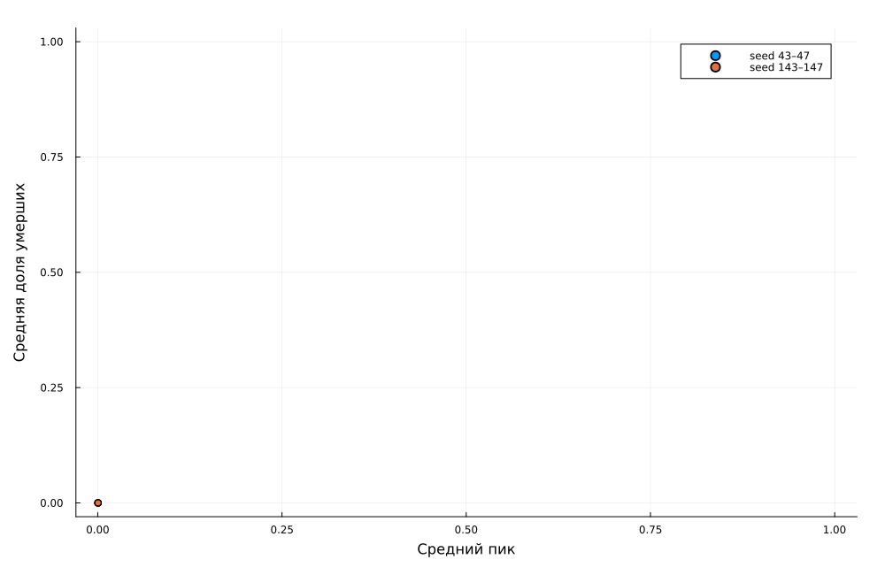{#fig-opt-seeds width=100%}



| Выявление | β | Средний пик | Средняя смертность |
| --- | --- | --- | --- |
| 3 | 0,1 | 0,000444 | 0 |
| 3 | 0,5 | 0,666331 | 0,055 |
| 3 | 1 | 1 | 0,129111 |
| 7 | 0,1 | 0,000889 | 0 |
| 7 | 0,5 | 1 | 0,105889 |
| 7 | 1 | 1 | 0,135778 |

: Избранные точки двух полных сканирований {#tbl-detection}

| β | Выявление | Вероятность смерти | Средний пик | Смертность |
| --- | --- | --- | --- | --- |
| 0,115295 | 4 | 0,096481 | 0,0004 | 0 |
| 0,104035 | 4 | 0,083815 | 0,0004 | 0 |

: Недоминируемые параметры на seed 143–147 {#tbl-pareto-second}

Оба поиска находят режимы с низкой интенсивностью передачи и ранним выявлением. Совпадающие или близкие цели не означают, что параметры оценены единственным образом: раннее затухание оставляет мало событий для различения кандидатов.

# Дополнительные задания

## Задания 1–3: R₀, порог и гетерогенность

По формуле-ориентиру из задания $R_0=\beta/\gamma$, где $\gamma=1/14$,
в базовом опыте получаем $R_0=7$. Условие $R_0>1$ указывает на возможность
распространения в упрощённой ОДУ-модели. В агентной реализации действуют
выявление, повторное заражение, миграция и особое правило контактов, поэтому
эта оценка не является точным критерием её стохастического порога.

Для эмпирического поиска использована дополнительная сетка β = 0,02; 0,04;
…; 0,20, по три повтора. Порогом на этой сетке назван первый β со средним
пиком выше 5%. Это явно выбранный критерий: другой уровень пика или большее
число повторов может изменить оценку.

В гетерогенном опыте интенсивности до выявления равны [0,2; 0,5; 0,8],
после выявления — [0,02; 0,05; 0,08]. Сохранены отдельные SIR-ряды городов
и сравнение суммарной инфекции с однородным базовым опытом.



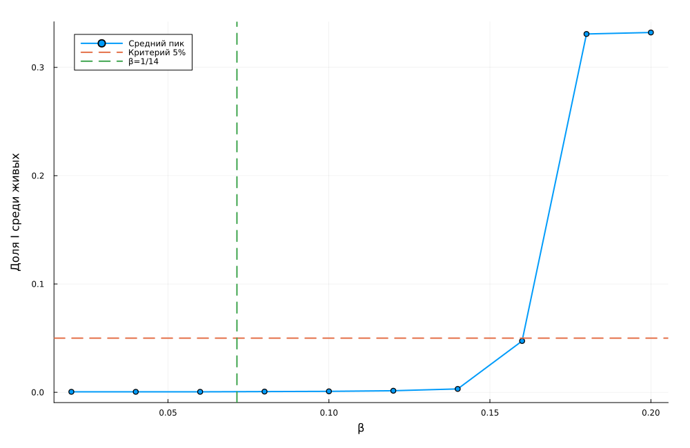{#fig-threshold width=100%}

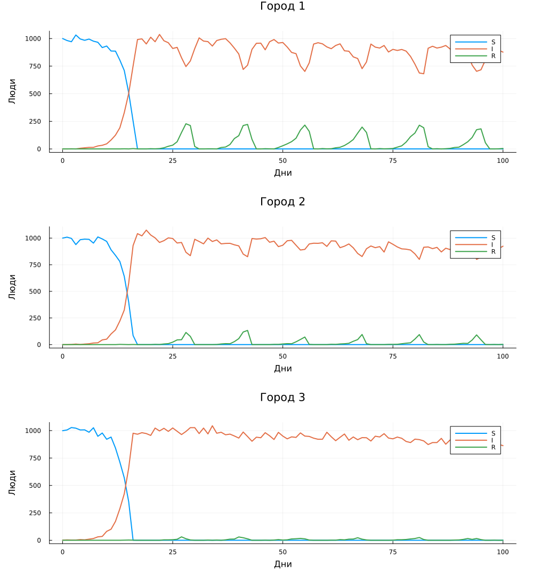{#fig-heterogeneous width=85%}

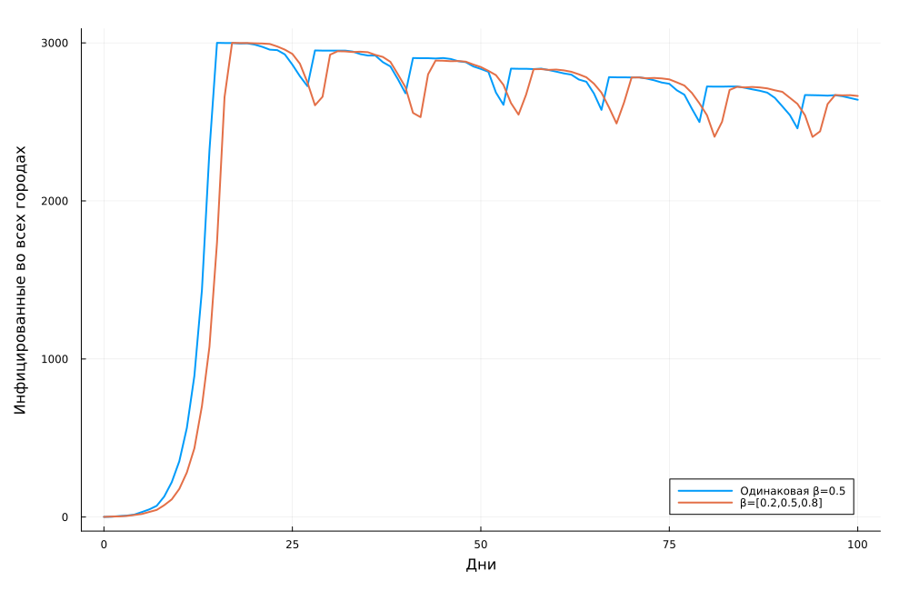{#fig-hetero-total width=100%}

Первое значение сетки со средним пиком выше 5% равно β = 0,18. Простой ориентир 1/14 ≈ 0,07143 значительно меньше. Это различие ожидаемо при несовпадении правил агентной и ОДУ-модели; оно не устанавливает точный аналитический порог агентной системы.

В неоднородном опыте к дню 100 получено I = 2664, R = 6, число умерших — 330. Миграция связывает города, поэтому их нельзя интерпретировать как три независимые SIR с разными β.

## Задания 4–5: миграция и карантин

Для задания 4 найден минимум среднего времени пика в базовой миграционной
серии. Для задания 5 при доле заражённых в городе выше 10% его исходящая
миграция запрещается: строка матрицы заменяется единичным диагональным
элементом. Входящие перемещения из других городов остаются возможными.
Карантин проверяется перед агентными действиями нового дня и не отменяется.

Сравнение выполнено попарно по одинаковым m и seed. Снижение пика определяется
как значение без карантина минус значение с карантином; положительная задержка
означает более поздний пик при карантине. Совпадение seed само по себе
не делает дальнейшие случайные события идентичными после изменения модели.



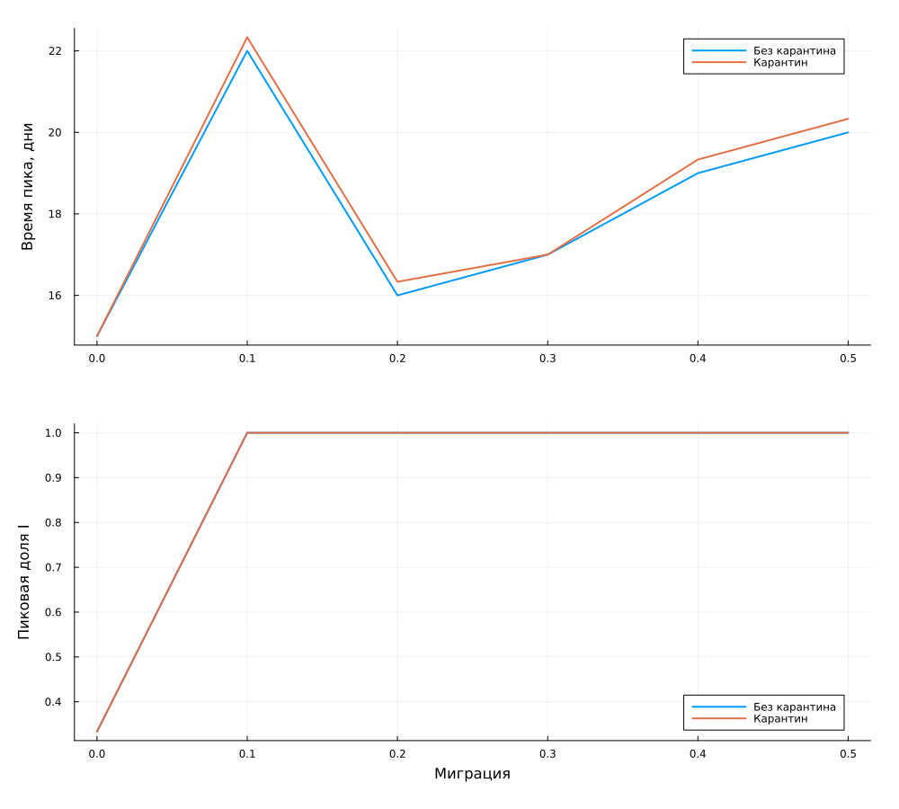{#fig-quarantine width=90%}

| m | Снижение пика | Задержка пика, дни |
| --- | --- | --- |
| 0 | 0 | 0 |
| 0,1 | 0 | 0,333 |
| 0,2 | 0 | 0,333 |
| 0,3 | 0 | 0 |
| 0,4 | 0 | 0,333 |
| 0,5 | 0 | 0,333 |

: Парные средние изменения при карантине {#tbl-quarantine}

В выполненной серии снижение пика равно нулю для всех шести интенсивностей. Средняя задержка не превышает 0,333 дня. К моменту превышения порога инфекция уже может присутствовать в других городах, а правило закрывает только исходящие поездки. Поэтому эта реализация карантина не обеспечивает заметного подавления эпидемии; иной механизм ограничений нужно исследовать отдельно.

## Задание 6: минимизация смертности с ограничением

Применён дифференциальный эволюционный поиск. Целевая функция равна средней
доле умерших, если пик ниже 30% во всех пяти обучающих повторах. Иначе
возвращается штраф $1+\max p_{\max}$. Это более строгое конечновыборочное
ограничение, чем ограничение только на средний пик.

После поиска результат отдельно проверяется на двадцати новых seed
1001–1020. Параметры, обучающий максимум, проверочный максимум и логический
результат сохраняются в CSV. Успешная конечная проверка не является
гарантией для всех возможных случайных траекторий.



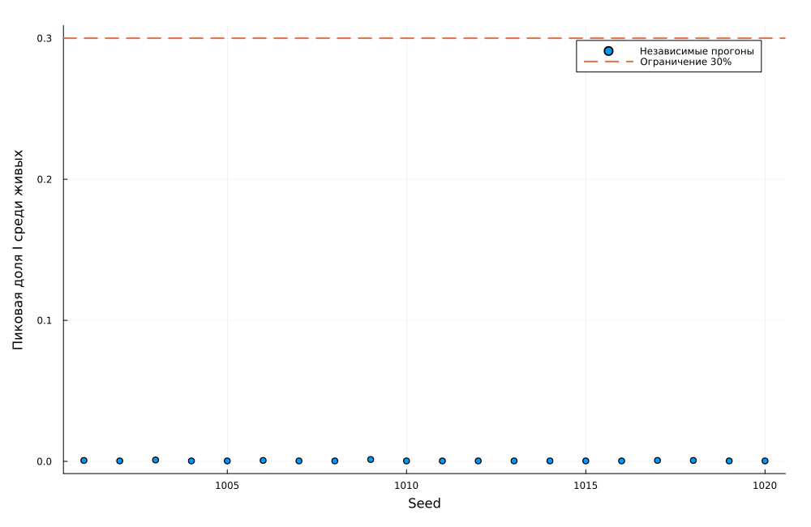{#fig-constrained width=100%}

| β | Выявление | Вероятность смерти | Пик обучения | Пик проверки |
| --- | --- | --- | --- | --- |
| 0,1 | 3 | 0,01 | 0,000667 | 0,001333 |

: Параметры ограниченной оптимизации {#tbl-constrained}

Ограничение выполнено в 20 из 20 независимых проверочных прогонов. Наибольшая проверочная доля I равна 0,133%, суммарное число умерших в этих прогонах — 0. Найденный режим лежит у нижних границ β и времени выявления. При заданном наборе параметров ранние цепочки заражений обычно затухают; малое число наблюдаемых смертей на конечной выборке не означает нулевого риска для любого seed.

# Литературное программирование и Jupyter

Для всех двенадцати сценариев создаются чистый Julia-файл, QMD, выполненный
IPYNB и читаемая HTML-страница. Порядок сборки учитывает зависимости: анализ
CSV и сравнительные дополнительные задания выполняются после основных
серий. Статические QMD-фрагменты включены непосредственно в настоящий отчёт.

```julia
using DrWatson
@quickactivate "project"
using Literate

execute_notebooks = "--execute" in ARGS
sources = filter(!=("--execute"), ARGS)
for source in sources
    name = splitext(basename(source))[1]
    Literate.script(source, scriptsdir(name); name, credit = false)
    Literate.notebook(
        source,
        projectdir("notebooks", name);
        name,
        execute = execute_notebooks,
        credit = false,
    )
    Literate.markdown(
        source,
        projectdir("markdown", name);
        name,
        flavor = Literate.QuartoFlavor(),
        credit = false,
    )
    # A static derivative is included in the report without repeating calculations.
    Literate.markdown(
        source,
        projectdir("markdown", name);
        name = name*"-report",
        flavor = Literate.QuartoFlavor(),
        credit = false,
        postprocess = text -> replace(
            replace(text, "```{julia}"=>"```julia"),
            r"^(#{1,4}) "m => heading -> "##"*heading,
        ),
    )
end
```

```bash
make notebooks
make docs
jupyter lab --ip=0.0.0.0 --port=8888 --no-browser
```

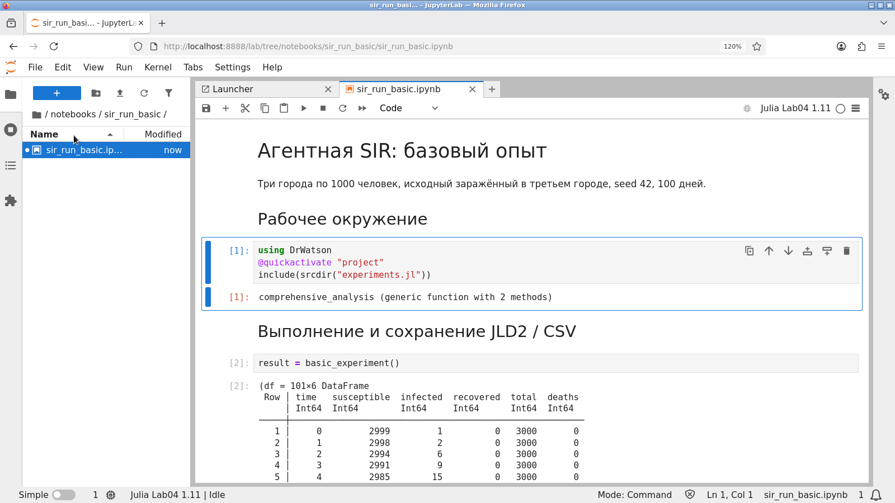{#fig-notebook-1 width=94%}

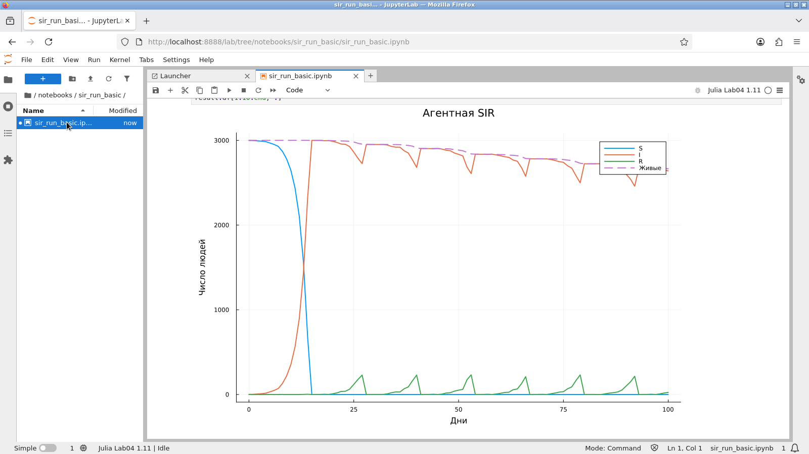{#fig-notebook-2 width=94%}



::: {tbl-colwidths="[62,10,14,14]"}

| Блокнот | Ячеек | Готово | Ошибок |
| --- | --- | --- | --- |
| `sir_extra_1_2_3` | 4 | 4 | 0 |
| `sir_extra_4_5` | 4 | 4 | 0 |
| `sir_extra_6` | 4 | 4 | 0 |
| `sir_migration_effect` | 3 | 3 | 0 |
| `sir_migration_effect__param` | 3 | 3 | 0 |
| `sir_optimize_parameters` | 3 | 3 | 0 |
| `sir_optimize_parameters__param` | 3 | 3 | 0 |
| `sir_run_basic` | 3 | 3 | 0 |
| `sir_run_basic__param` | 3 | 3 | 0 |
| `sir_scan_beta` | 3 | 3 | 0 |
| `sir_scan_beta__param` | 3 | 3 | 0 |
| `sir_visualize_dynamics` | 3 | 3 | 0 |

: Проверка выполненных блокнотов {#tbl-notebooks}

:::

# Тестирование и воспроизведение

Проверяются начальное число людей и заражённых, нормировка миграции, запрет
недопустимых вероятностей, равенство $S+I+R+D=N_0$, воспроизводимость,
предельные случаи без заражения и с нулевой/единичной смертностью, карантин
и независимость повторов целевой функции от порядка seed.

```julia
using Test, Agents
include("../src/sir_model.jl")
using .AgentSIR

@testset "SIR: initial state and probabilities" begin
    m = initialize_sir()
    @test counts(m).total == 3000
    @test counts(m).infected == 1
    @test city_counts(m, 3).infected == 1
    @test all(vec(sum(m.migration_rates; dims = 2)) .≈ 1)
    M = create_migration_matrix(3, 0.3)
    @test M[1, 1] ≈ 0.7
    @test M[1, 2] ≈ 0.15
    @test_throws ArgumentError create_migration_matrix(3, 1.1)
    @test_throws ArgumentError initialize_sir(death_rate = -0.1)
    @test_throws ArgumentError initialize_sir(
        Ns = [10, 10, 10],
        Is = [11, 0, 0],
    )
    @test_throws ArgumentError initialize_sir(
        migration_rates = zeros(3, 3),
    )
end

@testset "SIR: reproducibility and accounting" begin
    a, b = initialize_sir(Ns = [50, 50, 50]),
    initialize_sir(Ns = [50, 50, 50])
    for _ in 1:20
        advance!(a)
        advance!(b)
        @test counts(a) == counts(b)
        c = counts(a)
        @test c.susceptible+c.infected+c.recovered+c.deaths == 150
        @test c.total == nagents(a)
        @test sum(city_counts(a, i).total for i in 1:3) == c.total
    end
end

@testset "SIR: limiting cases" begin
    m = initialize_sir(Ns = [10, 10, 10], Is = [0, 0, 0])
    advance!(m, 30)
    @test counts(m).infected == 0
    @test counts(m).deaths == 0
    m = initialize_sir(
        Ns = [10, 10, 10],
        β_und = zeros(3),
        β_det = zeros(3),
        death_rate = 0.0,
    )
    advance!(m, 20)
    @test counts(m).recovered == 1
    @test counts(m).total == 30
    m = initialize_sir(
        Ns = [10, 10, 10],
        β_und = zeros(3),
        β_det = zeros(3),
        death_rate = 1.0,
    )
    advance!(m, 20)
    @test counts(m).deaths == 1
    @test counts(m).total == 29
end

@testset "SIR: quarantine and independent replicates" begin
    M = create_migration_matrix(3, 0.3)
    m = initialize_sir(
        Ns = [10, 10, 10],
        Is = [2, 0, 0],
        migration_rates = M,
        quarantine_threshold = 0.1,
    )
    update_quarantine!(m)
    @test m.closed == [true, false, false]
    @test m.migration_rates[1, :] == [1, 0, 0]
    @test m.migration_rates[2, :] == M[2, :]
    @test M[1, 2] ≈ 0.15
    x = [0.1, 3.0, 0.01]
    forward = objective_replicates(
        x;
        seeds = 43:45,
        Ns = [20, 20, 20],
        n_steps = 20,
    )
    backward = objective_replicates(
        x;
        seeds = 45:-1:43,
        Ns = [20, 20, 20],
        n_steps = 20,
    )
    @test forward.peak ≈ backward.peak
    @test forward.death_fraction ≈ backward.death_fraction
    @test forward.max_peak == backward.max_peak
end
```

Повторный запуск завершился успешно: 103 проверок.

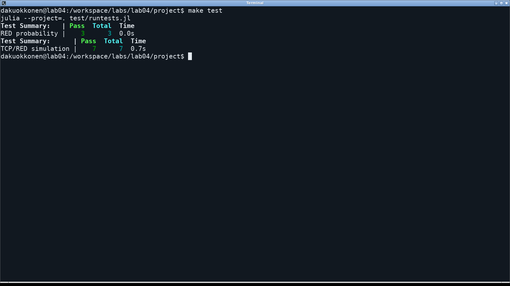{#fig-tests width=94%}

Полный расчёт запускается командой `make all` в каталоге проекта. После него
отчёт собирается из своего каталога:

```bash
cd ../report
make all
```

Закреплённое окружение и seed обеспечивают повторяемость отдельного прогона.
У ограниченной по времени оптимизации число оценённых кандидатов зависит
от скорости машины и прогрева; поэтому конкретный найденный набор может
измениться. Для проверки опубликованного результата сохранены параметры
и оценки, а не только рисунок фронта.

# Выводы

Выполнены пять основных сценариев, четыре параметрических расширения и все шесть дополнительных заданий в трёх отдельных файлах. Миграция обеспечивает распространение между городами, а раннее выявление сокращает период высокой заразности. Повторное заражение и последовательное обновление допускают пики, близкие к полной доле живой популяции.

Эмпирический порог по выбранному критерию на сетке равен 0,18, но не совпадает с ориентиром ОДУ 1/14. Заданный карантин почти не задерживает пик и в выполненных повторах не уменьшает его величину. Ограниченная оптимизация прошла проверку на 20 новых seed, однако конечная проверка не даёт гарантии для всех траекторий.

Все данные, литературные исходники, выполненные блокноты и результаты проверок сохранены. Выводы относятся к учебному алгоритму и указанным параметрам; модель не калибрована по реальной эпидемии.

# Источники

1. Королькова А. В., Кулябов Д. С. *Имитационное моделирование. Практикум*.
   Глава 4 «Агентная модель SIR», стр. 137–164.
2. Agents.jl. Документация: <https://juliadynamics.github.io/Agents.jl/stable/>.
3. BlackBoxOptim.jl. Методы оптимизации и многокритериальная схема:
   <https://github.com/robertfeldt/BlackBoxOptim.jl>.
4. DrWatson.jl. Документация: <https://juliadynamics.github.io/DrWatson.jl/stable/>.
5. Literate.jl. Документация: <https://fredrikekre.github.io/Literate.jl/v2/>.
6. Plots.jl. Документация: <https://docs.juliaplots.org/stable/>.
