---
author:
  name: Куокконен Дарина Андреевна
  affiliation:
    - name: Российский университет дружбы народов имени Патриса Лумумбы
      country: Российская Федерация
      city: Москва
      address: ул. Миклухо-Маклая, д. 6
title: "Лабораторная работа № 5"
subtitle: "Сети Петри и задача обедающих философов"
institute: "НФИбд-01-23"
date: 2026-08-31
date-format: "YYYY-MM-DD"
lang: ru-RU
---

# Вводная часть

## Цель и задачи

**Цель:** исследовать deadlock при конкурентном доступе к ресурсам и проверить
способ его предотвращения с помощью арбитра.

- построить две сети Петри для пяти философов;
- реализовать алгоритм Гиллеспи и ODE-аппроксимацию;
- определить deadlock, производительность и равномерность;
- выполнить базовый и параметрический эксперименты.
- анимировать классическую сеть и отдельно проанализировать CSV.

## Формализм сети Петри

$$
N=(P,T,F,M_0), \qquad M'=M+(I^+-I^-)_{\cdot j}.
$$

| Элемент | Представление |
|---|---|
| позиции | состояния и ресурсы |
| переходы | атомарные события |
| фишки | доступные ресурсы |
| маркировка | текущее состояние |

## Постановка задачи

Пять философов поочерёдно размышляют и едят. Для еды требуются две соседние
вилки.

- `Think_i` — философ размышляет;
- `Hungry_i` — удерживает левую вилку;
- `Eat_i` — удерживает обе вилки;
- `Fork_i` — вилка свободна.

# Модели

## Классическая сеть

Каждый философ сначала выполняет `GetLeft_i`, затем `GetRight_i`.

Если все пять переходов `GetLeft_i` сработали раньше `GetRight_i`, каждая
вилка занята, а разрешённых переходов нет.

**Результат:** циклическое ожидание и глобальный deadlock.

## Сеть с арбитром

Добавлена позиция `Arbiter` с четырьмя фишками.

- переход `GetLeft_i` потребляет разрешение;
- `PutForks_i` возвращает разрешение;
- одновременно начать захват могут не более четырёх философов.

Один процесс остаётся вне цикла ожидания, поэтому система продолжает работу.

## Матрица инцидентности

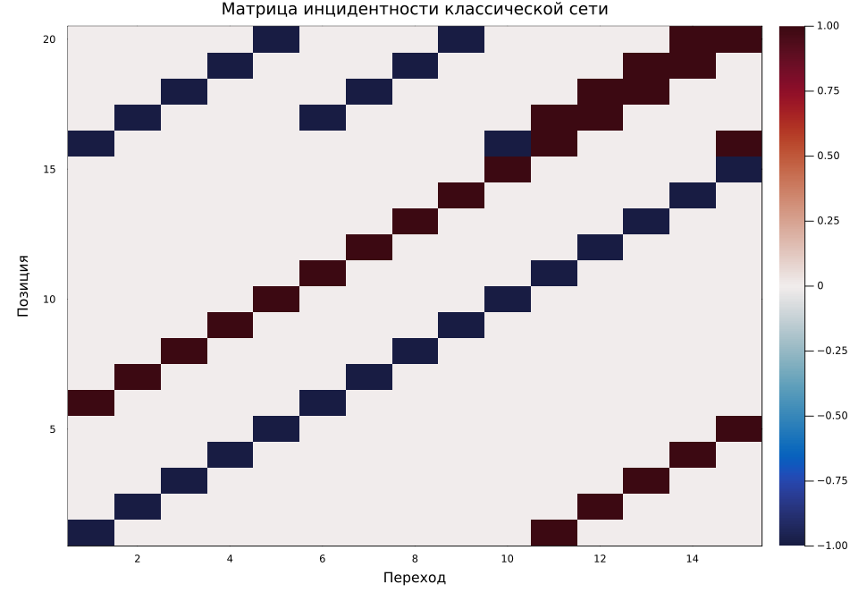

## Стохастический алгоритм

Для разрешённых переходов:

$$
\Delta t\sim\operatorname{Exp}\!\left(\sum_j\lambda_j\right),
\qquad
P(J=j)=\frac{\lambda_j}{\sum_k\lambda_k}.
$$

| `GetLeft` | `GetRight` | `PutForks` |
|---:|---:|---:|
| 2,0 | 1,0 | 1,4 |

## Вычислительный конвейер

`Literate.jl` → `Julia` → `Jupyter` → `Quarto`

:::::::::::::: {.columns align=center}
::: {.column width="62%"}
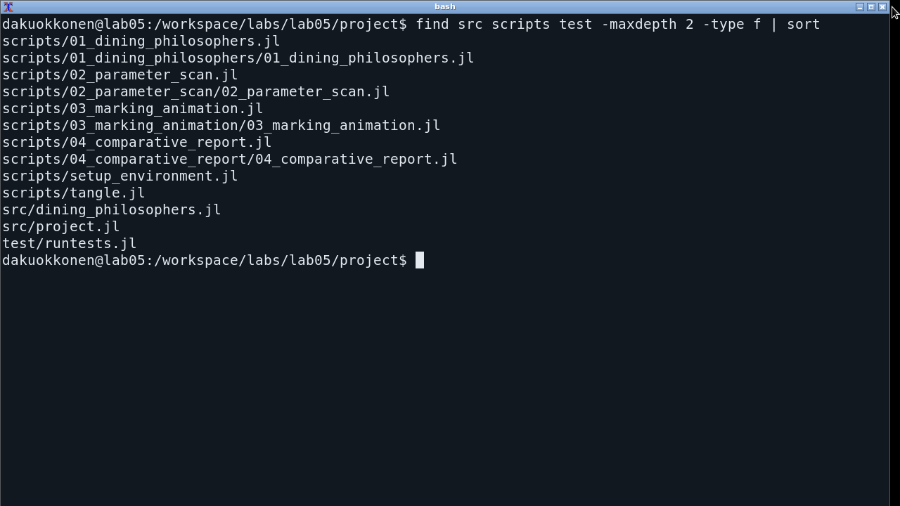
:::
::: {.column width="38%"}

- Julia 1.11.9
- DifferentialEquations.jl
- DataFrames.jl и CSV.jl
- Plots.jl
- 4 выполненных блокнота
- 56 автоматических проверок

:::
::::::::::::::

# Результаты

## Базовый эксперимент

| Показатель | Классическая | С арбитром |
|---|---:|---:|
| Deadlock | да | нет |
| События | 5 | 98 |
| Приёмы пищи | 0 | 31 |
| Индекс Джейна | 0,0000 | 0,9109 |

## Классическая маркировка

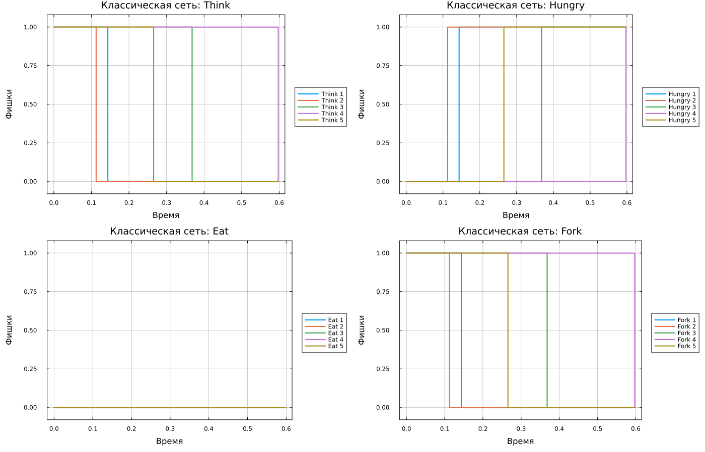

После пяти событий все философы удерживают левые вилки. Система остановилась
при $t=0{,}5973$.

## Маркировка с арбитром

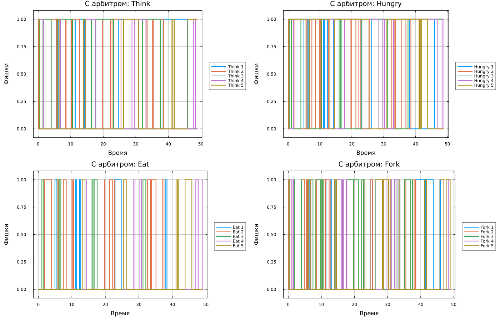

Арбитр сохраняет активность сети на всём горизонте моделирования.

## Отдельный анализ CSV

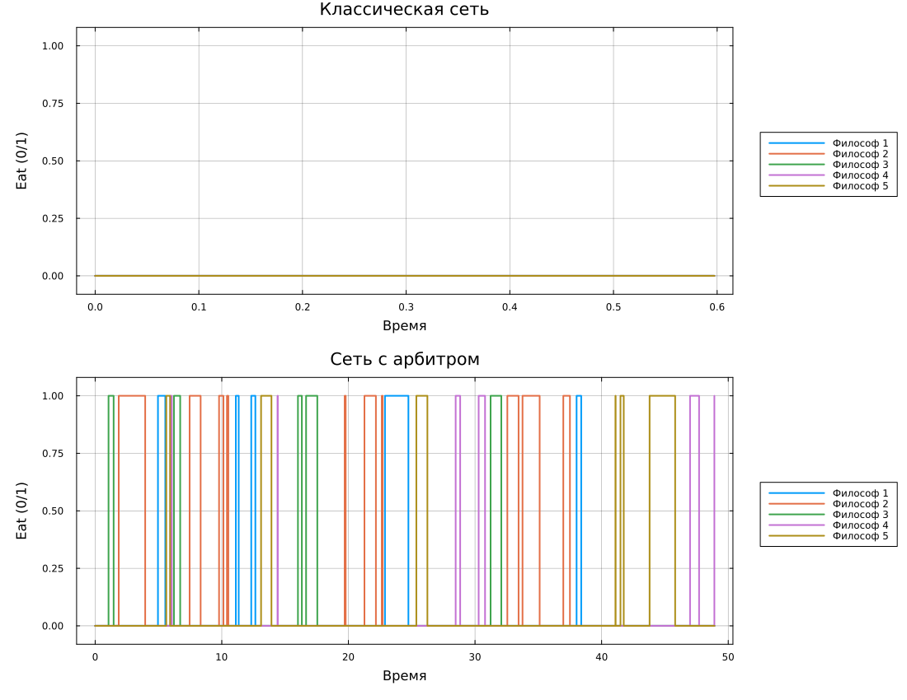

`04_comparative_report.jl` читает сохранённые траектории без нового расчёта:
6 строк для классической сети и 99 — для сети с арбитром.

## Анимация классической сети

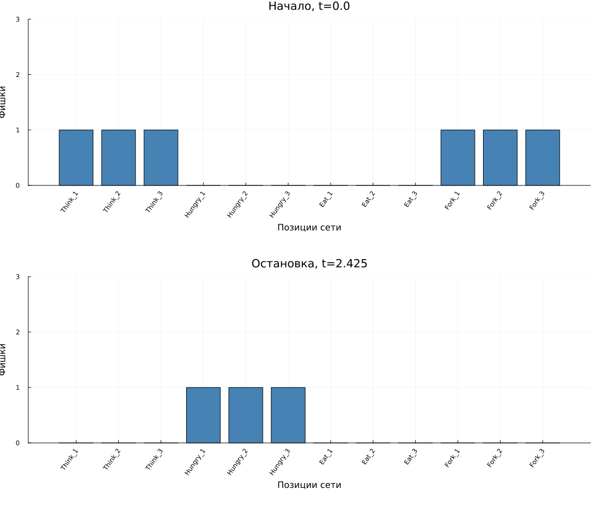{fig-alt="Initial and deadlocked markings for three philosophers"}

$N=3$, горизонт 30, единичные интенсивности. Deadlock после 6 событий
при $t=2{,}425484$. С арбитром — 36 событий без блокировки.

## Детерминированная аппроксимация

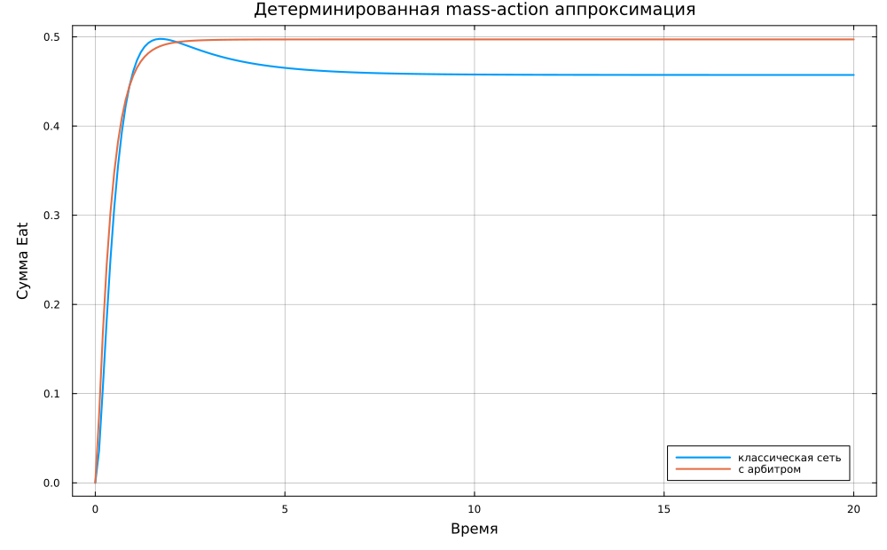

Mass-action ODE описывает усреднённую динамику и дополняет дискретную
траекторию событий.

## Параметрический эксперимент

960 траекторий:

- $N=3,\ldots,8$;
- $\lambda_L\in\{1{,}0;1{,}5;2{,}0;3{,}0\}$;
- 20 повторов на комбинацию и вариант сети.

## Наблюдаемая доля deadlock

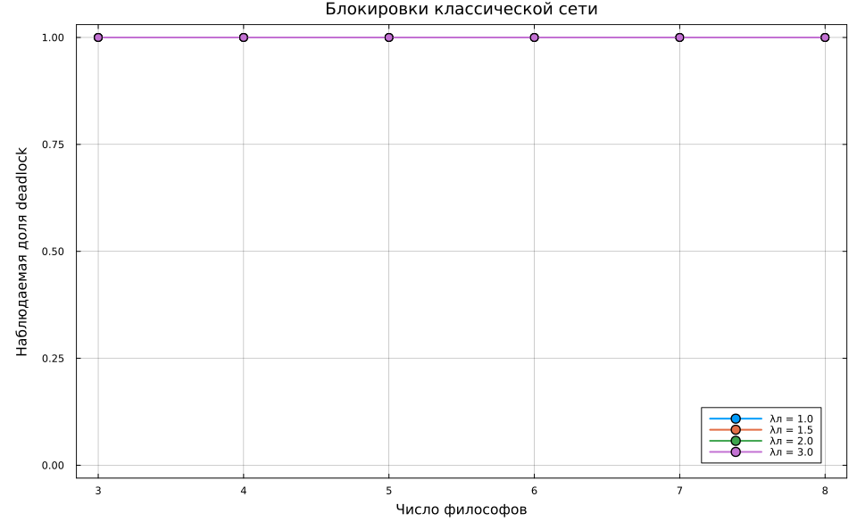

- классическая сеть: 1,0 во всех комбинациях;
- сеть с арбитром: 0,0 во всех комбинациях.

Частоты относятся к выбранным параметрам и горизонту 50.

## Производительность и fairness

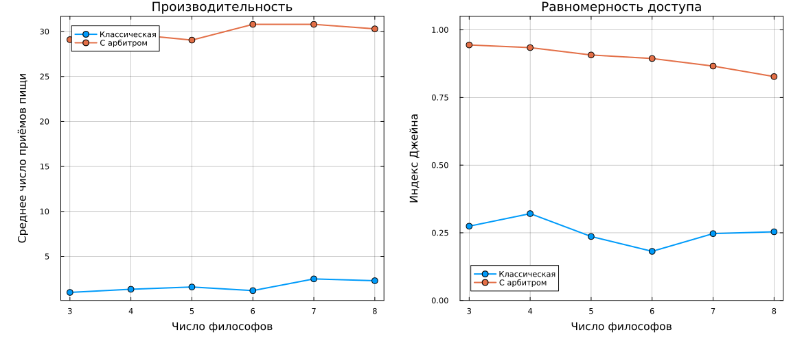

При $\lambda_L=2$ арбитр обеспечивает 29–31 приём пищи и индекс Джейна
0,83–0,94.

## Выполненные блокноты

:::::::::::::: {.columns}
::: {.column width="50%"}
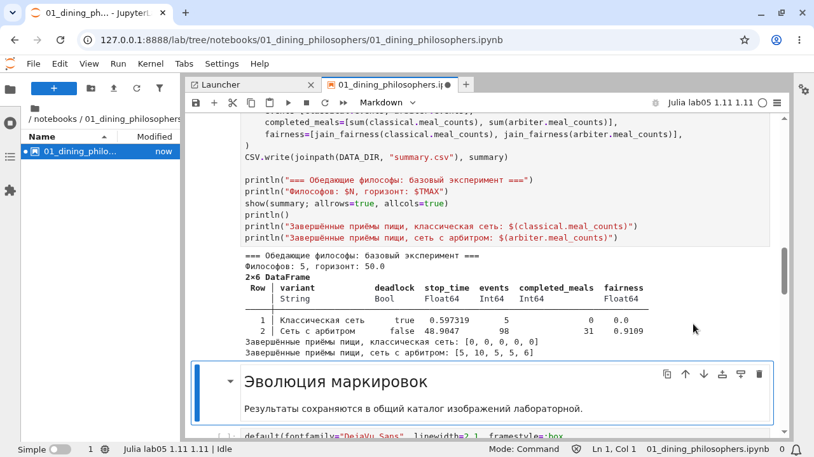

Базовая траектория.
:::
::: {.column width="50%"}
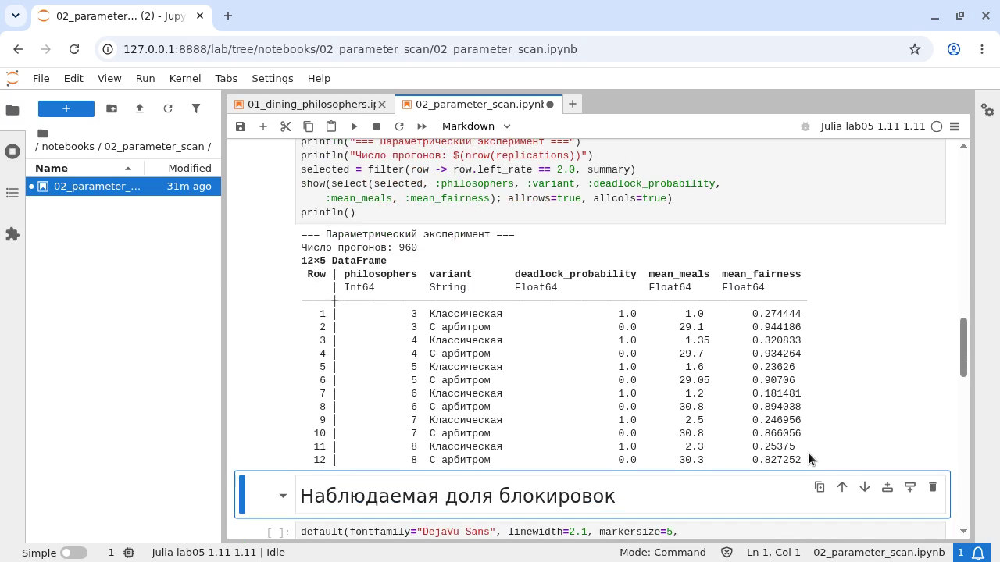

Серия параметров.
:::
::::::::::::::

## Проверка реализации

:::::::::::::: {.columns align=center}
::: {.column width="65%"}
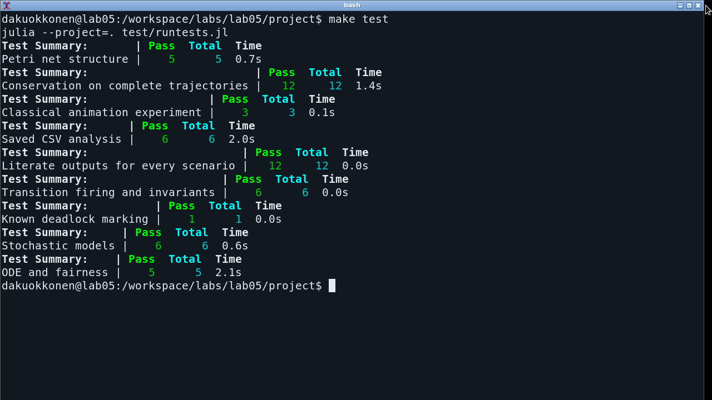
:::
::: {.column width="35%"}

- размерности сетей;
- начальные маркировки;
- срабатывание переходов;
- известный deadlock;
- активность арбитра;
- неотрицательность;
- ODE и индекс Джейна.

**Все 56 проверок пройдены.**
:::
::::::::::::::

# Заключение

## Выводы

- классическая сеть воспроизводит циклическое ожидание;
- арбитр с $N-1$ фишками устраняет глобальный deadlock;
- базовая модифицированная сеть завершила 31 приём пищи;
- 960 прогонов подтвердили структурное различие вариантов;
- получены Julia-код, данные, Jupyter, QMD, DOCX, PDF, HTML и PPTX.

Каждый из четырёх сценариев представлен литературным исходником,
чистым JL, выполненным IPYNB и документацией Quarto.
