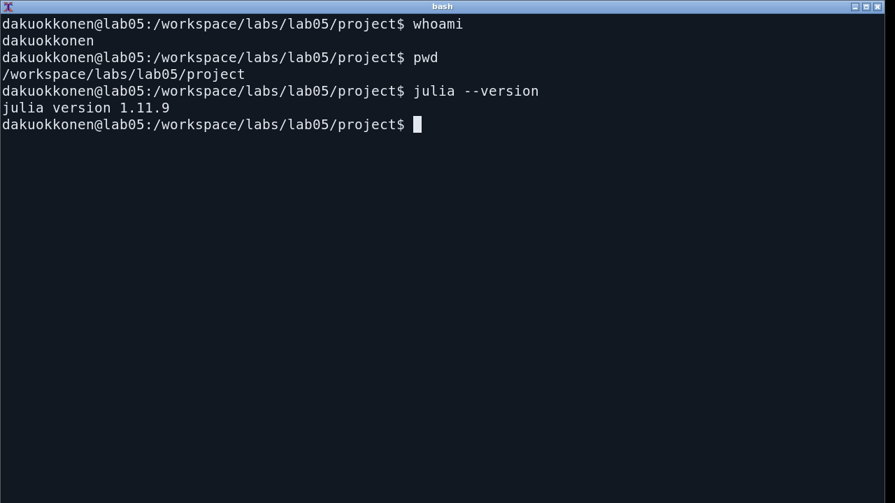

Российский университет дружбы народов имени Патриса Лумумбы.\
Учебная группа: НФИбд-01-23.

# Содержание {.unnumbered}

1. Цель и постановка задачи
2. Теоретические основы сетей Петри
3. Формализация задачи обедающих философов
4. Организация вычислительного проекта
5. Реализация модели
6. Базовый стохастический эксперимент
7. Детерминированная аппроксимация
8. Параметрический эксперимент
9. Литературное программирование и Jupyter
10. Проверка реализации
11. Выводы
12. Источники



# Цель и постановка задачи

Цель работы — исследовать взаимную блокировку при конкурентном доступе пяти
процессов к пяти разделяемым ресурсам и оценить эффективность арбитра средствами
сетей Петри.

Для достижения цели выполнены следующие задачи:

1. формально описаны позиции, переходы, дуги и начальная маркировка;
2. построены классическая сеть и сеть с дополнительной позицией-арбитром;
3. реализован прямой стохастический алгоритм Гиллеспи;
4. добавлена непрерывная mass-action аппроксимация системы;
5. определены критерий deadlock, число завершённых приёмов пищи и индекс
   равномерности Джейна;
6. проведены базовый и параметрический эксперименты;
7. получены Julia-скрипты, выполненные блокноты Jupyter и документы Quarto;
8. реализация проверена автоматическими тестами.

Исходное состояние рабочего окружения показано на @fig-env.

{#fig-env width=92%}

# Теоретические основы сетей Петри

Сеть Петри задаётся четвёркой

$$
N=(P,T,F,M_0),
$$

где $P$ — конечное множество позиций, $T$ — множество переходов,
$F\subseteq(P\times T)\cup(T\times P)$ — отношение дуг, а $M_0$ — начальная
маркировка. Формализм был предложен К. А. Петри для описания взаимодействующих
автоматов и позднее стал одним из основных средств анализа параллельных систем
[@petri1962; @peterson1981].

Для матриц входных и выходных дуг $A$ и $B$ вводится матрица
инцидентности

$$
C=B-A.
$$

Переход $t_j$ разрешён в маркировке $M$, если для каждой позиции выполняется
$M_i\ge A_{ij}$. После срабатывания маркировка изменяется атомарно:

$$
M'=M+C_{\cdot j}.
$$

Глобальный deadlock фиксируется, когда множество разрешённых переходов пусто.
Для рассматриваемой сети это означает, что ни один философ не может получить
вторую вилку и ни один уже не ест.

# Формализация задачи обедающих философов

Для каждого философа $i$ определены три позиции состояния:
`Think_i`, `Hungry_i` и `Eat_i`. Позиция `Hungry_i` означает, что философ уже
захватил левую вилку. Каждая вилка представлена ресурсной позицией `Fork_i`.

| Элемент | Классическая сеть | Сеть с арбитром |
|---|---:|---:|
| Философы | 5 | 5 |
| Позиции | 20 | 21 |
| Переходы | 15 | 15 |
| Фишки в позициях `Think` | 5 | 5 |
| Фишки в позициях `Fork` | 5 | 5 |
| Фишки в позиции `Arbiter` | — | 4 |

: Размерность и начальная маркировка сетей {#tbl-net-size}

Переходы `GetLeft_i`, `GetRight_i` и `PutForks_i` соответственно моделируют
захват левой вилки, захват правой вилки и освобождение обеих вилок. В
классической сети все пять переходов `GetLeft_i` могут сработать до любого
`GetRight_i`: возникает циклическое ожидание. В модифицированной сети
`GetLeft_i` дополнительно потребляет разрешение из позиции `Arbiter`, в которой
находятся только $N-1$ фишек. Поэтому хотя бы один философ остаётся вне цикла
захвата и одна из цепочек может завершиться. Структура изменений маркировки
представлена матрицей на @fig-incidence.

{#fig-incidence width=92%}

# Организация вычислительного проекта

Расчёты выполнены в Julia 1.11.9 внутри изолированного окружения. Версии
пакетов закреплены в `Project.toml` и `Manifest.toml`.

| Компонент | Назначение |
|---|---|
| `src/dining_philosophers.jl` | структуры сети, правила срабатывания и оба алгоритма |
| `scripts/01_dining_philosophers.jl` | базовый стохастический и ODE-эксперимент |
| `scripts/02_parameter_scan.jl` | 960 прогонов по числу философов и интенсивности |
| `scripts/03_marking_animation.jl` | анимация изменения маркировки |
| `scripts/tangle.jl` | получение `.jl`, QMD и IPYNB из литературного кода |
| `test/runtests.jl` | структурные, динамические и численные проверки |

: Состав Julia-проекта {#tbl-files}

Фактический состав каталогов показан на @fig-tree.

{#fig-tree width=92%}

# Реализация модели

## Построение входных и выходных дуг

В реализации входные и выходные дуги хранятся раздельно. Такой способ не
теряет информацию при наличии петель и позволяет одинаково использовать сеть
в дискретном и непрерывном алгоритмах.

```julia
input[think, get_left] = 1
input[left_fork, get_left] = 1
output[hungry, get_left] = 1
if arbiter
    input[arbiter_place, get_left] = 1
end

input[hungry, get_right] = 1
input[right_fork, get_right] = 1
output[eat, get_right] = 1

input[eat, put_forks] = 1
output[think, put_forks] = 1
output[left_fork, put_forks] = 1
output[right_fork, put_forks] = 1
if arbiter
    output[arbiter_place, put_forks] = 1
end
```

Листинг 1 — Построение дуг одного философа в `src/dining_philosophers.jl`

## Проверка и срабатывание перехода

Разрешённость перехода вычисляется непосредственно по матрице входных дуг.
Изменение маркировки выполняется одной операцией с колонкой матрицы
инцидентности.

```julia
function enabled_transitions(net::PetriNet,
        marking::AbstractVector{<:Real}; tol=1e-10)
    length(marking) == nplaces(net) ||
        throw(ArgumentError("marking length mismatch"))
    [j for j in 1:ntransitions(net)
     if all(marking[i] + tol >= net.input[i, j]
            for i in 1:nplaces(net))]
end

function fire_transition!(net::PetriNet, marking::Vector{Int},
        transition::Integer)
    transition in enabled_transitions(net, marking) ||
        throw(ArgumentError("transition is not enabled"))
    marking .+= incidence(net)[:, transition]
    marking
end
```

Листинг 2 — Семантика срабатывания в `src/dining_philosophers.jl`

## Прямой алгоритм Гиллеспи

В каждый момент выбираются разрешённые переходы. Время до следующего события
имеет экспоненциальное распределение с параметром, равным сумме их
интенсивностей. Затем переход выбирается пропорционально собственной
интенсивности. Это соответствует прямому алгоритму Гиллеспи [@gillespie1977].

```julia
enabled = enabled_transitions(net, marking)
isempty(enabled) && (deadlock = true; break)
total_rate = sum(rates[enabled])
dt = randexp(rng) / total_rate
threshold = rand(rng) * total_rate

cumulative = 0.0
for transition in enabled
    cumulative += rates[transition]
    if threshold <= cumulative
        chosen = transition
        break
    end
end
fire_transition!(net, marking, chosen)
```

Листинг 3 — Выбор события в `src/dining_philosophers.jl`

# Базовый стохастический эксперимент

Для обеих сетей использованы $N=5$, горизонт $t_{max}=50$ и одинаковое
начальное число генератора. Интенсивности переходов равны 2,0 для захвата левой
вилки, 1,0 для захвата правой и 1,4 для освобождения ресурсов.

```julia
classical_net, classical_initial = build_classical_network(N)
arbiter_net, arbiter_initial = build_arbiter_network(N)

classical = simulate_stochastic(
    classical_net, classical_initial, TMAX;
    rates=RATES, rng=MersenneTwister(202605),
)
arbiter = simulate_stochastic(
    arbiter_net, arbiter_initial, TMAX;
    rates=RATES, rng=MersenneTwister(202605),
)
```

Листинг 4 — Базовый запуск в `scripts/01_dining_philosophers.jl`

| Показатель | Классическая сеть | Сеть с арбитром |
|---|---:|---:|
| Deadlock | да | нет |
| Время последнего события | 0,5973 | 48,9047 |
| Число событий | 5 | 98 |
| Завершённые приёмы пищи | 0 | 31 |
| Индекс Джейна | 0,0000 | 0,9109 |

: Результаты базового эксперимента {#tbl-base}

Классическая траектория заблокировалась сразу после пяти срабатываний: каждый
философ перешёл из `Think_i` в `Hungry_i` и забрал левую вилку. Ни один
`GetRight_i` после этого не был разрешён. На @fig-classic видно накопление
всех пяти фишек в позициях `Hungry`.

{#fig-classic width=92%}

Арбитр ограничил число одновременно начатых захватов четырьмя. За тот же
горизонт выполнено 98 переходов и завершён 31 цикл питания. Распределение
циклов между философами `[5, 10, 5, 5, 6]` даёт индекс Джейна 0,9109: доступ
остаётся достаточно равномерным, хотя случайная траектория не обязана быть
полностью симметричной. На @fig-arbiter состояния продолжают чередоваться
на всём горизонте эксперимента.

{#fig-arbiter width=92%}

Сопоставление маркеров `Eat_i` показывает принципиальное различие режимов:
классическая сеть не успевает завершить ни одного приёма пищи, тогда как в
модифицированной сети философы последовательно получают обе вилки
(@fig-eat).

{#fig-eat width=92%}

# Детерминированная аппроксимация

Для непрерывного варианта интенсивность перехода вычислялась по закону
действующих масс:

$$
a_j(x)=\lambda_j\prod_i x_i^{A_{ij}}, \qquad
\frac{dx}{dt}=Ca(x).
$$

ODE-решение не заменяет дискретный анализ достижимости: дробные значения
позиций интерпретируются как непрерывные количества. Это приближение среднего
поля, а не точное математическое ожидание стохастического процесса: для
нелинейных интенсивностей среднее произведения в общем случае не равно
произведению средних. Кривые на @fig-ode позволяют сопоставить динамику
двух непрерывных моделей.

{#fig-ode width=88%}

# Параметрический эксперимент

Число философов изменялось от 3 до 8, интенсивность `GetLeft` — от 1,0 до 3,0.
Для каждой комбинации выполнено 20 повторов для классической сети и сети с
арбитром; всего получено 960 независимых траекторий.



```julia
for N in 3:8, left_rate in (1.0, 1.5, 2.0, 3.0),
        replication in 1:REPLICATIONS
    rates = default_rates(N; left_rate, right_rate=1.0,
        release_rate=1.4)
    for (variant, builder) in (
            ("Классическая", build_classical_network),
            ("С арбитром", build_arbiter_network))
        net, initial = builder(N)
        seed = 100_000N + 1_000round(Int, 10left_rate) +
            replication +
            (variant == "С арбитром" ? 500 : 0)
        result = simulate_stochastic(net, initial, TMAX;
            rates, rng=MersenneTwister(seed))
        push!(rows, (
            philosophers=N,
            left_rate=left_rate,
            replication=replication,
            variant=variant,
            deadlock=result.deadlock,
            stop_time=result.stop_time,
            events=result.events,
            meals=sum(result.meal_counts),
            fairness=jain_fairness(result.meal_counts),
        ))
    end
end
```

Листинг 5 — Параметрический цикл в `scripts/02_parameter_scan.jl`

Во всех исследованных комбинациях классическая сеть завершилась deadlock, а
сеть с арбитром — ни в одной. Более высокая интенсивность захвата левой вилки
ускоряет формирование циклического ожидания: при $N=5$ среднее время
блокировки уменьшилось с 6,696 при $\lambda_L=1$ до 1,749 при
$\lambda_L=3$. Наблюдаемые частоты представлены на @fig-risk; число повторов
не даёт основания приравнивать их к точным вероятностям для иных условий.

{#fig-risk width=90%}

При $\lambda_L=2$ сеть с арбитром обеспечивает в среднем 29–31 завершённый
приём пищи за 50 единиц времени. Индекс Джейна уменьшается с ростом числа
философов, но остаётся выше 0,82. Классическая сеть имеет существенно меньшие
производительность и равномерность из-за ранней остановки (@fig-param).

{#fig-param width=94%}

# Литературное программирование и Jupyter

Исходные сценарии оформлены в стиле Literate.jl. Команда `make tangle`
сформировала чистые Julia-файлы, QMD-документацию и два блокнота. Блокноты
выполнены ядром `Julia lab05 1.11`, поэтому сохранённые `.ipynb` содержат
фактический вывод экспериментов. Базовый сценарий представлен на
@fig-jupyter-base, параметрическая серия — на @fig-jupyter-scan.

{#fig-jupyter-base width=94%}

{#fig-jupyter-scan width=94%}

# Проверка реализации

Тесты охватывают размерности матриц, начальную маркировку, список разрешённых
переходов, сохранение неотрицательности, известную тупиковую маркировку,
различие классической сети и сети с арбитром, ODE-траекторию и индекс Джейна.

```julia
@testset "Known deadlock marking" begin
    net, marking = build_classical_network(5)
    marking .= 0
    marking[6:10] .= 1
    @test detect_deadlock(net, marking)
end

@testset "Stochastic models" begin
    rates = default_rates(5)
    classical_net, classical_initial = build_classical_network(5)
    arbiter_net, arbiter_initial = build_arbiter_network(5)
    classical = simulate_stochastic(classical_net,
        classical_initial, 50.0; rates, rng=MersenneTwister(202605))
    arbiter = simulate_stochastic(arbiter_net,
        arbiter_initial, 50.0; rates, rng=MersenneTwister(202605))
    @test classical.deadlock
    @test !arbiter.deadlock
    @test sum(arbiter.meal_counts) > 0
end
```

Листинг 6 — Проверка deadlock и арбитра в `test/runtests.jl`

Все 23 проверки завершились успешно. Дополнительно проверены
целостность итоговых форматов и согласованность данных,
включённых в таблицы отчёта. Итог запуска тестов показан на @fig-tests.

{#fig-tests width=82%}

# Выводы

1. Классическая сеть Петри воспроизводит взаимную блокировку: при базовом
   запуске пять философов одновременно захватили левые вилки, после чего
   множество разрешённых переходов стало пустым.
2. Позиция-арбитр с $N-1$ фишками устраняет глобальный deadlock, поскольку
   не допускает одновременного включения всех процессов в цикл ожидания.
3. В базовой траектории сеть с арбитром выполнила 31 приём пищи и достигла
   индекса равномерности 0,9109.
4. В серии из 960 прогонов наблюдаемая доля блокировок составила 1 для
   классической сети и 0 для сети с арбитром. Эти частоты относятся к
   выбранным параметрам и горизонту моделирования, а не ко всем возможным
   траекториям.
5. Стохастическая модель отражает отдельные траектории событий, а
   детерминированная mass-action система описывает усреднённую динамику; эти
   представления дополняют друг друга, но не взаимозаменяемы.
6. Проект полностью представлен Julia-исходниками, данными, выполненными
   Jupyter-блокнотами, документацией Quarto и автоматическими тестами.

# Источники {.unnumbered}

::: {#refs}
:::
