


# Содержание {.unnumbered}

1. Цель и постановка задачи.
2. Модель SIR и сеть Петри.
3. Вычислительная среда и общий модуль.
4. Базовые сценарии: ОДУ, SSA, сканирование, анимация, анализ CSV.
5. Параметрические варианты четырёх сценариев.
6. Литературное программирование и выполненные блокноты.
7. Проверки, ограничения и выводы.

**Аннотация.** Построена сеть Петри SIR и сопоставлены её непрерывная и
событийная интерпретации. Выполнены четыре основных сценария главы 6
практикума и четыре параметрических варианта. Сохранены закон массового
действия βSI, исходные параметры и временные сетки задания. Отдельно
исследовано влияние шага сохранения на оценку пика заражений. Числа в отчёте
получены из сохранённых результатов Julia.



# Цель и постановка задачи

Цель — освоить представление динамической системы сетью Петри и два
способа её исполнения: систему обыкновенных дифференциальных уравнений
и стохастический процесс с дискретными событиями. Проверяется согласованность
структуры сети, численного решения, событийной траектории и анализа CSV.

Выполняется глава 6 «Реализация основных моделей в подходе сетей Петри»
практикума А. В. Корольковой и Д. С. Кулябова, стр. 191–207. Основное задание
содержит общий модуль `src/SIRPetri.jl` и четыре самостоятельных сценария.
§6.2 требует литературные исходники, производные форматы, параметрические
варианты и интеграцию документации в отчёт.

| Сценарий | Назначение | Результат |
|:--|:--|:--|
| `sirpetri_run.jl` | ОДУ и SSA | Траектории S/I/R, CSV и сеть |
| `sirpetri_scan_parameters.jl` | 15 значений β | Пик I и R(100) |
| `sirpetri_animate.jl` | Изменение маркировок | GIF из 501 кадра |
| `sirpetri_report.jl` | Чтение сохранённых CSV | Сравнение I(t) и чувствительности |

: Основные сценарии задания {#tbl-scenarios}

Четыре файла с суффиксом `__param` расширяют каждый из этих сценариев,
не заменяя базовые запуски. Общий модуль, тесты, настройка среды и
`tangle.jl` не считаются дополнительными экспериментами.

# Модель SIR и сеть Петри

## Состояния и переходы

S обозначает восприимчивых, I — заражённых, R — выздоровевших. Рождения,
миграция, смертность и повторное заражение не рассматриваются. Позициям
сети соответствуют состояния, а переходам — заражение и выздоровление:

$$ S+I\xrightarrow{\beta}2I,\qquad I\xrightarrow{\gamma}R. $$

В первом переходе S уменьшается на единицу, I увеличивается на единицу;
второй переносит одну единицу из I в R. В SSA маркировки целочисленны,
в непрерывной интерпретации — действительные неотрицательные величины.

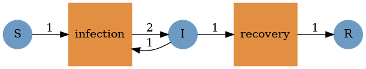{#fig-net width=75%}

Схема (@fig-net) показывает две выходные дуги к I, обеспечивающие суммарное приращение +1.
Матрица изменения маркировки вычисляется из дуг сети:

$$ C=\begin{pmatrix}-1&0\\1&-1\\0&1\end{pmatrix}. $$

Суммы столбцов равны нулю: N=S+I+R сохраняется при каждом переходе.
Начальная маркировка (990,10,0) соответствует N=1000.

## Непрерывная и событийная интерпретации

Интенсивности массового действия равны a₁=βSI и a₂=γI.
В работе **нет деления βSI на N**. Система уравнений имеет вид

$$ \dot S=-\beta SI,\quad \dot I=\beta SI-\gamma I,\quad \dot R=\gamma I. $$

Начальный рост I определяется βS₀>γ. При γ=0,1 критическое значение
β равно 0,1/990≈0,00010101. Весь диапазон β=0,1…0,8 находится выше порога.
Утверждение примера на стр. 201 об отсутствии эпидемии при β=0,1
противоречит указанному закону. Замена на βSI/N дала бы другую модель
и поэтому не производилась.

Прямой метод Гиллеспи генерирует время до события из экспоненциального
распределения с параметром a₀=a₁+a₂. Переход выбирается с вероятностями
a₁/a₀ и a₂/a₀. После события интенсивности пересчитываются. Событие за
пределами T не исполняется; последнее состояние дополняется строкой T.
Если a₀=0, система остаётся в текущей маркировке.

## Независимый контроль пика

Для непрерывной модели выполняется интегральное соотношение

$$ I+S-\frac{\gamma}{\beta}\ln S=
I_0+S_0-\frac{\gamma}{\beta}\ln S_0. $$

Внутренний максимум достигается при S*=γ/β, откуда

$$ I_{\max}=I_0+S_0-S_{p}+S_{p}\ln(S_{p}/S_0),\qquad S_{p}=\gamma/\beta. $$

Формула проверяет численное решение независимо от интегратора. Она не
подменяет требуемый `maximum(df.I)` на сетке 0,5: дискретный и уточнённый
пики далее приводятся раздельно.

# Вычислительная среда и общий модуль

## Организация проекта

Использована Julia 1.11.9. Версии закреплены в `Project.toml` и
`Manifest.toml`: AlgebraicPetri 0.8.11, Catlab 0.14.17, OrdinaryDiffEq 7.8.1,
DataFrames 1.8.2, CSV 0.10.17, Plots 1.41.7, DrWatson 2.19.1,
Literate 2.21.0, IJulia 1.34.4. Общий модуль расположен в `project/src`,
литературные исходники — в `project/scripts`, данные — в `project/data`.
Все иллюстрации находятся в едином каталоге `image`.

```bash
julia --version
julia --project=. scripts/setup_environment.jl
make tangle
make run
make notebooks
make docs
make test
```

`make run` исполняет восемь сценариев; `make notebooks` отдельно запускает
их блокноты ядром Julia. DrWatson восстанавливает корень проекта независимо
от вложенного каталога блокнота.

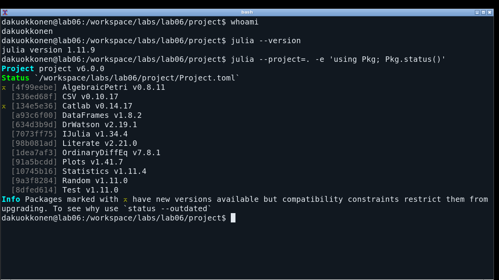{#fig-environment width=92%}

Снимок (@fig-environment) фиксирует фактически используемое окружение.

## Построение сети и правой части

Листинг из `project/src/SIRPetri.jl` показывает настоящий объект
`LabelledPetriNet`. Преобразование `PetriNet(net)` снимает символьные метки,
сохраняя структуру, и согласует индексацию с числовым вектором состояний.

```julia
function build_sir_network(β=0.3, γ=0.1)
    all(isfinite, (β, γ)) && min(β, γ) >= 0 ||
        throw(ArgumentError("Invalid rates"))
    net = LabelledPetriNet([:S, :I, :R],
        :infection => ((:S, :I) => (:I, :I)),
        :recovery => (:I => :R))
    net, [990.0, 10.0, 0.0], [:S, :I, :R]
end

function sir_ode(net, rates=[0.3, 0.1])
    f! = vectorfield(PetriNet(net))
    (du, u, p, t) -> f!(du, u, rates, t)
end
```

Правая часть получается вызовом `vectorfield`, а не независимой ручной
записью уравнений. Tsit5 использует относительный допуск 10⁻⁹ и абсолютный
10⁻¹⁰; проверяется успешное завершение решателя. Для уточнения пика
допуски ужесточены до 10⁻¹⁰ и 10⁻¹¹.

## Прямой метод Гиллеспи

Цикл из `simulate_stochastic` в `src/SIRPetri.jl` приведён ниже. До него
проверяются параметры, начальная целочисленная маркировка и интервал.
Матрица C извлекается из дуг сети.

```julia
while t < tend
    propensities = [rates[j] * prod(u[s] for s in inputs(net, j))
                   for j in 1:nt(net)]
    total = sum(propensities)
    total > 0 || break
    next_t = t - log(rand(rng)) / total
    next_t <= tend || break
    transition = searchsortedfirst(cumsum(propensities), rand(rng) * total)
    u .+= C[:, transition]
    minimum(u) >= 0 || error("Negative token count")
    t = next_t
    push!(df, (t, u[1], u[2], u[3]))
end
df.time[end] < tend && push!(df, (tend, u[1], u[2], u[3]))
```

Во входах переходов SIR нет повторяющихся позиций, поэтому произведение
маркировок даёт βSI и γI. Модуль не заявляется универсальным SSA для
реакций с произвольными кратностями одинаковых реагентов.

# Основные вычислительные сценарии

## Базовый опыт

Для `sirpetri_run.jl` взяты β=0,3, γ=0,1, T=100, шаг сохранения ОДУ 0,5,
seed=123 для SSA. CSV содержат все столбцы `time,S,I,R`, а не одну
агрегированную метрику. Траектория ОДУ имеет 201 строку.

Ниже включена документация, автоматически полученная из
`project/scripts/sirpetri_run.jl` средствами Literate. Аналогичный способ
использован для всех восьми сценариев: QMD-фрагменты подключены
непосредственно в соответствующие разделы отчёта.



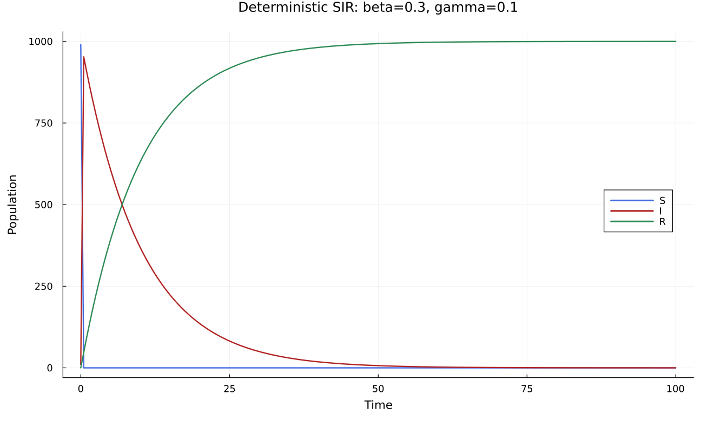{#fig-det width=92%}

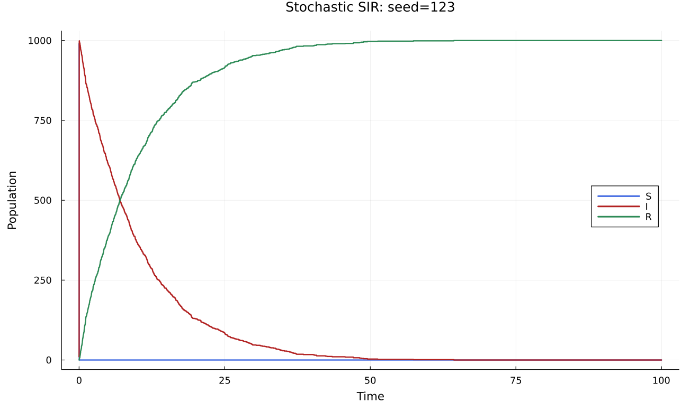{#fig-ssa width=92%}

Графики (@fig-det и @fig-ssa) показывают, что восприимчивые быстро заражаются, после чего I
убывает вследствие выздоровления, а R возрастает. SSA изображена
ступенчато: отдельное событие меняет маркировку дискретно.

| Показатель | ОДУ, сетка 0,5 | SSA, события |
|:--|--:|--:|
| Максимум I | 952,691393 | 999 |
| Время максимума | 0,5 | 0,037042 |
| R(100) | 999,954530 | 1000 |
| Ошибка сохранения N | 2,16·10⁻¹² | 0 |

: Базовый опыт, `sir_summary.csv` {#tbl-base}

В базовом сравнении (@tbl-base) способы наблюдения различаются. Уточнение ОДУ даёт
t*=0,0420463125 и I*=997,0012275894, совпадая с аналитическим значением
с ошибкой менее 10⁻⁸. Исходная сетка недооценивает пик примерно на
44,31 человека, или 4,44%; это не ошибка интегратора.

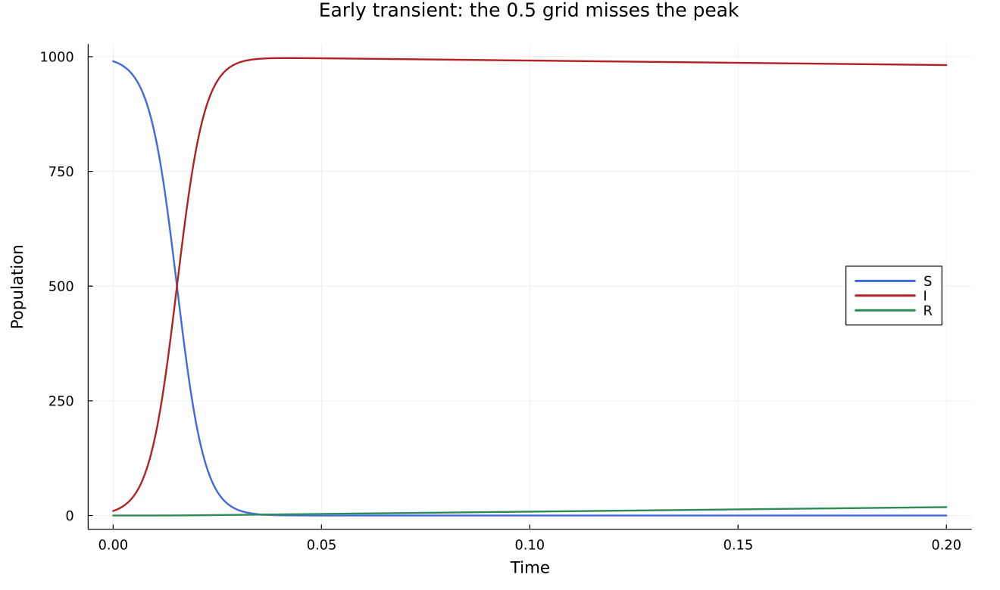{#fig-early width=92%}

@fig-early показывает, что t=0,5 находится уже после максимума.
Дополнительные данные записаны в `sir_early.csv` и `sir_peak_refined.csv`;
они не заменяют обязательные `sir_det.csv` и `sir_stoch.csv`.

## Сканирование коэффициента заражения

`sirpetri_scan_parameters.jl` выполняет 15 запусков β=0,1:0,05:0,8
при γ=0,1, T=100, шаге 0,5 и прежних начальных условиях.
`sir_scan.csv` содержит β, `peak_I` и `final_R`.



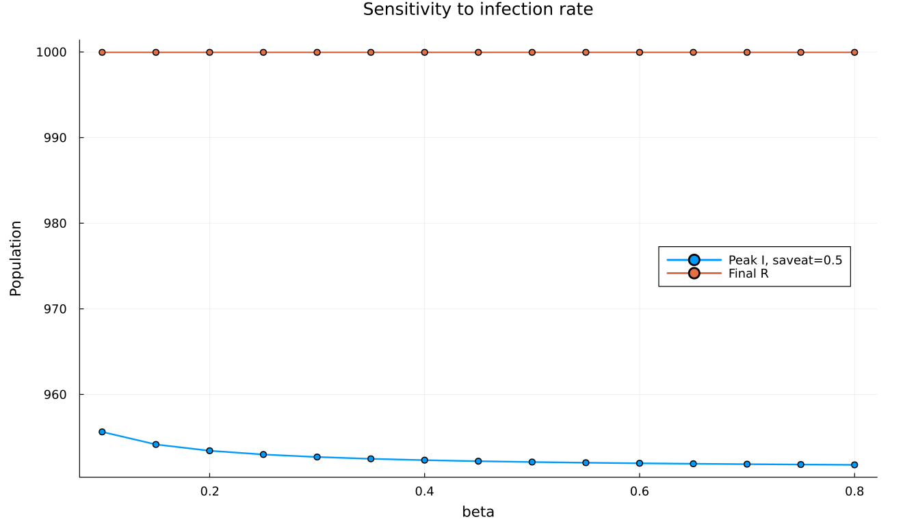{#fig-scan width=92%}

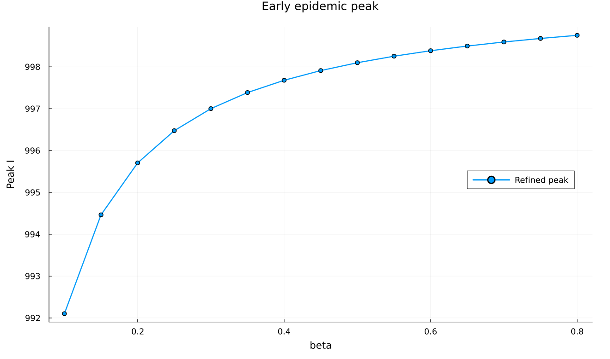{#fig-scan-fine width=92%}

При β=0,1 дискретный максимум равен 955,6260, при 0,3 — 952,6914,
при 0,8 — 951,7772. Убывание дискретной оценки (@fig-scan) не означает ослабления
эпидемии: увеличение β сдвигает пик раньше, и к t=0,5 выздоровление
успевает сильнее уменьшить I. Уточнённый пик (@fig-scan-fine),
напротив, возрастает; R(100) почти постоянно и близко к 1000.

## Анимация маркировок

`sirpetri_animate.jl` использует β=0,3, γ=0,1 и 501 момент от 0 до 100
с шагом 0,2. В кадре три столбца S/I/R с фиксированной шкалой 0–1050.
`01-animation.gif` при 25 кадрах/с длится около 20 секунд.



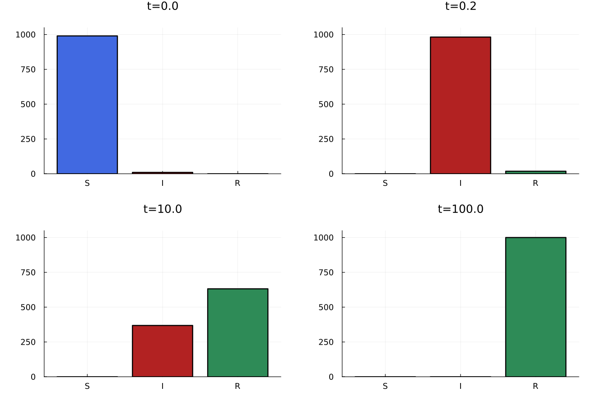{#fig-animation width=92%}

В последовательности кадров (@fig-animation) сначала преобладает S, затем I, затем R. Этот рисунок
служит печатным представлением реально построенной GIF. Шаг 0,2 также
не разрешает ранний пик подробно. На стр. 203–204 примера вместо
анимации повторён код сканирования; здесь выполнено текстовое требование
об изменении маркировок во времени.

## Отдельный анализ CSV

`sirpetri_report.jl` читает `sir_det.csv`, `sir_stoch.csv` и `sir_scan.csv`
без повторной симуляции. SSA использует свои реальные времена событий.
Для численной метрики она отображается на 201 момент ОДУ правосторонне
непрерывной ступенчатой интерполяцией.



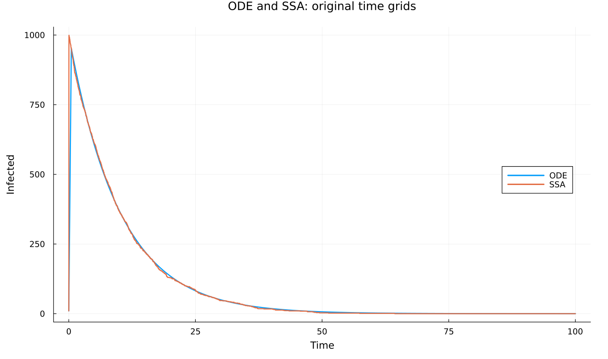{#fig-comparison width=92%}

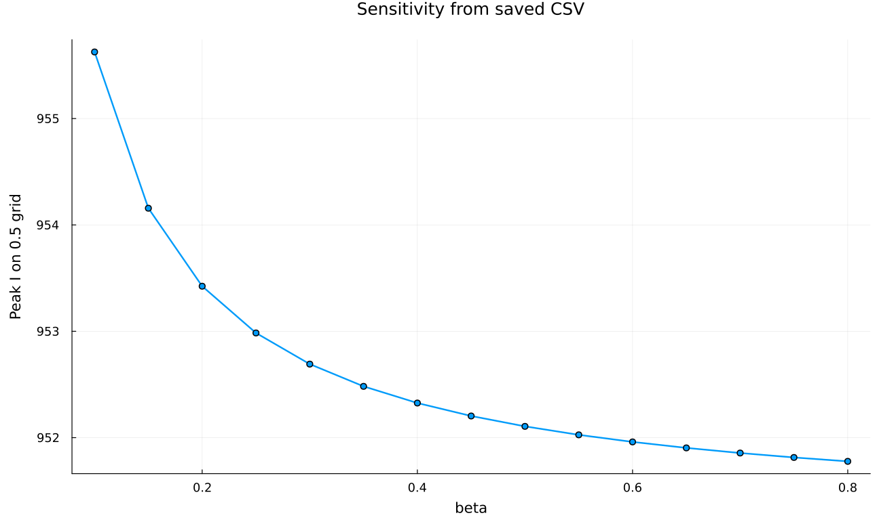{#fig-report-scan width=92%}

При сравнении (@fig-comparison) наблюдается близкая динамика после быстрого начального
перехода. RMSE на общей сетке равна 3,5954 человека, максимальное абсолютное
различие — 19,0308. Это характеристика одного SSA, не доверительный
интервал и не ошибка интегратора. @fig-report-scan воспроизводит метрику
сканирования из сохранённых данных. Ошибка согласования временных
индексов в примере стр. 206 исправлена.

# Параметрические варианты

## Девять сочетаний и 180 стохастических запусков

Для §6.2 приняты β∈{0,1;0,3;0,8} и γ∈{0,05;0,1;0,2}.
Каждому из девяти сочетаний соответствуют ОДУ и 20 SSA. Начальные условия,
T=100 и шаг ОДУ 0,5 сохранены. Seed равен `123+100*case_id+replicate`.
Среднее и выборочное стандартное отклонение вычисляются по 20 повторам.



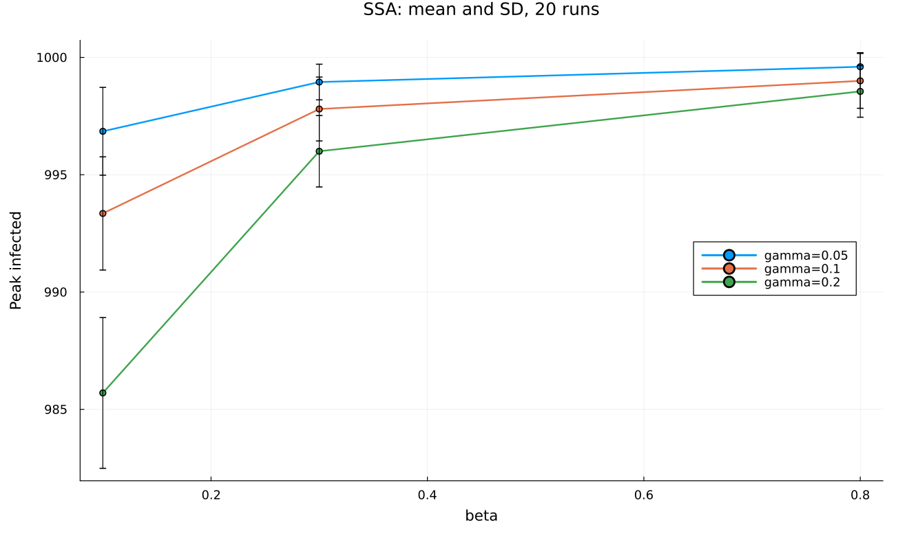{#fig-replicates width=92%}

| β | γ | Средний пик | Станд. отклонение | Среднее R(100) |
|--:|--:|--:|--:|--:|
| 0,1 | 0,05 | 996,85 | 1,87 | 993,50 |
| 0,3 | 0,05 | 998,95 | 0,76 | 993,15 |
| 0,8 | 0,05 | 999,60 | 0,60 | 992,80 |
| 0,1 | 0,10 | 993,35 | 2,41 | 999,95 |
| 0,3 | 0,10 | 997,80 | 1,36 | 999,90 |
| 0,8 | 0,10 | 999,00 | 1,17 | 999,95 |
| 0,1 | 0,20 | 985,70 | 3,21 | 1000,00 |
| 0,3 | 0,20 | 996,00 | 1,52 | 1000,00 |
| 0,8 | 0,20 | 998,55 | 1,10 | 1000,00 |

: Статистика `sir_param_summary.csv` {#tbl-replicates}

При фиксированном γ рост β повышает средний пик; рост γ при неизменном
β его уменьшает. При γ=0,05 к T=100 остаётся несколько заражённых.
R(100)<1000 объясняется конечным горизонтом, а не потерей численности.
Вертикальные отрезки (@fig-replicates) — стандартные отклонения, не 95%-е интервалы.

## Сетка из 45 опытов

В `sirpetri_scan_parameters__param.jl` исходные 15 β повторены при
трёх γ. Максимум на сетке 0,5 и уточнённый пик сохраняются отдельно.



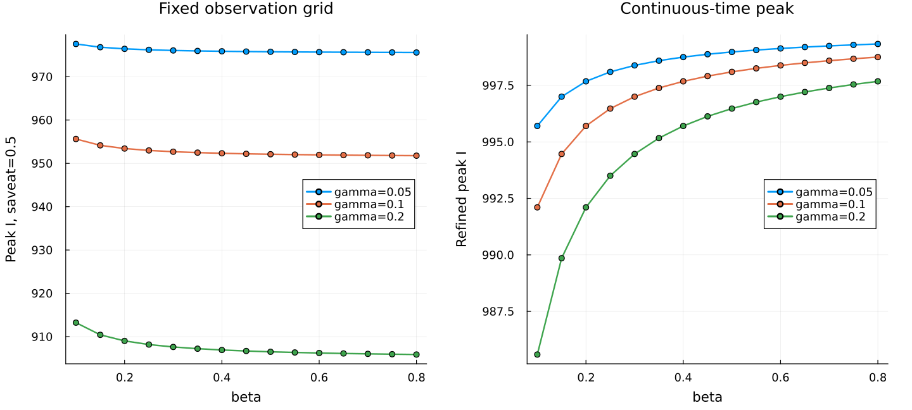{#fig-param-scan width=92%}

@fig-param-scan подтверждает эффект редкой сетки наблюдений для всех
трёх γ. Правая панель согласуется с аналитическим условием S*=γ/β;
только по левой панели делать вывод о влиянии β нельзя.

## Три параметрические анимации

Третий вариант использует β=0,1;0,3;0,8 при γ=0,1. Каждая GIF содержит
501 кадр на сетке 0,2: всего 1503 кадра в `02-animation.gif`,
`03-animation.gif` и `04-animation.gif`. Траектории сохранены в
`data/parameters`, сводка — в `sir_animation_param_summary.csv`.



Различия сосредоточены в начале процесса; затем почти вся популяция
переходит в R. Глобальная шкала полезна для наблюдения выздоровления,
но ранний максимум дополнительно следует изучать по численным данным.

## Анализ параметрических CSV

Последний вариант читает пять созданных таблиц, объединяет статистику SSA
и уточнённые пики ОДУ по `case_id`, строит средний пик SSA против ОДУ
и зависимость R(100) от β при трёх γ. Симулятор здесь не вызывается.



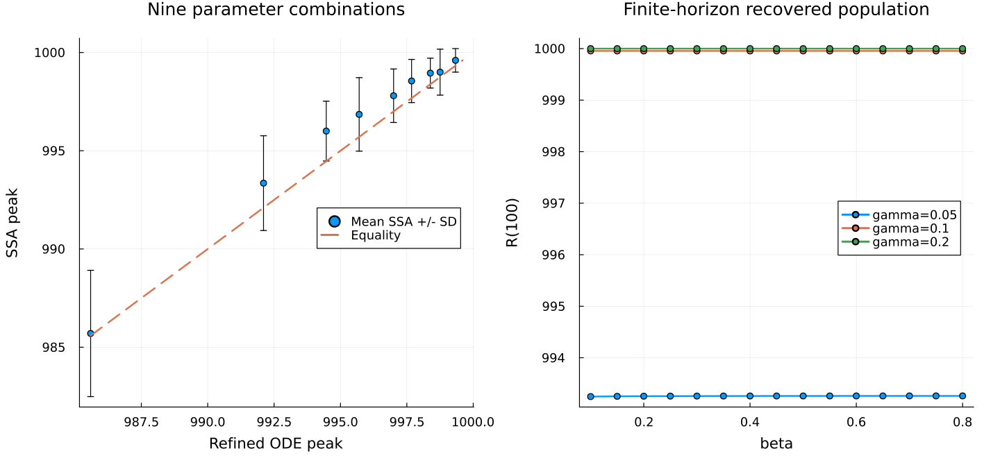{#fig-param-analysis width=92%}

В параметрическом сравнении (@fig-param-analysis) средние SSA близки к линии равенства, но не
обязаны совпадать с пиком ОДУ: максимум — нелинейная статистика, а выборка
ограничена 20 повторами. Правая панель показывает влияние γ на R(100).

# Литературное программирование и блокноты

## Производные форматы

Восемь литературных `.jl` содержат пояснения Literate и исполняемый код.
`scripts/tangle.jl` формирует чистый Julia-файл, QMD и IPYNB. Фрагмент
генератора ниже взят из действительного исходника.

```julia
Literate.script(source, scriptsdir(name); name, credit=false)
Literate.notebook(source, projectdir("notebooks", name); name,
    execute=false, credit=false)
Literate.markdown(source, dest; name,
    flavor=Literate.QuartoFlavor(), credit=false)
```

Дополнительный `-report.qmd` имеет обычные Julia-блоки и более глубокие
заголовки. Его можно включать в отчёт без повторных вычислений при сборке.
Все восемь таких включений размещены в соответствующих разделах выше.
Листинги общего модуля и тестов дополняют эти включения, а не заменяют их.
Документация HTML собирается `make docs`.

## Jupyter

```bash
jupyter lab
```

В интерфейсе открывается IPYNB из `project/notebooks` с ядром Julia lab06.
Последовательно выполняются ячейки настройки, расчёта, таблиц и графиков.
Все восемь сохранённых блокнотов содержат счётчики выполнения и выводы
без ошибок; анимационные блокноты содержат GIF.

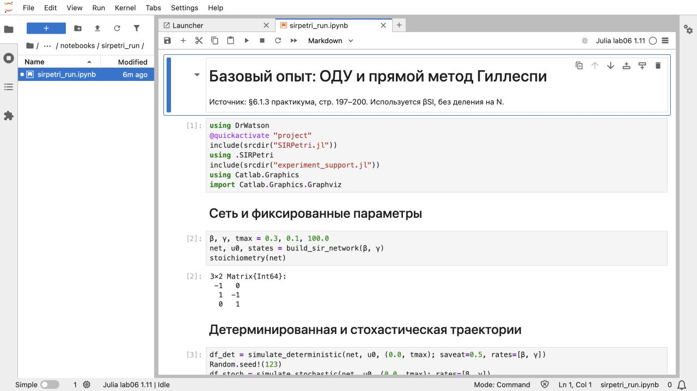{#fig-jupyter-start width=92%}

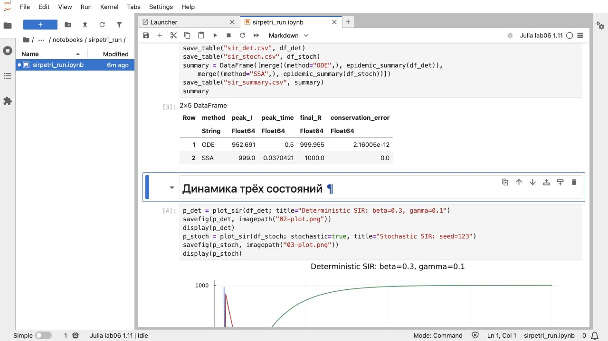{#fig-jupyter-result width=92%}

Снимки @fig-jupyter-start и @fig-jupyter-result показывают код вместе
со счётчиками выполнения и фактическим выводом ячеек.

# Проверки и ограничения

## Структурные и численные тесты

В `test/runtests.jl` пройдены 42 проверки: структура и интенсивности — 7,
ОДУ — 11, SSA — 14, сохранённые результаты — 10. Проверены сохранение N,
неотрицательность с численным допуском для ОДУ, аналитический пик,
целочисленность SSA, допустимые события, seed и конечный горизонт.

```julia
@test stoichiometry(net) == [-1 0; 1 -1; 0 1]
@test sum(stoichiometry(net); dims=1) == zeros(1, 2)
@test maximum(abs.(df.S .+ df.I .+ df.R .- 1000)) < 1e-6
@test isapprox(peak.peak, peak.analytic; atol=1e-5)
@test all(a.S .+ a.I .+ a.R .== 1000)
@test all(diff(a.time) .> 0)
@test a.time[end] == 100
@test nrow(runs)==180
@test length(unique(runs.seed))==180
```

Это фрагменты реальных проверок из `project/test/runtests.jl`;
инициализация переменных находится в полном файле. Тесты дополняют
содержательную сверку задания, но сами по себе не доказывают его полноту.

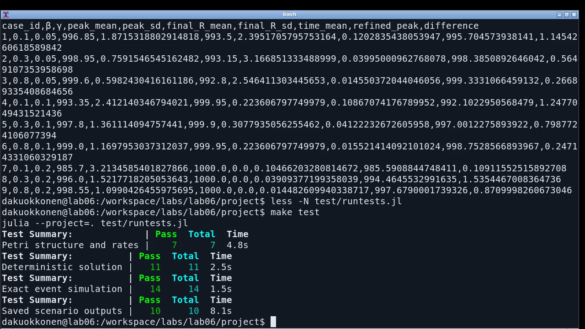{#fig-tests width=92%}

Штатный вывод `make test` (@fig-tests) подтверждает прохождение 42 проверок.

## Ограничения

Модель предполагает однородное перемешивание и постоянные коэффициенты.
Время условно; параметры не оценивались по медицинским данным. Сильная
начальная вспышка обусловлена ненормированным βSI и не является прогнозом.
Шаг сохранения отличается от адаптивного шага Tsit5 и может скрывать
экстремумы даже при точном решении. Двадцать повторов не дают оснований
утверждать универсальное совпадение SSA и ОДУ или отсутствие редких исходов.

# Выводы

Построена сеть AlgebraicPetri с тремя позициями и двумя переходами. Из одной
структуры получены ОДУ, стехиометрические изменения и интенсивности SSA.
Оба исполнения сохраняют N=1000, событийное — целочисленные маркировки.

Выполнены четыре основных сценария и четыре параметрических варианта:
траектории, сканирование, анимация и отдельный анализ CSV. Расширение
включает 180 SSA, 45 точек двухпараметрической сетки и три дополнительные
анимации. Производные JL/QMD/IPYNB созданы для каждого сценария;
документация интегрирована в тематические разделы отчёта.

Главный результат — необходимость отличать динамику модели от сетки
наблюдений. Пик ОДУ около 997 достигается до t=0,05 и пропускается
шагом 0,5. Противоречия примера исправлены явно: закон βSI сохранён,
времена SSA согласованы, а анимация реализует текстовое требование практикума.

# Источники

1. Королькова А. В., Кулябов Д. С. Имитационное моделирование. Практикум.
   Глава 6 «Реализация основных моделей в подходе сетей Петри», стр. 191–207.
   Редакция PDF от 22.05.2026.
2. Исходный код AlgebraicPetri 0.8.11 и Catlab 0.14.17 в закреплённом
   окружении: LabelledPetriNet, vectorfield, Graphviz.Graph.
3. Исходный код и результаты работы: `project/src`, `project/scripts`,
   `project/data`, `project/notebooks`, `project/test`.
4. `project/Manifest.toml`: точные версии вычислительной среды.
