

# Содержание {.unnumbered}

1\. Цель и постановка задачи.

2\. Принципы дискретно-событийного моделирования.

3\. Среда и организация проекта.

4\. Очередь M/M/c: модель, базовый опыт и параметры.

5\. Система Росса: процессы, резерв, ремонт и аналитика.

6\. Литературные исходники и выполненные блокноты.

7\. Проверки, ограничения и выводы.

**Аннотация.** Исследуются две системы с конкуренцией за ограниченные
ресурсы: многоканальная очередь и ремонт машин с холодным резервом.
Модели реализованы процессами ConcurrentSim, а не дискретизацией времени.
Исходные примеры дополнены наблюдением очередей, параметрическими сериями
и независимыми аналитическими расчётами. Результаты представлены в CSV,
графиках и выполненных Julia-блокнотах. Код четырёх самостоятельных сценариев
включён в отчёт из автоматически полученной Quarto-документации.



# Цель и постановка задачи

Цель работы — освоить процессный подход к дискретно-событийному
моделированию и проверить, как ограниченная пропускная способность влияет
на ожидание обслуживания и надёжность системы. Выполняется глава 7
«Дискретно-событийное моделирование» практикума А. В. Корольковой и
Д. С. Кулябова, стр. 209–219, редакция PDF от 22 мая 2026 года.

В §7.2 требуется реализовать M/M/c в проекте DrWatson и построить необходимые
графики. В §7.3 рассматривается система Росса; дополнительные задания
предусматривают несколько ремонтников, изменение числа работающих машин,
мониторинг загрузки и очереди, графики исправных машин и сравнение с
аналитикой. §7.4 распространяет литературное программирование и
параметрические варианты на обе модели.

Методичка задаёт два примера, но не назначает имена файлов. В проекте выбраны
четыре самостоятельных сценария (@tbl-scenarios). Общие модули, тесты и
производные форматы не считаются новыми экспериментами.

| Сценарий | Содержание | Объём |
|:--|:--|:--|
| `mmc_queue.jl` | Базовая M/M/2 | 10 клиентов |
| `mmc_queue__param.jl` | Интенсивность и число каналов | 12 × 20 000 клиентов |
| `ross_repair.jl` | 10 машин, 3 резервные, 1 ремонтник | 5 прогонов |
| `ross_repair__param.jl` | Число машин и ремонтников | 9 × 200 прогонов |

: Самостоятельные сценарии лабораторной {#tbl-scenarios}

# Принципы дискретно-событийного моделирования

Состояние системы меняется в моменты событий: прибытия заявки, окончания
обслуживания, отказа машины или завершения ремонта. Между событиями
численности очереди и занятых ресурсов постоянны. Поэтому календарь может
сразу перейти к ближайшему событию; малый фиксированный шаг времени не нужен.

В ConcurrentSim объект `Simulation` хранит календарь, `now(env)` возвращает
его время, а `@process` запускает процесс. Функция с `@resumable` может
приостанавливаться на `@yield` и продолжаться после события. `timeout`
задаёт ожидание, `request` запрашивает ресурс, `unlock` освобождает его.
В модели ремонта `Store{Process}` хранит резервные процессы, а `interrupt`
переводит резервную машину в работу.

Такое представление важно отличать от параллельного вычисления потоками.
Одновременное существование процессов модели не означает одновременное
исполнение машинных инструкций: события обрабатываются в порядке календаря.
Записи с одинаковым временем отражают последовательные стадии одного
мгновенного перехода. Они имеют нулевую длительность и не должны искажать
интегральные средние.

# Среда и организация проекта

Вычисления выполнены в отдельном контейнере от пользователя `dakuokkonen`.
Каталог проекта — `/workspace/labs/lab07/project`. Julia имеет версию 1.11.9;
зависимости перечислены в `Project.toml` и закреплены в `Manifest.toml`.
Общий код отделён от сценариев: `src/MMCQueue.jl` описывает очередь,
`src/RossRepair.jl` — систему ремонта. `src/experiment_support.jl` содержит
сохранение таблиц, графики и расчёт интервалов для независимых повторов.

| Пакет | Версия | Назначение |
|:--|:--|:--|
| ConcurrentSim | 1.5.1 | Календарь, процессы и ресурсы |
| ResumableFunctions | 1.0.7 | Процессы Julia |
| Distributions | 0.25.131 | Экспоненциальные времена, t-квантили |
| StableRNGs | 1.0.4 | Явные воспроизводимые генераторы |
| DrWatson | 2.19.1 | Активация и пути проекта |
| DataFrames / CSV | 1.8.2 / 0.10.17 | Таблицы и данные |
| Plots | 1.41.7 | Визуализация траекторий |
| Literate / IJulia | 2.21.0 / 1.34.4 | Производные форматы и ядро Julia |

: Основные зависимости {#tbl-packages}

Проверка среды и пакетов показана на @fig-environment. Внутри проекта
используются обычные команды; основная последовательность сохраняется в
`Makefile`.

```bash
whoami
pwd
julia --version
julia --project=. -e 'using Pkg; Pkg.status()'
make tangle
make run
make notebooks
make docs
make test
```

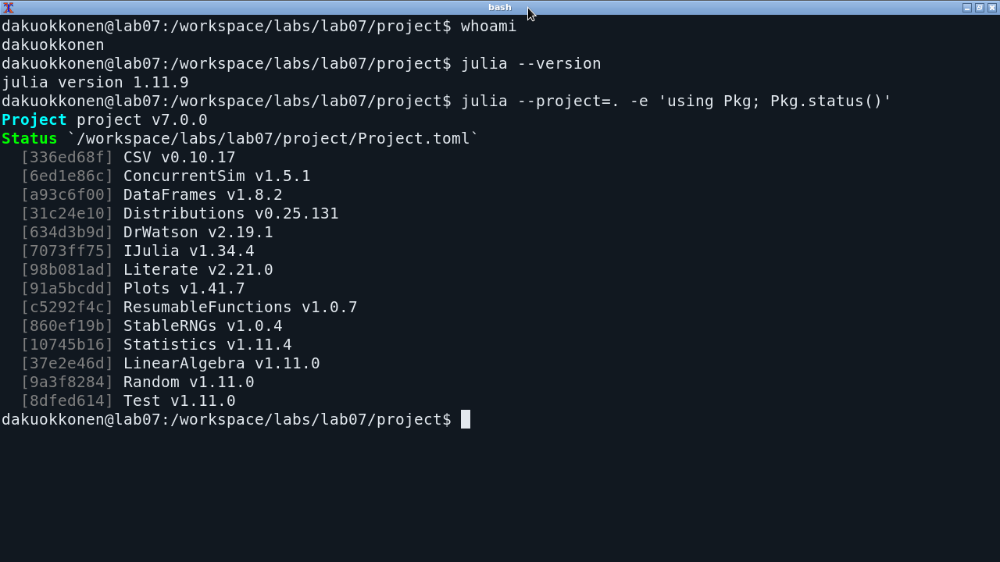{#fig-environment width=92%}

# Очередь M/M/c

## Предположения и стационарная теория

Межприходные интервалы независимы и экспоненциальны с интенсивностью λ,
обслуживание в каждом из c одинаковых каналов — с интенсивностью μ.
Очередь общая, неограниченная, дисциплина FIFO. Начальное состояние пустое;
отказы в обслуживании и уход нетерпеливых клиентов не рассматриваются.

Конструктор `Exponential` принимает **среднее время**, поэтому используются
`Exponential(1/λ)` и `Exponential(1/μ)`. При λ=0,9 и μ=0,5 средний интервал
прибытия равен 1,1111, среднее обслуживание — 2 единицам времени.

Пусть a=λ/μ и ρ=λ/(cμ). Стационарный режим существует только при ρ<1.
Вероятность пустой системы и вероятность ожидания по формуле Эрланга C:

$$ p_0=\left[\sum_{k=0}^{c-1}\frac{a^k}{k!}
+\frac{a^c}{c!(1-\rho)}\right]^{-1},\qquad
P_{wait}=\frac{a^c p_0}{c!(1-\rho)}. $$

Характеристики очереди и системы вычисляются как

$$ L_q=\frac{\rho P_{wait}}{1-\rho},\quad
W_q=\frac{L_q}{\lambda},\quad W=W_q+\frac1\mu,\quad L=\lambda W. $$

При c=1 они сводятся к M/M/1, например W=1/(μ−λ). Это используется
как независимая проверка реализации формулы. При ρ≥1 программа возвращает
для стационарных характеристик `missing`, а не нули или отрицательные числа.

## Процесс заявки и наблюдение событий

Все моменты прибытия заранее получаются накоплением экспоненциальных
интервалов, как в примере практикума. Затем для каждого клиента создаётся
процесс. До получения ресурса клиент относится к очереди, после получения —
к занятым каналам. Время обслуживания выбирается при начале обслуживания.
Такая последовательность обращений к генератору сохраняет смысл исходного
примера и делает seed однозначным.

В листинге 1 приведена центральная часть функции `customer` из
`src/MMCQueue.jl`. `record!` сохраняет новое состояние и текущее время.

```julia
@yield timeout(env, arrival)
monitor.queue += 1
record!(monitor, env, "arrival", id)
verbose && println("Customer $id arrived: ", now(env))
@yield request(server)
monitor.queue -= 1
monitor.busy += 1
starts[id] = now(env)
record!(monitor, env, "service_start", id)
verbose && println("Customer $id entered service: ", now(env))
@yield timeout(env, rand(rng, service))
ends[id] = now(env)
monitor.busy -= 1
record!(monitor, env, "departure", id)
@yield unlock(server)
verbose && println("Customer $id exited service: ", now(env))
```

*Листинг 1 — События одной заявки, `src/MMCQueue.jl`.*

Для клиента сохраняются прибытие, начало и окончание обслуживания,
ожидание, длительность обслуживания и пребывание в системе. Для календаря —
длина очереди, число занятых каналов и общее число клиентов. После полного
исчерпания календаря `run(env)` может перевести его часы на горизонт Inf;
поэтому физическое время завершения опыта определяется последним фактическим
уходом, `maximum(ends)`, а не значением пустого календаря.

## Базовый опыт: десять клиентов

Сохранены исходные условия: 10 клиентов, c=2, λ=0,9, μ=0,5,
`StableRNG(123)`. Команда запуска:

```bash
julia --project=. scripts/mmc_queue.jl
```

Ниже непосредственно включён результат Literate для этого сценария.
Фрагмент содержит действительный код получения CSV, мониторинга и графиков.



Первый клиент прибывает в 0,145185, последний — в 7,828990. Последнее
обслуживание завершается в 18,690265. Все десять клиентов обслужены,
восемь ожидали свободный канал. Среднее ожидание равно 4,856796, пребывание
в системе — 8,410492. Наблюдаемое среднее обслуживание 3,553696 отличается
от математического ожидания 2: выборка из десяти случайных величин мала.

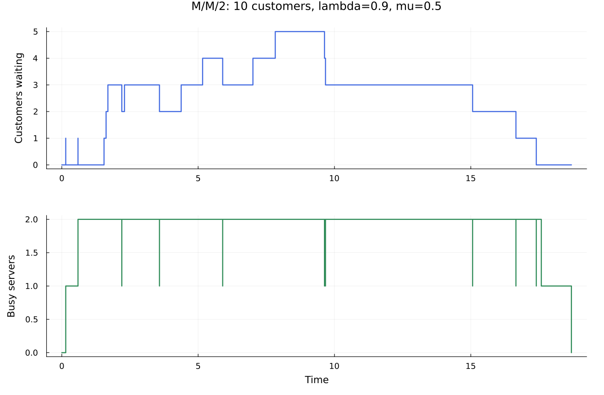{#fig-mmc-events width=92%}

На @fig-mmc-events ресурс никогда не обслуживает больше двух клиентов.
После последнего прибытия очередь постепенно освобождается. Эта конечная
фаза отличается от постоянно поступающего стационарного потока.

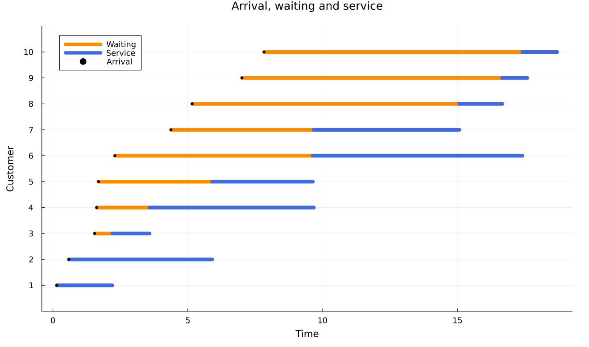{#fig-clients width=92%}

На @fig-clients чёрная точка отмечает прибытие, оранжевый участок —
ожидание, синий — обслуживание. Начала обслуживания упорядочены по
прибытию, однако окончания могут следовать в другом порядке из-за разных
случайных длительностей.

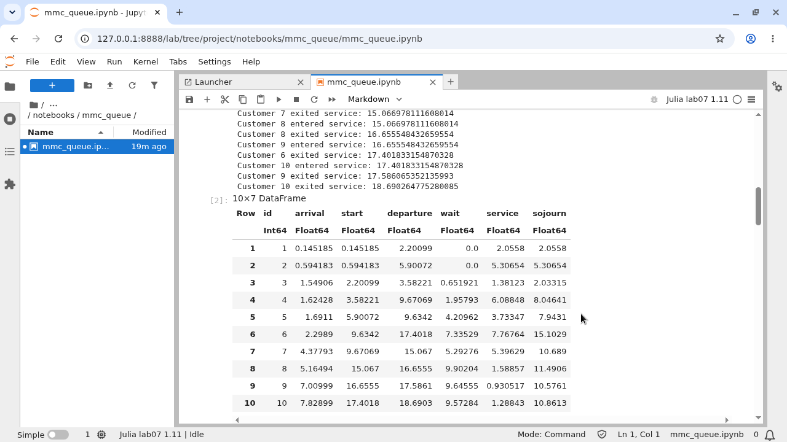{#fig-mmc-notebook width=92%}

Блокнот (@fig-mmc-notebook) сохраняет исходные параметры, таблицу клиентов
и графики. Стационарное Wq=8,526316 для этих интенсивностей не обязано
совпадать с 4,856796 короткого запуска из пустой системы.

## Параметрическая серия и закон Литтла

Исследованы λ∈{0,3;0,6;0,9} и c∈{1;2;3;4} при μ=0,5.
Каждый из 12 опытов включает 20 000 клиентов; первые 2 000 исключены
из клиентских оценок. Seed равен 7000 плюс номер сочетания, где λ
изменяется быстрее c. Всего сохранены 240 000 строк клиентских данных.

Средние очереди и занятости считаются по времени, а не усреднением строк:

$$ \overline{Q}=\frac{1}{t_1-t_0}\sum_j Q(t_j)
\left|[t_j,t_{j+1})\cap[t_0,t_1]\right|. $$

t₀ — прибытие первого клиента после разогрева, t₁ — последнее прибытие.
Клиентские времена досчитываются до обслуживания всех заявок, но интеграл
состояния не включает искусственный участок освобождения системы.
На конечном окне Lq−λWq и L−λW не равны строго нулю: присутствуют
граничные клиенты и отличие фактической интенсивности от заданной λ.

```bash
julia --project=. scripts/mmc_queue__param.jl
```





| λ | c | ρ | Wq, опыт | Wq, теория |
|--:|--:|--:|--:|--:|
| 0,3 | 1 | 0,60 | 3,183015 | 3,000000 |
| 0,6 | 1 | 1,20 | 3837,500125 | нет |
| 0,9 | 1 | 1,80 | 9690,747835 | нет |
| 0,3 | 2 | 0,30 | 0,208983 | 0,197802 |
| 0,6 | 2 | 0,60 | 1,152095 | 1,125000 |
| 0,9 | 2 | 0,90 | 9,128937 | 8,526316 |
| 0,3 | 3 | 0,20 | 0,020125 | 0,020548 |
| 0,6 | 3 | 0,40 | 0,147471 | 0,156863 |
| 0,9 | 3 | 0,60 | 0,567654 | 0,591241 |
| 0,3 | 4 | 0,15 | 0,000965 | 0,002051 |
| 0,6 | 4 | 0,30 | 0,027861 | 0,026464 |
| 0,9 | 4 | 0,45 | 0,103164 | 0,116849 |

: Ожидание после разогрева во всех сочетаниях {#tbl-mmc-parameters}

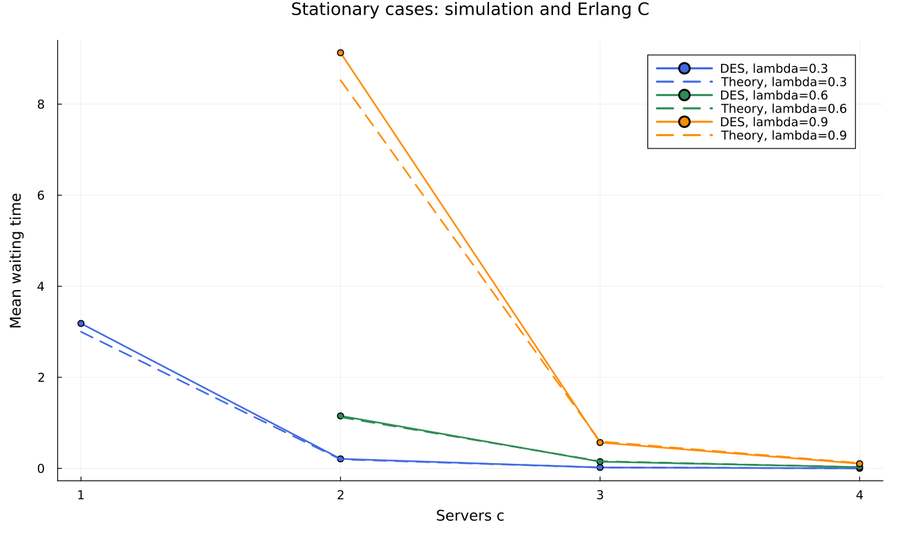{#fig-erlang width=92%}

Увеличение числа каналов резко сокращает ожидание (@fig-erlang).
При λ=0,9 переход от двух к трём каналам уменьшает наблюдаемое Wq
с 9,128937 до 0,567654. Это следствие снижения загрузки с 0,9 до 0,6,
а не изменения распределения обслуживания.

Согласие с теорией нельзя оценивать только общим видом линий. При малой
загрузке c=4, λ=0,3 ожидание возникает редко: в анализируемых 18 000
клиентах ожидали лишь 49. Относительное расхождение Wq здесь велико,
хотя абсолютная разность около 0,0011 мала. Один длинный прогон не даёт
универсальной гарантии точности для всех редких событий.

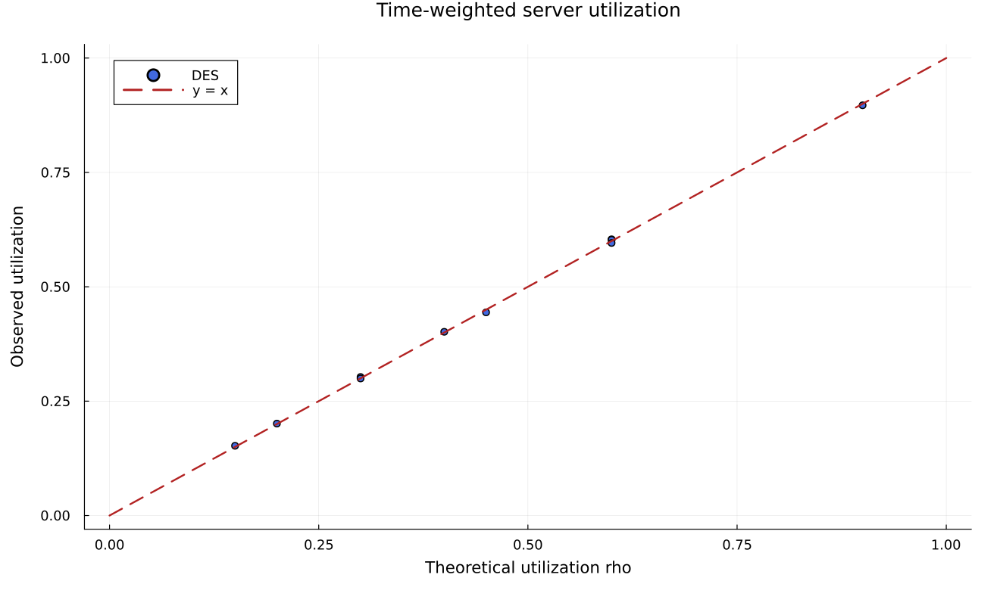{#fig-utilization width=85%}

Загрузка (@fig-utilization) значительно устойчивее редких оценок ожидания.
Для c=2, λ=0,9 она равна 0,896747 при теоретических 0,9; остаток
Lq−λWq равен 0,079802. Остаток — диагностическая величина конечного окна,
не автоматическое доказательство ошибки модели.

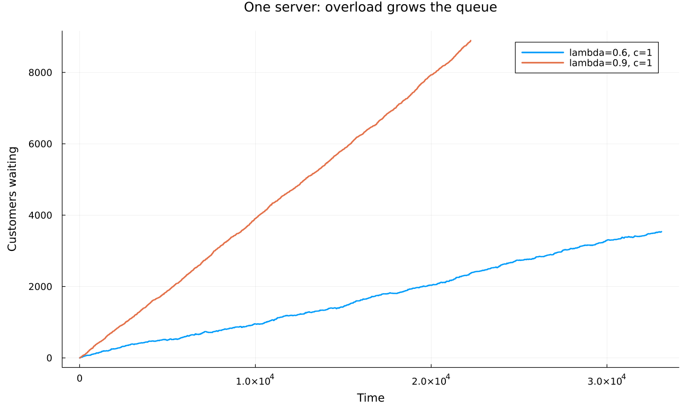{#fig-overload width=92%}

При c=1 и λ=0,6 либо 0,9 поток превышает производительность 0,5.
Очередь растёт (@fig-overload). Конечные эксперименты завершаются после
прекращения поступлений и обслуживания остатка, но это не превращает
неустойчивую систему в стационарную. Теоретические поля в CSV оставлены пустыми.

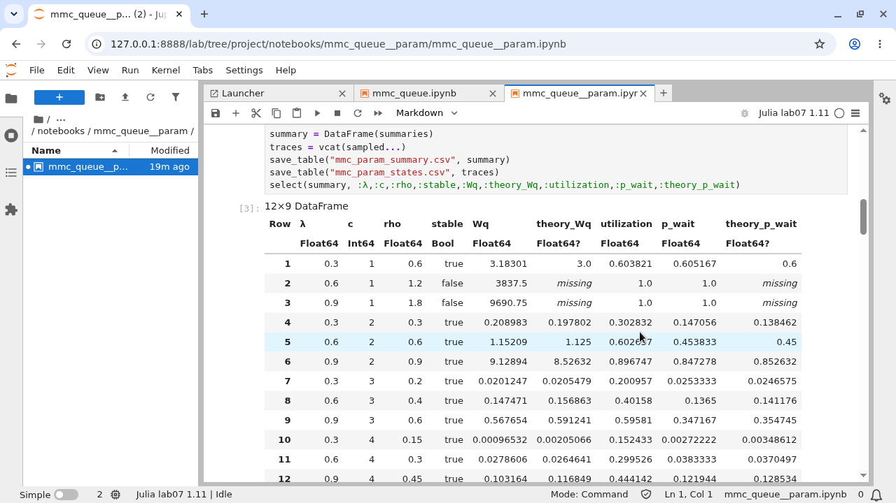{#fig-mmc-param-notebook width=92%}

Все двенадцать сочетаний доступны в таблице блокнота (@fig-mmc-param-notebook).
Для обзорных графиков сохранено по 1001 отсчёту фактического состояния;
усреднение по времени производится по исходным событиям, не по этой сетке.

# Система Росса

## Холодный резерв и критерий аварии

Одновременно работают N одинаковых машин. Ещё S машин находятся в холодном
резерве: пока они не задействованы, отказов у них нет. Сломавшаяся машина
немедленно заменяется резервной и поступает в ремонт. После ремонта она
возвращается в резерв. r одинаковых ремонтников обслуживают не более r
неисправных машин одновременно; остальные ожидают в общей очереди.

В исходном опыте N=10, S=3, r=1. `Exponential(100)` означает среднее
время работы одной машины 100 часов, а `Exponential(1)` — средний ремонт
1 час. Интенсивности равны соответственно 0,01 и 1 в час. Пока система
работоспособна, суммарная интенсивность отказов N/100=0,1 в час.
Следовательно, ремонт в среднем намного быстрее интервала между отказами.

Если k машин неисправны, исправных N+S−k. При k=S исправных ещё N,
все они работают, но резерва нет. Авария возникает при следующем отказе:
k=S+1, исправных становится N−1. Остановка уже при нулевом резерве
была бы другой моделью с более ранним временем аварии.

## Процессы машин, резерв и ремонтный ресурс

В листинге 2 приведён жизненный цикл из `src/RossRepair.jl`. Ожидание
`timeout(env, Inf)` соответствует холодному резерву. Перехватывается только
`InterruptException`, используемое для активации машины; другие исключения
не скрываются. Составное событие даёт немедленный результат запроса резерва.

```julia
while true
    try
        @yield timeout(env, Inf)
    catch exception
        exception isa ConcurrentSim.InterruptException || rethrow()
    end
    @yield timeout(env, rand(rng, F))
    record!(monitor, env, "failure", id; broken_delta=1)
    get_spare = take!(spares)
    @yield get_spare | timeout(env)
    if state(get_spare) != ConcurrentSim.idle
        @yield interrupt(value(get_spare))
    else
        record!(monitor, env, "crash", id)
        throw(StopSimulation("No more spares!"))
    end
    @yield request(repair)
    record!(monitor, env, "repair_start", id; busy_delta=1)
    @yield timeout(env, rand(rng, G))
    record!(monitor, env, "repair_complete", id;
        broken_delta=-1, busy_delta=-1)
    @yield unlock(repair)
    @yield put!(spares, active_process(env))
end
```

*Листинг 2 — Жизненный цикл машины, `src/RossRepair.jl`.*

Замена r=1 на большее значение меняет ёмкость `Resource`, а не вводит
искусственное ускорение одной ремонтной операции. Каждый ремонт по-прежнему
имеет независимую экспоненциальную длительность со средним 1 час.

Монитор сначала интегрирует старое состояние на интервале от предыдущего
события, затем меняет счётчики. Для времени аварии T рассчитываются

$$ U=\frac{1}{rT}\int_0^T b(t)\,dt,\qquad
\overline Q=\frac1T\int_0^T\bigl(k(t)-b(t)\bigr)\,dt, $$

где b(t) — число занятых ремонтников. Простое среднее столбца `busy`
по строкам CSV было бы неверным: длинные и короткие интервалы имели бы
одинаковый вес.

## Аналитическая проверка поглощающей цепью

Из-за отсутствия памяти экспоненциальных распределений число неисправных
машин k является достаточным состоянием. До аварии k∈{0,…,S};
состояние S+1 поглощающее. Интенсивности переходов:

$$ q_{k,k+1}=a=\frac{N}{F},\qquad
q_{k,k-1}=b_k=\frac{\min(k,r)}{G},\qquad
q_{k,k}=-(a+b_k), $$

где F и G — средние времена работы и ремонта. Переход из S в S+1
не входит отдельным столбцом в транзиентную матрицу Q, но его интенсивность
остаётся в диагонали. Иначе цепь не могла бы поглощаться.

Вектор средних времён до аварии m удовлетворяет Qm=−1.
Ожидаемые времена пребывания в состояниях из начального k=0 образуют
вектор v, определяемый системой (−Q)ᵀv=e₀. Тогда E[T]=m₀=Σvₖ,
а аналитические загрузка и очередь получаются взвешиванием min(k,r)
и max(k−r,0) по v. Используются решения линейных систем, а не явное
обращение матрицы.

```julia
failure = N/failure_mean
Q = zeros(S+1,S+1)
for k in 0:S
    repair = min(k,repairers)/repair_mean
    Q[k+1,k+1] = -(failure+repair)
    k < S && (Q[k+1,k+2] = failure)
    k > 0 && (Q[k+1,k] = repair)
end
times = -Q \ ones(S+1)
start = zeros(S+1); start[1] = 1.0
occupation = transpose(-Q) \ start
```

*Листинг 3 — Транзиентная матрица и средние времена, `src/RossRepair.jl`.*

Для одного ремонтника результат независимо проверяется рекуррентной формулой

$$ E[T]=\frac1a\sum_{k=0}^{S}\sum_{j=0}^{k}\left(\frac{b}{a}\right)^j,
\qquad a=N/F,\quad b=1/G. $$

Для N=10, S=3, r=1 получено E[T]=12 340 часов, U=0,09967585,
средняя очередь 0,01053485. Это аналитика конкретной модели до первого
поглощения, а не произвольное сравнение с обычной бесконечной M/M/1.

## Пять базовых прогонов

Сохранены N=10, S=3, r=1, F=100, G=1 и RUNS=5. В тексте исходника
практикума объявлен `SEED=150`, но в вычислении фактически применяется
`StableRNG(42)`. Здесь воспроизведён именно действительный генератор: один
поток последовательно используется во всех пяти прогонах, без сброса seed
перед каждым из них.

```bash
julia --project=. scripts/ross_repair.jl
```



| Прогон | Время аварии, ч | Загрузка ремонтника | Средняя очередь |
|--:|--:|--:|--:|
| 1 | 12 715,718225 | 0,101820 | 0,012732 |
| 2 | 37 335,535676 | 0,099657 | 0,011228 |
| 3 | 30 844,626678 | 0,100806 | 0,010236 |
| 4 | 1 601,252491 | 0,106319 | 0,014589 |
| 5 | 824,104871 | 0,110306 | 0,017696 |

: Исходная последовательность пяти прогонов {#tbl-ross-base}

Пять времён (@tbl-ross-base) совпали с контрольной последовательностью
официального примера ConcurrentSim. Среднее равно 16 664,247588 часов,
стандартная ошибка — 7 489,259406 часа. Приближённый t-интервал 95%
после ограничения нижней границы нулём составляет [0;37 457,765208].
Такой широкий интервал подчёркивает, что пяти наблюдений недостаточно
для точной оценки математического ожидания. Он не является точным
распределительным результатом для асимметричного времени аварии.

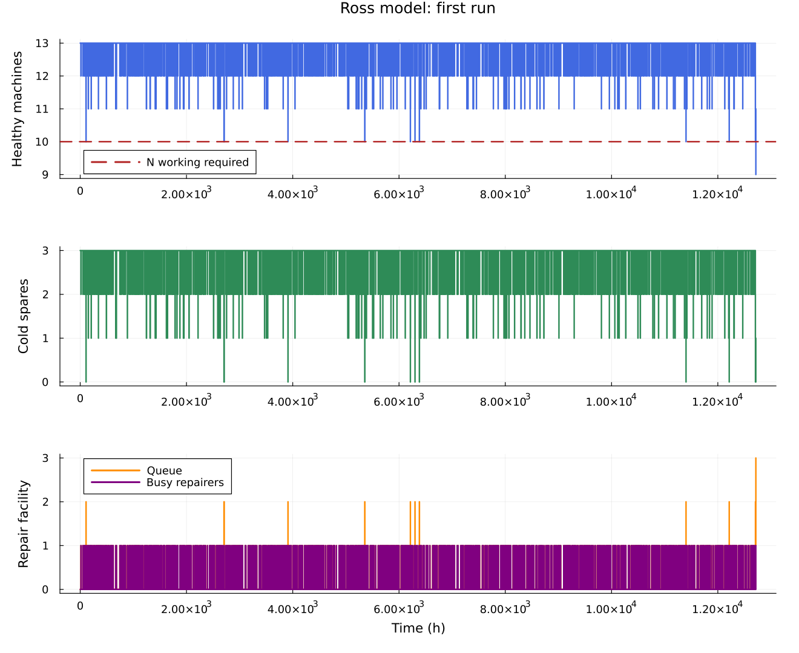{#fig-ross-full width=92%}

Большую часть первого прогона машины исправны и ремонтная очередь пуста
(@fig-ross-full). Сжатие 12 715 часов на одну ось скрывает подробности
редкого аварийного эпизода, поэтому дополнительно показан его конец.

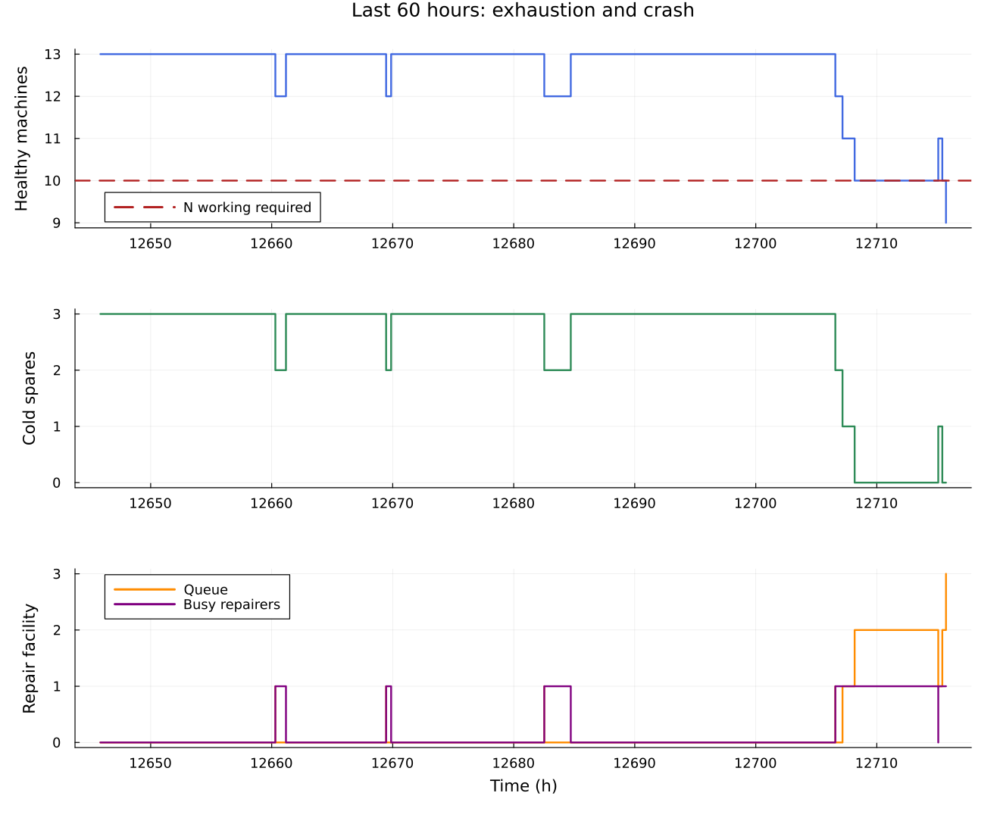{#fig-ross-tail width=92%}

На @fig-ross-tail исправных становится меньше N только в последнем
переходе. Нулевой резерв до него ещё допускает работу всех десяти машин.
Число работающих и резервных машин определяется из текущего числа исправных,
а ёмкость ремонта никогда не превышается.

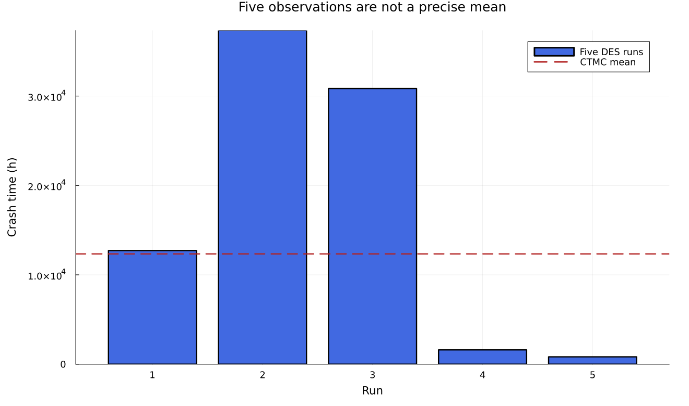{#fig-ross-runs width=92%}

@fig-ross-runs показывает сильную вариативность времени до редкой
аварии. Для сопоставления загрузки и очереди с отношением аналитических
ожидаемых интегралов используются объединённые оценки:
Σarea_busy/(rΣT) и Σarea_queue/ΣT. Они равны 0,10064594 и 0,01121856.
Среднее пяти индивидуальных отношений U не эквивалентно этому расчёту.

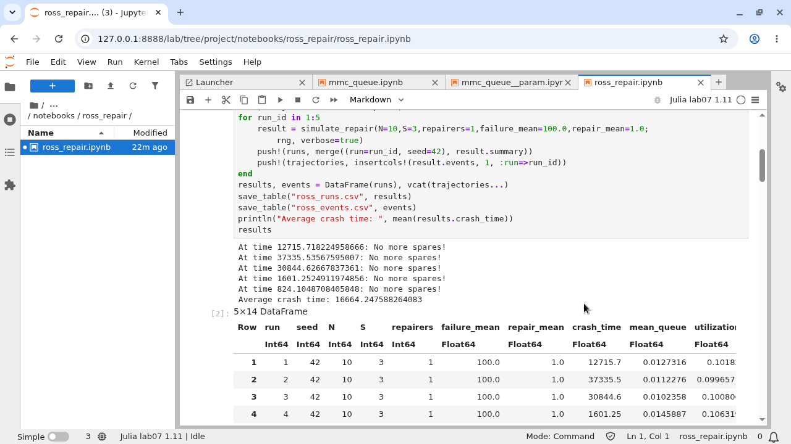{#fig-ross-notebook width=92%}

В блокноте (@fig-ross-notebook) сохранены пять результатов и таблица
ожидаемых времён пребывания в состояниях аналитической цепи.

## Несколько ремонтников и изменение числа машин

В параметрическом эксперименте N∈{5;10;20}, r∈{1;2;3}, S=3,
F=100, G=1. Число повторов методичкой не задано; выбрано по 200
независимых прогонов на сочетание, всего 1800. Для сочетания i и повтора j
seed=710000+1000i+j. Каждый прогон использует ту же процессную модель
ConcurrentSim; отключено лишь сохранение большого журнала событий.

Для среднего времени приведены стандартная ошибка s/√200 и приближённый
95%-й t-интервал. Это интервалы Монте-Карло, а не жёсткие границы будущих
отказов. Каждый интервал относится к отдельному сочетанию; совместная
95%-я гарантия для всех девяти строк не заявляется.

```bash
julia --project=. scripts/ross_repair__param.jl
```



| N | r | Среднее, ч | 95%-й интервал, ч | Аналитика, ч | Откл., % |
|--:|--:|--:|:--|--:|--:|
| 5 | 1 | 187 130,07 | [156 084,66;218 175,48] | 177 280 | +5,56% |
| 10 | 1 | 12 102,43 | [10 376,68;13 828,18] | 12 340 | −1,93% |
| 20 | 1 | 985,02 | [841,35;1128,69] | 970 | +1,55% |
| 5 | 2 | 700 789,78 | [599 640,22;801 939,34] | 690 080 | +1,55% |
| 10 | 2 | 52 858,15 | [45 406,95;60 309,35] | 46 540 | +13,58% |
| 20 | 2 | 3331,38 | [2865,76;3797,00] | 3395 | −1,87% |
| 5 | 3 | 1 003 502,75 | [852 486,56;1 154 518,93] | 1 026 480 | −2,24% |
| 10 | 3 | 67 627,88 | [57 439,49;77 816,27] | 68 640 | −1,47% |
| 20 | 3 | 4749,87 | [4050,57;5449,16] | 4920 | −3,46% |

: Двести независимых прогонов для каждого сочетания {#tbl-ross-param tbl-colwidths="[5,5,20,34,21,15]"}

Все девять интервалов в этой серии накрыли соответствующее аналитическое
ожидание (@tbl-ross-param). Это наблюдаемый результат, а не требование к
любой будущей выборке. Наибольшее относительное отклонение среднего
составило +13,58% при N=10 и r=2; стандартная ошибка там равна 3778,58 часа,
поэтому точечное расхождение не противоречит приведённому интервалу.

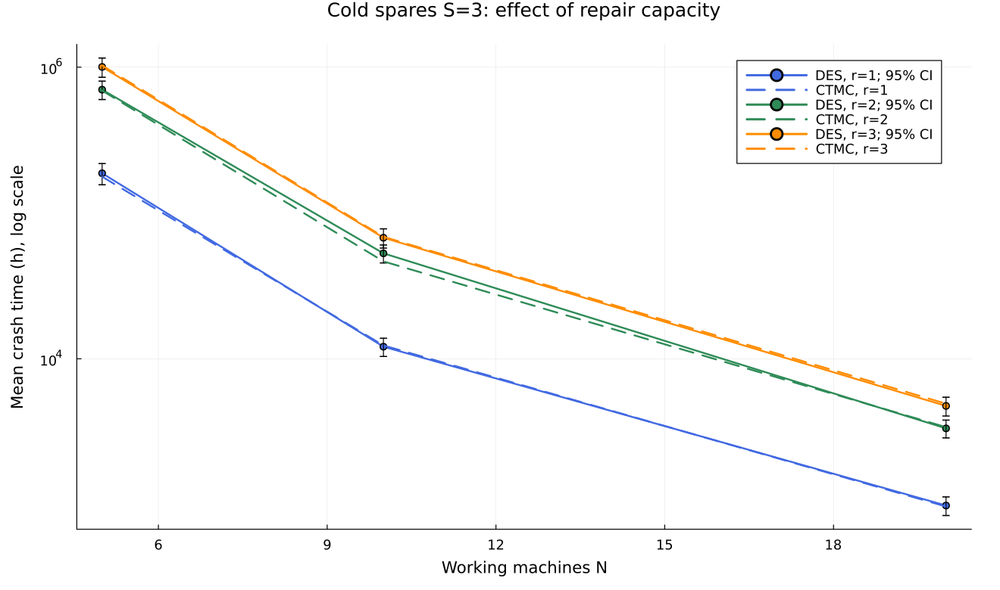{#fig-ross-param width=92%}

При увеличении N суммарный поток отказов N/F растёт, а S и ремонтная
мощность остаются прежними, поэтому система теряет резерв быстрее.
Дополнительные ремонтники уменьшают вероятность накопления S+1 отказов.
Логарифмическая ось на @fig-ross-param нужна из-за разных порядков времени,
а отрезки показывают интервалы среднего, не разброс отдельных прогонов.

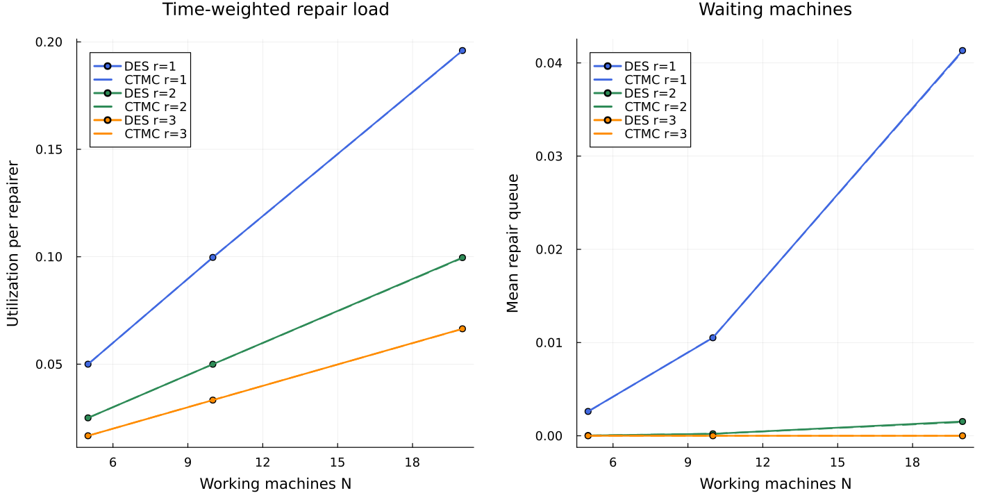{#fig-ross-monitor width=92%}

@fig-ross-monitor сопоставляет объединённые интегральные оценки с
поглощающей цепью. При r=3 и S=3 очередь до аварии тождественно пуста:
каждая из максимум трёх неисправных машин сразу получает ремонтника.
Четвёртый отказ уже завершает эксперимент и не создаёт положительного
по длительности участка ожидания. Нулевая очередь здесь не означает
нулевую вероятность аварии.

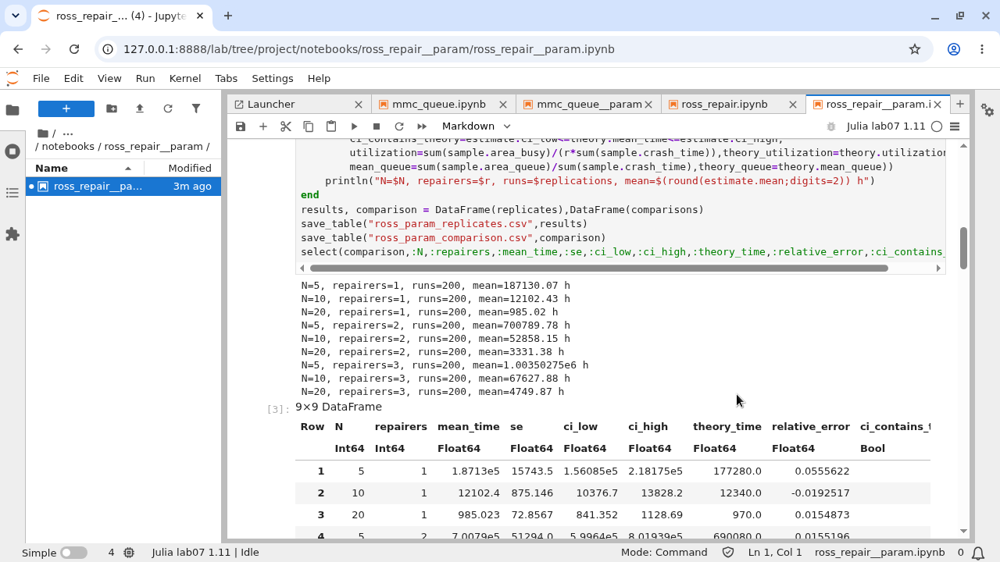{#fig-ross-param-notebook width=92%}

Блокнот (@fig-ross-param-notebook) содержит таблицы оценок, интервалы,
аналитику и графики. Отдельная аналитическая таблица меняет S от 0 до 5
при N=10 и r=1. Этот расчёт не выдаётся за дополнительную имитационную
серию: он служит проверкой влияния резерва и рекуррентной формулы.

## Уточнения к примеру практикума

Средние времена 100 и 1 час нельзя трактовать как интенсивности. При
исходных параметрах ремонт занимает в среднем 1 час, а отказы всего
работающего парка разделены в среднем 10 часами. Поэтому качественное
утверждение о медленном ремонте относительно отказов не соответствует
числам данного примера.

Увеличение резерва до S=5 при одном ремонтнике даёт аналитически
E[T]=1 234 560 часов, а не несколько сотен часов. Значение проверено
матричным решением и независимой рекуррентной формулой. Зависимость сильно
нелинейна: пока ремонт успевает устранять обычные отказы, авария требует
редкой последовательности их накопления.

Объявление SEED=150 при фактически используемом 42 описано явно.
Критерий аварии уточнён как переход к N−1 исправным машинам.
Корректные операции `request`/`unlock` сохранены по актуальному API;
логика резервирования и ремонта не заменена другой моделью.

# Литературные исходники и блокноты

Файл `scripts/tangle.jl` создаёт для каждого из четырёх литературных
сценариев чистый Julia-код, исполняемый QMD и IPYNB. Для отчёта также
создаётся вариант `*-report.qmd` с обычными Julia-листингами. Это позволяет
включить весь сценарий в тематический раздел, не перезапуская тысячи
моделирований при каждой правке текста отчёта.

```julia
Literate.script(source, scriptsdir(name); name, credit=false)
Literate.notebook(source, projectdir("notebooks", name); name,
    execute=false, credit=false, postprocess=nb -> begin
        nb["metadata"]["kernelspec"] = Dict("language"=>"julia",
            "name"=>"julia-lab07-1.11",
            "display_name"=>"Julia lab07 1.11")
        nb
    end)
Literate.markdown(source, dest; name,
    flavor=Literate.QuartoFlavor(), credit=false)
```

*Листинг 4 — Получение производных форматов, `scripts/tangle.jl`.*

Первоначальный `execute=false` относится только к созданию структуры IPYNB.
После этого `make notebooks` действительно выполняет каждый блокнот через
ядро Julia. Сохраняются счётчики выполнения и выходы всех кодовых ячеек.
Команда `make docs` исполняет QMD и создаёт HTML-документацию.
Все четыре `*-report.qmd` включены непосредственно в соответствующие
разделы данного отчёта, а не заменены вручную выбранными выдержками.

| Блокнот | Кодовых ячеек | Счётчики | Ошибки |
|:--|--:|:--|--:|
| `mmc_queue.ipynb` | 6 | 1–6 | 0 |
| `mmc_queue__param.ipynb` | 6 | 1–6 | 0 |
| `ross_repair.ipynb` | 6 | 1–6 | 0 |
| `ross_repair__param.ipynb` | 6 | 1–6 | 0 |

: Проверка выполненных Julia-блокнотов {#tbl-notebooks tbl-colwidths="[46,20,19,15]"}

В каждом блокноте проверены все шесть кодовых ячеек (@tbl-notebooks):
счётчики не пусты, исключений выполнения нет, таблицы и графики сохранены.

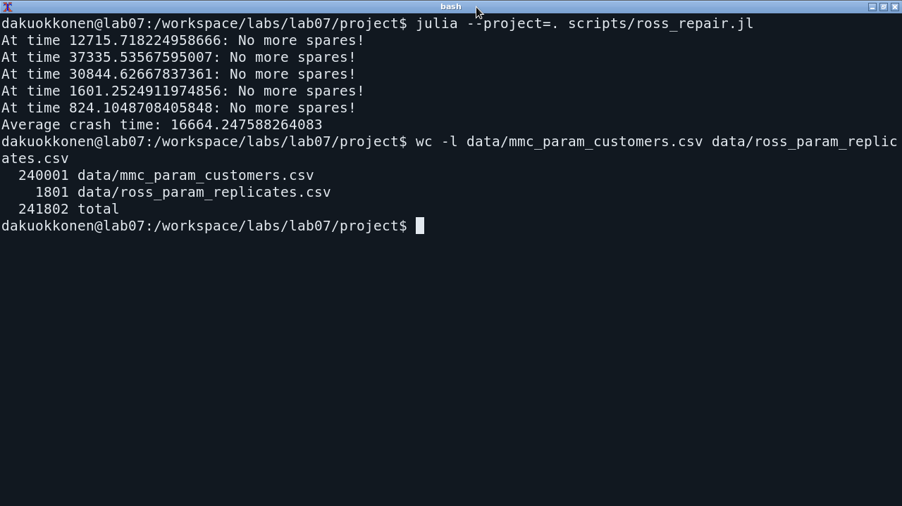{#fig-runs-terminal width=92%}

Вывод запуска (@fig-runs-terminal), содержимое CSV и выходы блокнотов
проверяются раздельно: наличие файла без результата выполнения не считается
завершённым экспериментом.

# Проверки и ограничения

`test/runtests.jl` содержит 221 проверку в четырёх группах. Для очереди
проверены причинный порядок arrival≤start≤departure, FIFO, ограничения
ресурса, отсутствие отрицательной очереди, обслуживание всех заявок,
повторяемость seed и тождества площадей под траекториями. Для стационарной
теории проверены M/M/1, Эрланг C и запрет стационарных оценок при перегрузке.

Для системы Росса проверены все пять контрольных времён, сохранение общего
числа машин, работа N машин до аварии, capacity ремонтников и временные
интегралы. Отдельно проверены S=0, N=1 и r=1…3. Аналитика сверена с
рекуррентной формулой на 24 сочетаниях N и S; проверены положительность
времён и остаток Qm+1.

```julia
@test all(c.arrival .<= c.start .<= c.departure)
@test issorted(c.start)
@test all(0 .<= e.busy .<= 2)
@test isapprox(sum(c.wait),
    sum(diff(e.time).*e.queue[1:end-1]); rtol=1e-12)
@test analytic_repair().mean_time ≈ 12340
@test analytic_repair(N=5,S=0).mean_time ≈ 100/5
@test analytic_repair(repairers=3).mean_queue == 0
```

*Листинг 5 — Фрагменты независимых проверок, `test/runtests.jl`.*

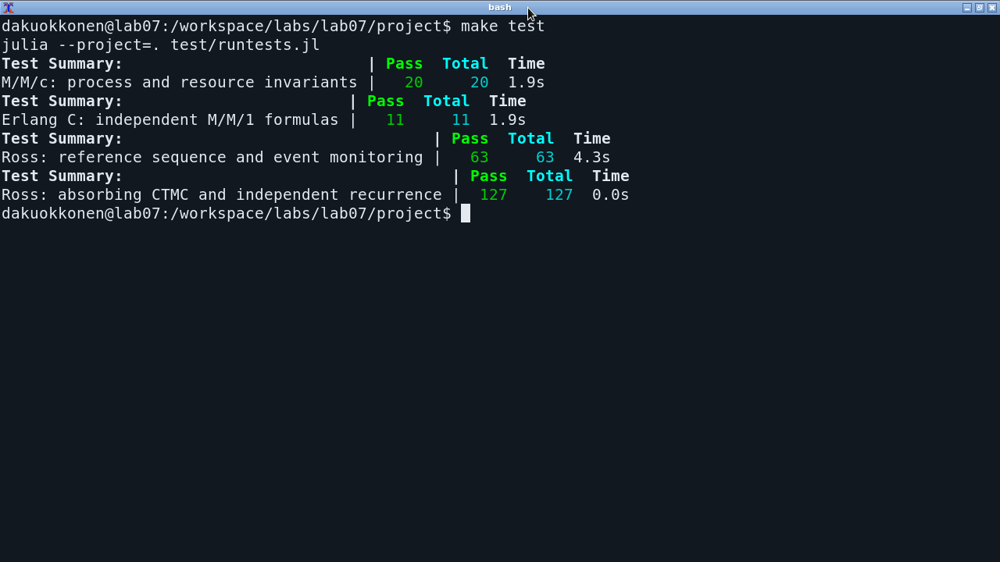{#fig-tests width=92%}

Тесты на @fig-tests подтверждают программные инварианты, но не устраняют
статистическую погрешность. В M/M/c использован один длинный прогон на
сочетание; редкое ожидание при низкой загрузке оценено менее точно.
В модели Росса 200 повторов существенно содержательнее пяти, однако
интервалы среднего остаются приближёнными. Аналитические формулы опираются
на независимые экспоненциальные времена и холодный резерв; при старении,
общих причинах отказов или отказах резервных машин эта цепь уже не описывает
систему без изменения состояний и переходов.

# Выводы

Две модели реализованы средствами одного событийного механизма, но отвечают
на разные вопросы. M/M/c показывает накопление ожидания при приближении
входного потока к пропускной способности. Система Росса связывает число
резервных машин и ремонтную мощность со временем до потери работоспособности.

Для M/M/c выполнены исходные десять клиентов и двенадцать параметрических
опытов. Разделены короткий переходный запуск, устойчивые режимы и перегрузка.
При λ=0,9 добавление третьего канала уменьшило наблюдаемое ожидание
с 9,128937 до 0,567654. Средние по состояниям получены интегрированием
межсобытийных интервалов; конечные расхождения закона Литтла сохранены
как диагностические результаты.

В системе Росса воспроизведены пять исходных времён аварии, построены
траектории исправных и резервных машин, загрузки и очереди ремонта.
Параметрическая серия содержит 1800 независимых прогонов для девяти
сочетаний числа машин и ремонтников. Сравнение выполнено с поглощающей
марковской цепью, дающей E[T]=12 340 часов для базовых условий.
Показано, почему отсутствие свободного резерва ещё не равно аварии и почему
среднее пяти наблюдений нельзя считать точным математическим ожиданием.

Четыре литературных сценария согласованы с чистыми Julia-файлами,
выполненными блокнотами и QMD-документацией. Полученные данные, рисунки,
листинги и аналитические ограничения связаны в одном исследовании.

# Источники {.unnumbered}

1\. Королькова А. В., Кулябов Д. С. *Имитационное моделирование. Практикум.*
   Глава 7 «Дискретно-событийное моделирование», с. 209–219.

2\. ConcurrentSim.jl. *M/M/c queueing system.*
   <https://juliadynamics.github.io/ConcurrentSim.jl/stable/examples/mmc/>.

3\. ConcurrentSim.jl. *A discrete event example (Ross).*
   <https://juliadynamics.github.io/ConcurrentSim.jl/stable/examples/ross/>.

4\. ConcurrentSim.jl. *API.*
   <https://juliadynamics.github.io/ConcurrentSim.jl/stable/api/>.

5\. Literate.jl. *File formats and output.* <https://fredrikekre.github.io/Literate.jl/v2/>.

6\. Quarto. *Scientific and technical publishing.* <https://quarto.org/docs/>.
