---
author:
  name: Куокконен Дарина Андреевна
  affiliation:
    - name: Российский университет дружбы народов имени Патриса Лумумбы
      country: Российская Федерация
      city: Москва
title: "Лабораторная работа № 8"
subtitle: "Реализация основных моделей в дискретно-событийном подходе"
institute: "НФИбд-01-23"
date: 2026-09-04
date-format: "YYYY-MM-DD"
lang: ru-RU
---

# Вводная часть

## Цель и задачи

Исследовать распространение инфекции через индивидуальные процессы
ConcurrentSim и сопоставить результаты с приближением среднего поля.

- базовая SIR и чувствительность β, c, γ;
- фиксированная длительность болезни и производительность;
- сохранение CSV и независимый анализ;
- демография, вакцинация и латентная стадия SEIR;
- литературные исходники и выполненные блокноты.

::: {.notes}
Практикум А. В. Корольковой и Д. С. Кулябова, глава 8, стр. 221–234,
редакция 22.05.2026. Это последняя лабораторная практикума.
:::

## Индивидуальная модель SIR

Восприимчивый человек ожидает контакт со средним временем 1/c.
Собеседник выбирается среди других живых людей.

$$
\tau_c\sim\mathrm{Exp}(1/c),\qquad
\tau_r\sim\mathrm{Exp}(1/\gamma).
$$

При встрече с заразным передача происходит с вероятностью β.
После болезни формируется иммунитет.

$$
a_{SI}=\beta c\frac{SI}{N-1},\qquad a_{IR}=\gamma I.
$$

::: {.notes}
Exp использует среднее ожидание как масштаб. Знаменатель N−1 исключает
самого человека. Для N≤1 контакт не выполняется. Источник: §8.2–8.4
практикума и src/sir_model.jl текущей лабораторной.
:::

## Начальные условия

| Величина | Значение |
|:--|--:|
| S₀ / I₀ / R₀ | 990 / 10 / 0 |
| Вероятность β | 0.05 |
| Контактов в день c | 10 |
| Интенсивность γ | 0.25 |
| Горизонт T | 40 дней |
| Зерно генератора | 1234 |

Средняя болезнь длится 4 дня. Начальное эффективное
репродуктивное число среднего поля приблизительно равно 1.982.

# Выполнение работы

## Структура исследования

Девять самостоятельных сценариев используют общий модуль `sir_model.jl`.

| Основная часть | Дополнительные исследования |
|:--|:--|
| Базовая SIR | Параметры β, c, γ |
| Сравнение с ОДУ | Фиксированная болезнь |
| Анализ сохранённых CSV | Время и память |
| Литературные форматы | Демография, вакцинация, SEIR |

Для каждого сценария сохранены литературный и чистый JL,
QMD, HTML и выполненный Julia-блокнот.

## Календарь событий и проверки состояния

- `@process` регистрирует процессы людей;
- `@yield timeout` приостанавливает процесс до события;
- `sir_run` продвигает модельное время до горизонта;
- `out` возвращает журнал состояний после переходов.

После ожидания повторно проверяется статус человека.
Смерть и вакцинация не позволяют отложенному контакту заразить его.

$$
S+E+I+R=N_0+B-D.
$$

## Среда Julia

:::::::::::::: {.columns align=center}
::: {.column width="64%"}
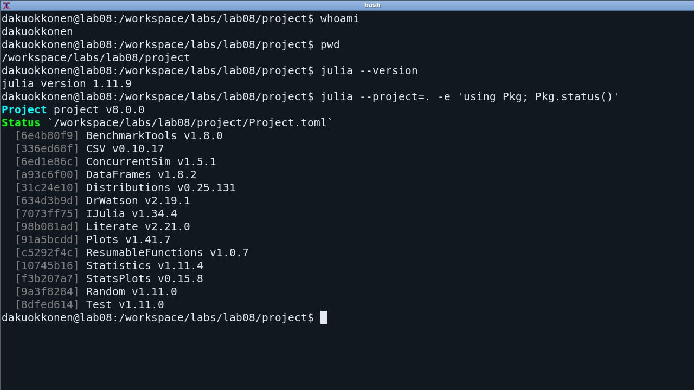
:::
::: {.column width="36%"}

- Julia 1.11.9
- ConcurrentSim
- ResumableFunctions
- Distributions
- DrWatson
- Literate и IJulia

Пользователь `dakuokkonen`.
Версии закреплены в `Manifest.toml`.
:::
::::::::::::::

# Результаты

## Базовый опыт

:::::::::::::: {.columns align=center}
::: {.column width="68%"}
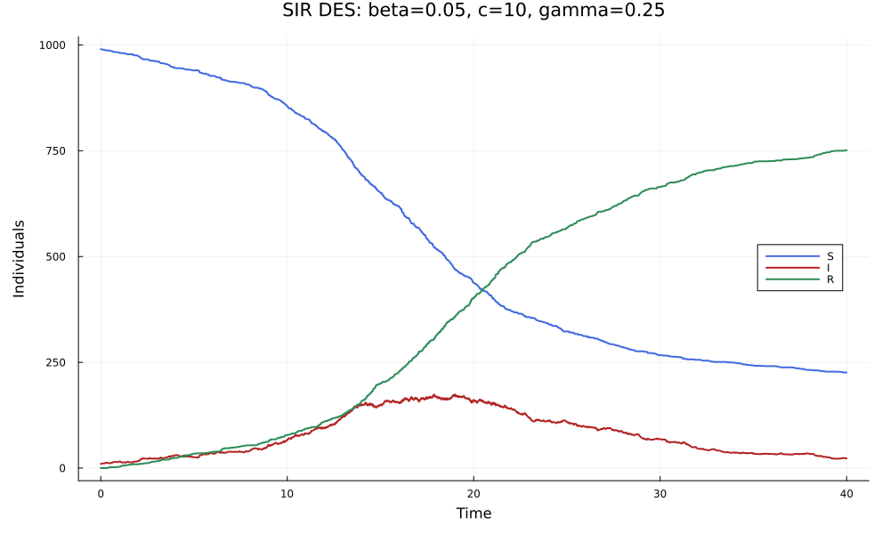
:::
::: {.column width="32%"}

Пик **174** при t=17.8722.

На 40-й день:

- S=226;
- I=23;
- R=751.

774 человека заражены к T.
Эпидемия ещё не завершилась.
:::
::::::::::::::

## Чувствительность к β и γ

:::::::::::::: {.columns align=center}
::: {.column width="68%"}
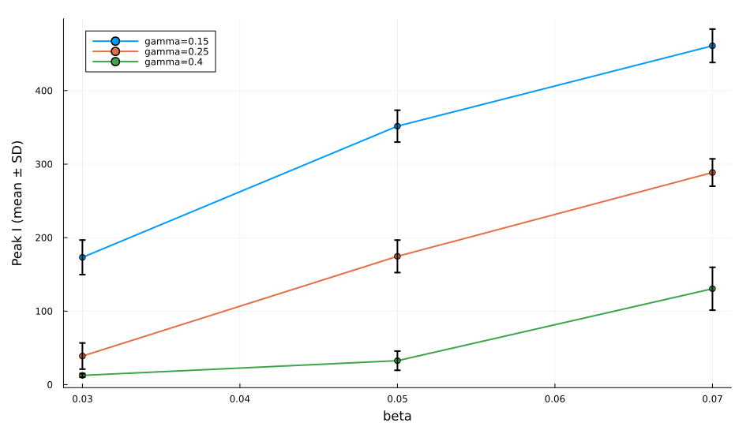
:::
::: {.column width="32%"}

27 сочетаний, по 10 повторов.

При c=10 и γ=0.25:

| β | Средний пик |
|--:|--:|
| 0.03 | 38.9 |
| 0.05 | 174.6 |
| 0.07 | 288.6 |

Усы показывают SD траекторий.
:::
::::::::::::::

## Частота контактов и выздоровление

При β=0.05 увеличение c повышает пик,
а увеличение γ сокращает среднюю длительность болезни.

| Изменяемый параметр | Значения | Средние пики I |
|:--|:--|:--|
| c при γ=0.25 | 5 / 10 / 15 | 21.7 / 174.6 / 319.0 |
| γ при c=10 | 0.15 / 0.25 / 0.4 | 351.7 / 174.6 / 32.6 |

Каждое среднее получено по 10 повторам.
Сравнение проводится при неизменных остальных параметрах.

## Фиксированная болезнь

:::::::::::::: {.columns align=center}
::: {.column width="68%"}
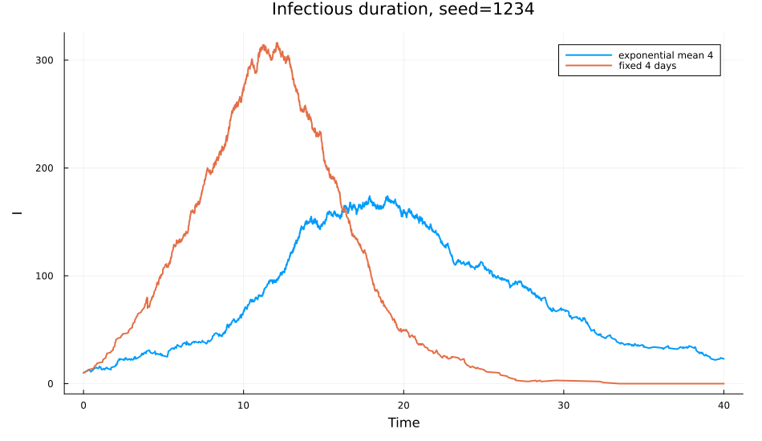
:::
::: {.column width="32%"}

По 20 повторов каждого закона.

Средние пики:

- Exp: **166.25**;
- ровно 4 дня: **326.05**.

Одинаковое среднее ожидание даёт разную динамику.
:::
::::::::::::::

## Производительность

:::::::::::::: {.columns align=center}
::: {.column width="64%"}
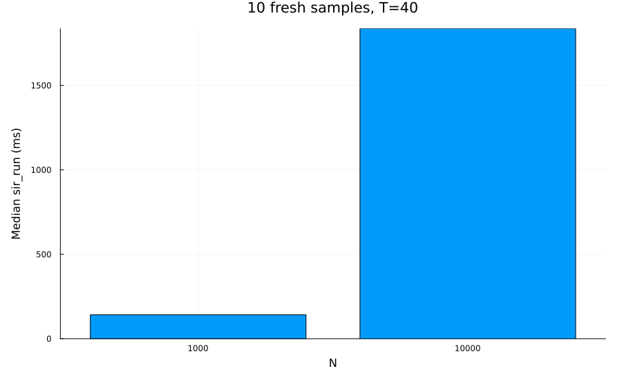
:::
::: {.column width="36%"}

10 свежих образцов для каждого N.

Медиана `sir_run`:

- N=1000: 141.64 мс;
- N=10000: 1836.21 мс.

Создание модели вынесено в `setup`, `evals=1`.
Объём аллокаций не равен пиковому RSS.
:::
::::::::::::::

## Независимый анализ CSV

:::::::::::::: {.columns align=center}
::: {.column width="68%"}
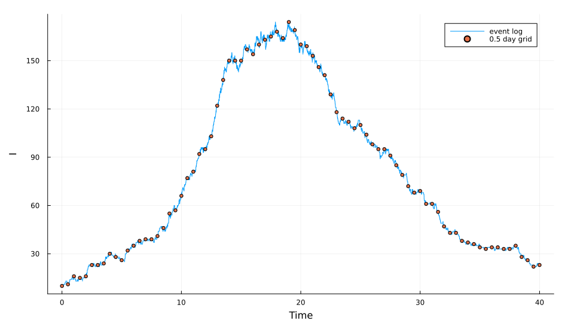
:::
::: {.column width="32%"}

488 траекторий с параметрами в именах.

Отдельный сценарий читает базовый журнал без новой симуляции.

Сетка 0:0.5:40 содержит 81 точку.
Точный пик берётся из событий.
:::
::::::::::::::

## Демография и вымирание

:::::::::::::: {.columns align=center}
::: {.column width="65%"}
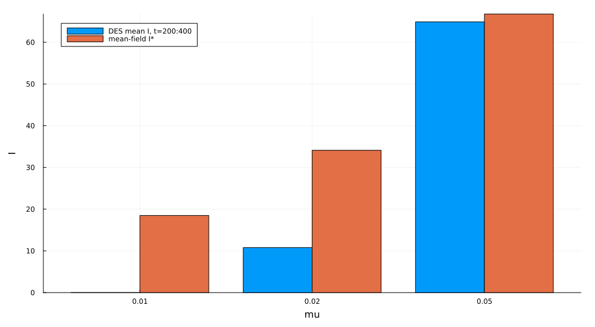
:::
::: {.column width="35%"}

Постоянные рождения b=μN₀,
независимые смерти, T=400.

| μ | Вымираний |
|--:|--:|
| 0.01 | 5 из 5 |
| 0.02 | 4 из 5 |
| 0.05 | 0 из 5 |

Положительное I* не гарантирует сохранение инфекции в DES.
:::
::::::::::::::

## Срок вакцинации

:::::::::::::: {.columns align=center}
::: {.column width="66%"}
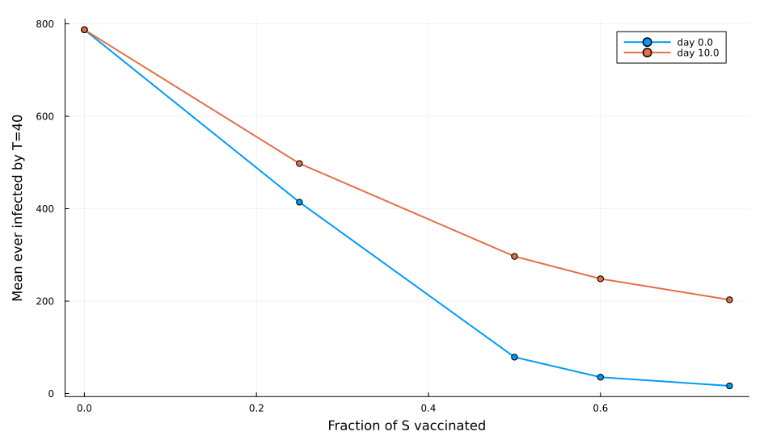
:::
::: {.column width="34%"}

Среднее число заразившихся:

- без вакцины: **787.2**;
- 75% S в день 0: **16.6**;
- 75% S в день 10: **202.9**.

По 10 повторов стратегии.
Вакцинированные не включены в число заражённых.
:::
::::::::::::::

## Латентная стадия SEIR

:::::::::::::: {.columns align=center}
::: {.column width="66%"}
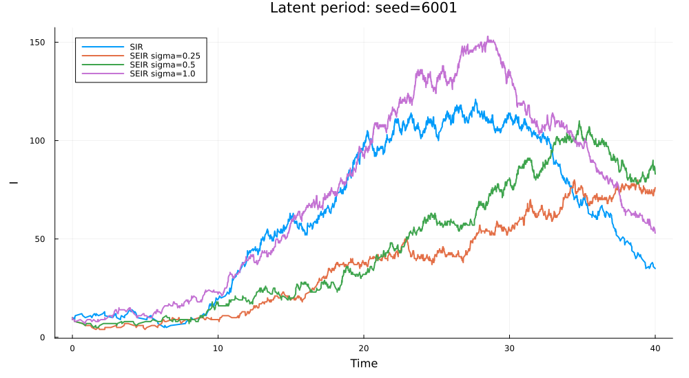
:::
::: {.column width="34%"}

E ещё не заразны.
Среднее ожидание E составляет 1/σ.

При σ=0.25 средний пик **84.0**, у SIR **167.2**.

Пик сдвигается к концу горизонта.
R(40) не определяет окончательный размер эпидемии.
:::
::::::::::::::

## Сравнение с ОДУ

:::::::::::::: {.columns align=center}
::: {.column width="66%"}
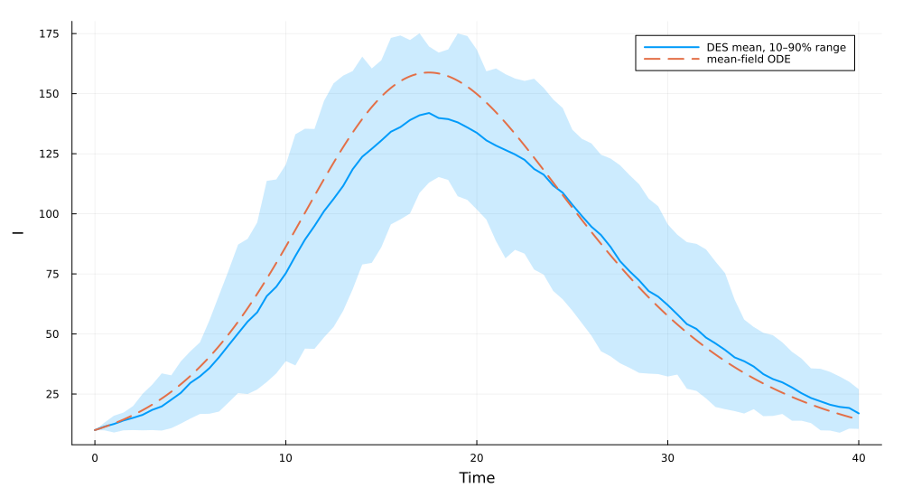
:::
::: {.column width="34%"}

20 DES-траекторий.

- пик ОДУ: **158.79**;
- среднее пиков: **160.40**;
- пик среднего: **141.95**.

Полоса 10–90% показывает разброс траекторий,
а не доверительный интервал среднего.
:::
::::::::::::::

## Блокноты и проверки

:::::::::::::: {.columns align=center}
::: {.column width="64%"}
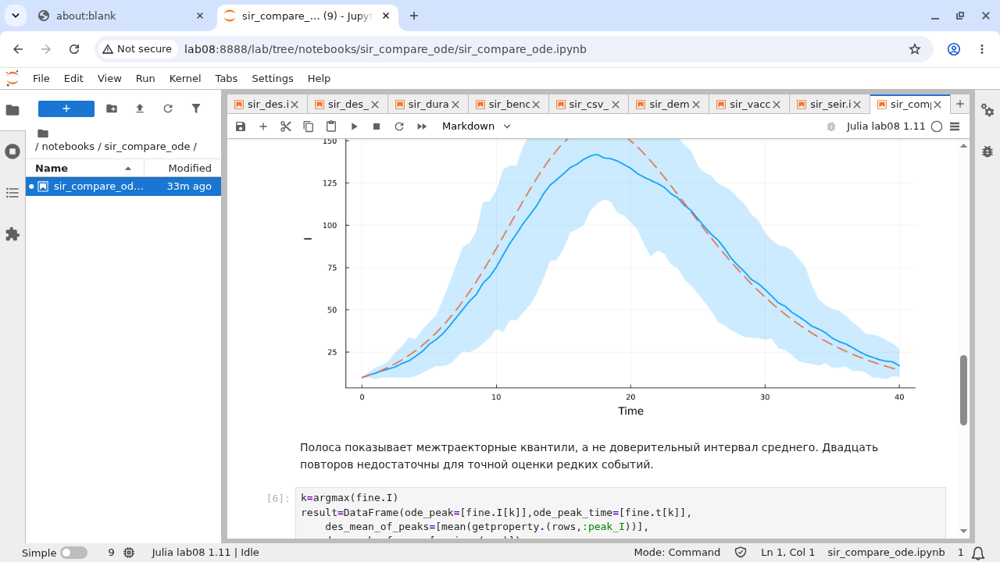
:::
::: {.column width="36%"}

9 выполненных блокнотов.
42 кодовые ячейки без ошибок.

13 248 успешных проверок:

- баланс и журнал;
- отложенные события;
- SEIR и вакцинация;
- ОДУ и сохранённые CSV.
:::
::::::::::::::

# Заключение

## Выводы

- Индивидуальные процессы воспроизводят SIR и её расширения.
- β и c усиливают распространение, γ сокращает болезнь.
- Закон длительности влияет на пик даже при одинаковом среднем.
- Демография допускает вымирание инфекции при положительном I*.
- Ранняя вакцинация снижает число заражений сильнее поздней.
- SEIR задерживает волну, а усреднение сглаживает случайные пики.

Все результаты относятся к указанным параметрам, повторам и горизонтам.

## Источники

1. Королькова А. В., Кулябов Д. С.
   *Имитационное моделирование. Практикум*.
   Глава 8, с. 221–234. Редакция 22.05.2026.
2. Исходники лабораторной № 8:
   `src/sir_model.jl`, `src/experiments.jl`, `scripts`.
3. Результаты Julia 1.11.9 от 04.09.2026:
   `data/analysis`, `data/sims`, выполненные блокноты.
