

# Содержание {.unnumbered}

1\. Цель и постановка задачи.

2\. Теоретическая часть.

3\. Среда и организация проекта.

4\. Общий модуль модели.

5\. Базовый опыт и дополнительные исследования.

6\. Производные форматы и проверка результатов.

7\. Выводы.

8\. Источники.

**Аннотация.** Работа посвящена распространению инфекции в конечной
полностью смешивающейся популяции. Каждый человек представлен процессом
ConcurrentSim с собственными случайными временами контактов и выздоровления.
Базовая SIR дополнена фиксированной длительностью болезни, демографией,
вакцинацией и латентной стадией SEIR. Исследованы параметры, затраты времени
и отличие индивидуальной динамики от приближения среднего поля. Девять
самостоятельных сценариев выполнены в Julia и в блокнотах Jupyter.
Их литературная документация включена непосредственно в тематические
разделы отчёта. Для базового опыта получен пик 174 заразных, а на 40-й день
сохраняются 23 заразных: горизонт расчёта ещё не означает окончания эпидемии.



<!-- Model: individual SIR / ConcurrentSim -->
<!-- Baseline: S0=990, I0=10, R0=0, beta=0.05, c=10, gamma=0.25 -->
<!-- Horizon: 40 days; seed: 1234 -->


# Цель и постановка задачи

Цель работы состоит в изучении дискретно-событийного подхода на примере
SIR и в проверке того, как индивидуальные случайные события изменяют
динамику инфекции. Источник задания — глава 8 «Реализация основных моделей
в дискретно-событийном подходе» практикума А. В. Корольковой и Д. С. Кулябова,
стр. 221–234, редакция от 22 мая 2026 года [1]. Это заключительная
лабораторная работа практикума.

Основная часть требует создать ядро `src/sir_model.jl` и сценарий
`scripts/sir_des.jl`, задать начальную популяцию, запустить процессы людей,
сохранить таблицу событий и построить S/I/R. Семь дополнительных заданий
§8.5 охватывают чувствительность параметров, фиксированную длительность
инфекции, производительность при 10 000 индивидов, CSV, демографию,
вакцинацию и SEIR. В §8.6 требуется литературный код и его производные
форматы, включая выполненные блокноты и интеграцию Quarto в отчёт.

В @tbl-scenarios показано выбранное разбиение. Методичка не задаёт число
файлов для дополнительных заданий. Общие модули, тесты и копии исходника
в разных форматах самостоятельными сценариями не считаются.

| Сценарий в `scripts` | Исследование |
|:--|:--|
| `sir_des.jl` | Базовая индивидуальная SIR |
| `sir_des__param.jl` | Полный факторный план β, c, γ |
| `sir_duration.jl` | Случайная и фиксированная болезнь |
| `sir_benchmark.jl` | Затраты при N=1000 и N=10000 |
| `sir_csv_report.jl` | Отдельный анализ сохранённого журнала |
| `sir_demography.jl` | Независимые смерти и рождения |
| `sir_vaccination.jl` | Вакцинация в дни 0 и 10 |
| `sir_seir.jl` | Латентная стадия E |
| `sir_compare_ode.jl` | Ансамбль DES и приближение ОДУ |

: Самостоятельные сценарии {#tbl-scenarios}

<!-- Model: individual SIR / ConcurrentSim -->
<!-- Baseline: S0=990, I0=10, R0=0, beta=0.05, c=10, gamma=0.25 -->
<!-- Horizon: 40 days; seed: 1234 -->


# Теоретическая часть

## События и индивидуальные процессы

Состояния S, I и R означают восприимчивость, заразность и иммунитет после
болезни. В базовом опыте численность постоянна. Время продвигается до
ближайшего события календаря, поэтому фиксированный шаг интегрирования
для индивидуальной модели не нужен. Между переходами численности
сохраняются, а журнал содержит состояние непосредственно после события.

Восприимчивый индивид ожидает контакт в течение случайного времени
$\tau_c\sim\mathrm{Exp}(1/c)$, где аргумент обозначает среднее ожидание.
В Julia пакет Distributions использует именно масштаб, а не интенсивность.
Партнёр выбирается равномерно среди других живых индивидов. Если он
заразен, заражение происходит с вероятностью $\beta$. Среднее время
инфекции равно $1/\gamma$, а в базовом варианте
$\tau_r\sim\mathrm{Exp}(1/\gamma)$.

Процессы логически существуют одновременно, но это не многопоточное
исполнение Julia. Планировщик обрабатывает события по временам. События
с одним временем последовательно меняют состояние, имея нулевую длительность.

## Интенсивности и приближение среднего поля

При текущих численностях условная интенсивность заражений равна

$$
a_{SI}(S,I)=\beta c\frac{SI}{N-1},\qquad a_{IR}(I)=\gamma I.
$$ {#eq-rates}

Знаменатель $N-1$ возникает из запрета выбирать самого себя. Для $N\leq1$
внешнего собеседника нет и интенсивность заражения равна нулю.
Здесь $\beta$ — безразмерная вероятность передачи при контакте.
Подмена (@eq-rates) законом $\beta SI$ изменила бы смысл и масштаб модели.

Приближение среднего поля для постоянного N имеет вид

$$
\frac{dS}{dt}=-\beta c\frac{SI}{N-1},\quad
\frac{dI}{dt}=\beta c\frac{SI}{N-1}-\gamma I,\quad
\frac{dR}{dt}=\gamma I.
$$ {#eq-ode}

Оно заменяет средние произведения произведениями средних и потому не
обязано точно совпадать со средним конечного стохастического ансамбля.
При начальных условиях опыта эффективное репродуктивное число
$\mathcal R_{\mathrm{eff}}(0)=\beta cS_0/[\gamma(N-1)]\approx1.982$.
Этот показатель описывает начальный рост в среднем поле, а не гарантирует
определённый исход отдельной случайной траектории.

## Измеряемые показатели

Пик $I_{\max}$ и время его первого достижения определяются по журналу
событий. Значения $S(T),I(T),R(T)$ относятся к выбранному горизонту.
Число когда-либо заражённых равно начальному $I_0$ плюс новые заражения.
Вакцинированные учитываются отдельным счётчиком и не входят в этот показатель.

В сериях используются средние, межтраекторное стандартное отклонение и
доли вымираний к T. Стандартное отклонение пика не является ошибкой одного
запуска. Полоса квантилей траекторий также не является доверительным
интервалом для среднего. Эти различия важны при интерпретации графиков.

# Среда и организация проекта

Расчёты выполнены в изолированном контейнере с Julia 1.11.9 от пользователя
`dakuokkonen`, в каталоге `/workspace/labs/lab08/project`.
`Project.toml` перечисляет зависимости, а `Manifest.toml` закрепляет версии.
Модель находится в `src/sir_model.jl`, повторяющиеся операции экспериментов
в `src/experiments.jl`. Каждый литературный сценарий имеет чистую версию,
QMD, HTML и выполненный IPYNB.

Проверка пользователя и среды отражена на @fig-env.
Основные пакеты приведены в @tbl-packages.

{#fig-env width=92%}

| Пакет | Назначение |
|:--|:--|
| ConcurrentSim, ResumableFunctions | Календарь и процессы людей |
| Distributions, Random | Времена ожидания и явный генератор Xoshiro |
| DrWatson | Активация, пути и имена данных |
| DataFrames, CSV | Журналы и сводные таблицы |
| StatsPlots, Plots | Графики траекторий и сравнений |
| BenchmarkTools | Измерение свежих прогонов модели |
| Literate, IJulia | Производные форматы и ядро Julia |

: Пакеты вычислительного проекта {#tbl-packages}

Команды выполняются из каталога проекта. `make tangle` создаёт производные
исходники, `make run` последовательно запускает сценарии, а `make notebooks`
сохраняет результаты ячеек. После повторной генерации блокнотов их требуется
выполнить заново: сама генерация не доказывает успешного расчёта.

```bash
whoami
pwd
julia --version
julia --project=. -e 'using Pkg; Pkg.status()'
make run
make tangle
make notebooks
make docs
make test
```

# Общий модуль модели

## Структуры и регистрация переходов

`SIRPerson` содержит идентификатор, состояние и время начала заразности.
`SIRModel` хранит календарь, параметры, явный генератор, живых индивидов,
счётчики и столбцы журнала. Конструктор проверяет вероятности,
неотрицательные численности и допустимость интенсивностей.

Фрагмент `src/sir_model.jl` в листинге 1 показывает единый переход между
состояниями. Такая функция заменяет отдельные обновления S/I/R и позволяет
применять один механизм также к E и D. Вспомогательные `increment!`,
`decrement!`, `carryover!` сохранены, но общий переход ведётся через счётчики.

```julia
function transition!(m, person, target::Symbol, event::Symbol)
    old = stateindex(person.status)
    old == 0 && return false
    m.counts[old] -= 1
    new = stateindex(target)
    new > 0 && (m.counts[new] += 1)
    person.status = target
    snapshot!(m, event, person.id)
    true
end
```

Листинг 1. Обновление состояния в `src/sir_model.jl`.

## Контакт и выздоровление

После ожидания контакта статус проверяется повторно. За это время индивид
мог умереть или получить вакцину, поэтому запланированное событие нельзя
безусловно выполнять. Цикл выбора собеседника запускается только при наличии
как минимум двух живых индивидов. Заражение вызывает переход в I либо в E,
если задана конечная интенсивность латентной стадии.

В листинге 2 приведён заключительный участок `live` из того же модуля.
Время болезни отсчитывается с перехода в I. После смерти ожидание может
завершиться, но проверка статуса не даёт вернуть умершего в R.

```julia
if person.status == :I
    duration = m.fixed_duration ? 1/m.γ :
        rand(m.rng, Exponential(1/m.γ))
    @yield timeout(sim, duration)
    if person.status == :I
        push!(m.disease_durations, now(sim)-person.infection_time)
        transition!(m,person,:R,:recovery)
    end
end
```

Листинг 2. Выбор длительности и безопасное выздоровление, `src/sir_model.jl`.

## Демография и вакцинация

Смерть реализована отдельным процессом `die`, независимым от ожидания контакта
и болезни. Он удаляет человека из массива живых за O(1), заменяя его последним
элементом и обновляя словарь позиций. Рождения имеют постоянную суммарную
интенсивность $b=\mu N_0$. Каждый новорождённый получает собственные процессы.
Следовательно, реализована именно постоянная интенсивность потока рождений,
а не величина, пропорциональная текущему размеру популяции.

Вакцинация выбирает $\lfloor fS\rfloor$ случайных восприимчивых и переводит
их в R. Доля f относится к текущим S. Для всех переходов контролируется

$$
S(t)+E(t)+I(t)+R(t)=N_0+B(t)-D(t).
$$ {#eq-balance}

Введённые проверки уточняют технически неполный пример методички: смерть
конкурирует с инфекцией, а не ожидается после её завершения. Это сохраняет
смысл независимой постоянной интенсивности смертности.

# Базовый опыт и дополнительные исследования

## Базовая SIR

Исходные условия точно соответствуют §8.2: $S_0=990$, $I_0=10$, $R_0=0$,
$\beta=0.05$, $c=10$, $\gamma=0.25$, $T=40$, `seed=1234`.
Команда запуска — `julia --project=. scripts/sir_des.jl`.
Ниже непосредственно включена документация литературного исходника
`scripts/sir_des.jl`, созданная `scripts/tangle.jl`.



Пик равен 174 при $t=17.872235$. На горизонте получены $S=226$, $I=23$,
$R=751$. Всего заражение перенесли или ещё переносят 774 человека.
В журнале 764 новых заражения и 751 выздоровление; начальные 10 заразных
не считаются новыми инфекциями. Последняя строка фиксирует горизонт.
Кривые на @fig-base показывают истощение восприимчивой части популяции.
После пика число заразных падает, хотя контакты продолжаются.

{#fig-base width=90%}

Запуск и сохранённый вывод показаны на @fig-base-term, @fig-base-nb и
@fig-base-result. График и численные значения получены одним сценарием.

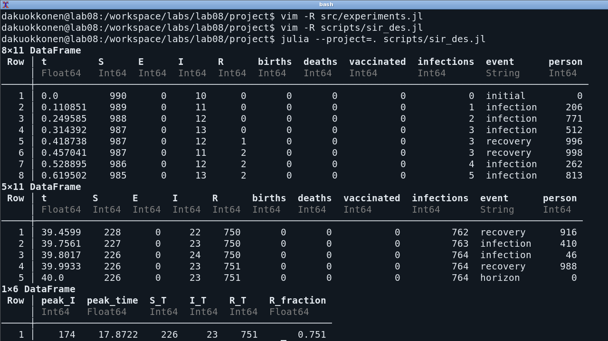{#fig-base-term width=92%}

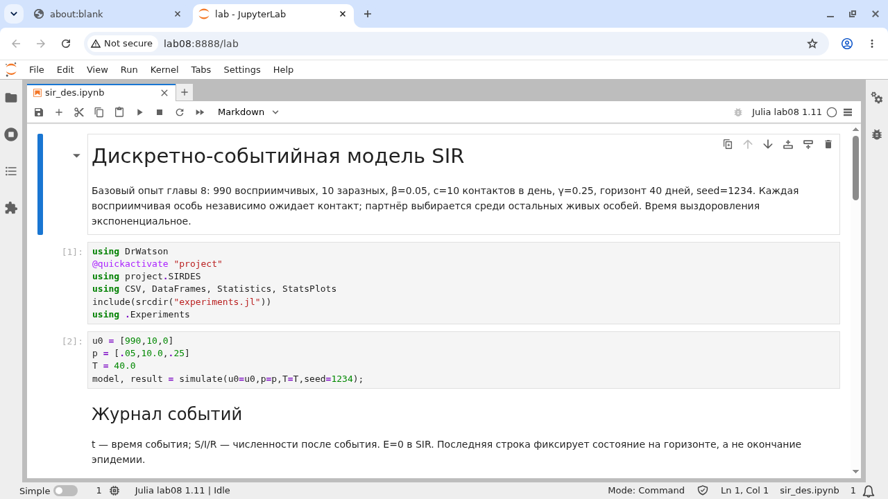{#fig-base-nb width=92%}

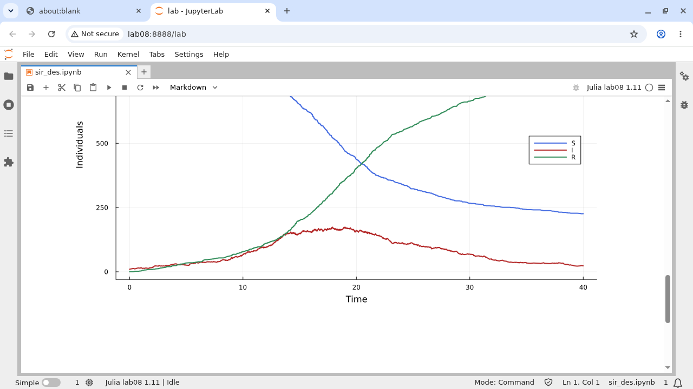{#fig-base-result width=92%}

## Чувствительность к параметрам

По §8.5.1 исследован полный план $\beta\in\{0.03,0.05,0.07\}$,
$c\in\{5,10,15\}$, $\gamma\in\{0.15,0.25,0.4\}$.
На каждое из 27 сочетаний приходится 10 повторов с `seed=2001:2010`.
Диапазоны c и γ и число повторов выбраны для исследования, а не предписаны
методичкой. Документация `scripts/sir_des__param.jl` включена ниже.



При $c=10$, $\gamma=0.25$ увеличение β от 0.03 до 0.07 повышает средний
пик с 38.9 до 288.6. Для базовой точки средний пик 174.6 и SD 22.10.
Увеличение c при неизменных β и γ действует в том же направлении:
при $\beta=0.05$, $\gamma=0.25$ средние пики для c=5,10,15 равны
21.7,174.6,319.0. Увеличение γ сокращает среднюю болезнь и снижает пик:
при $\beta=0.05$, $c=10$ значения составляют 351.7,174.6,32.6.
Таким образом, влияние каждого параметра проверено отдельно при прочих равных.

| β при c=10 и γ=0.25 | Средний пик I | SD пика | Среднее время пика | R(40)/N |
|--:|--:|--:|--:|--:|
| 0.03 | 38.9 | 17.78 | 24.20 | 0.2012 |
| 0.05 | 174.6 | 22.10 | 17.92 | 0.7843 |
| 0.07 | 288.6 | 18.60 | 11.21 | 0.9206 |

: Срез параметрического плана {#tbl-scan}

@fig-scan показывает пики и разброс, а @fig-scan-time — время пика и долю
выздоровевших к горизонту. При слабом распространении максимум часто близок
к начальному I, поэтому его время нельзя интерпретировать как стадию большой
эпидемической волны.

{#fig-scan width=90%}

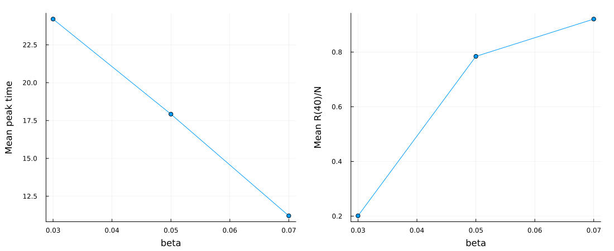{#fig-scan-time width=92%}

Выполнение плана отражено на @fig-scan-term. Полный блокнот содержит цикл,
27 сводных строк и оба графика (@fig-scan-nb, @fig-scan-result, @fig-scan-final).

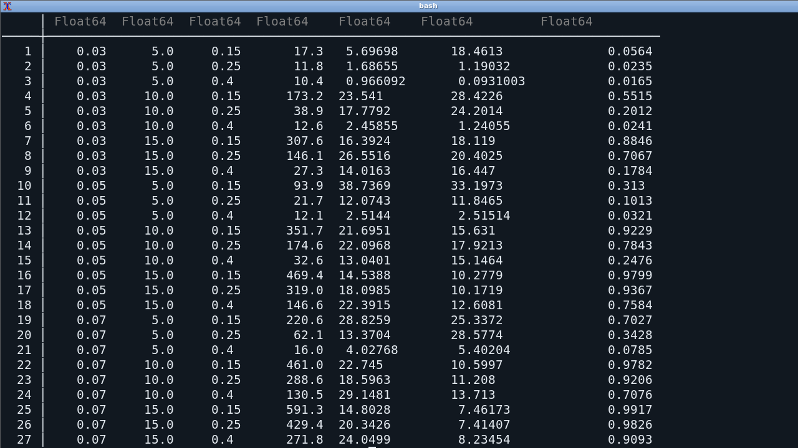{#fig-scan-term width=92%}

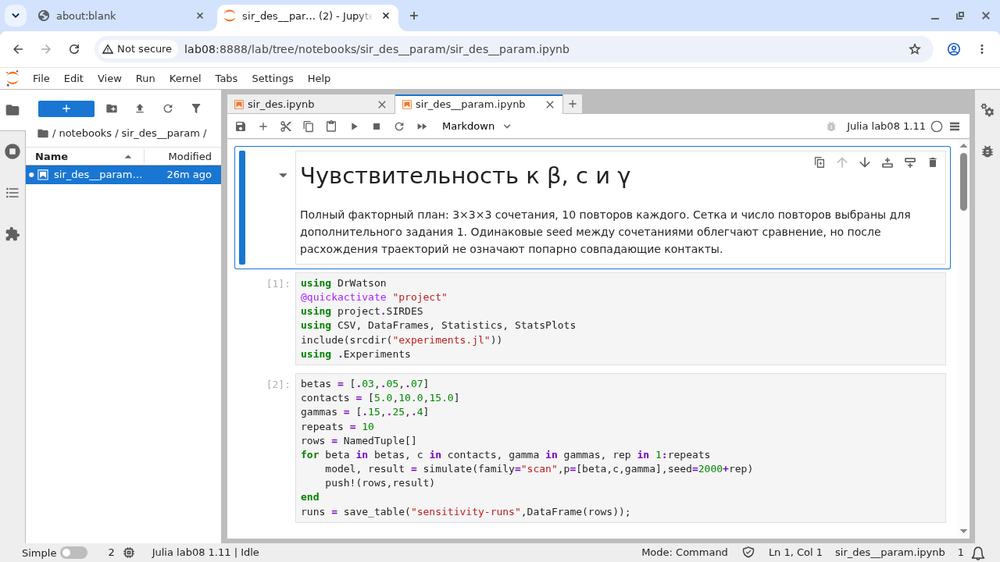{#fig-scan-nb width=92%}

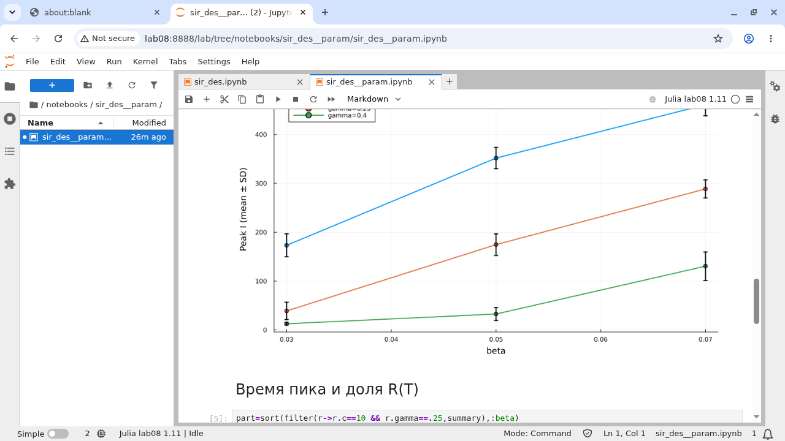{#fig-scan-result width=92%}

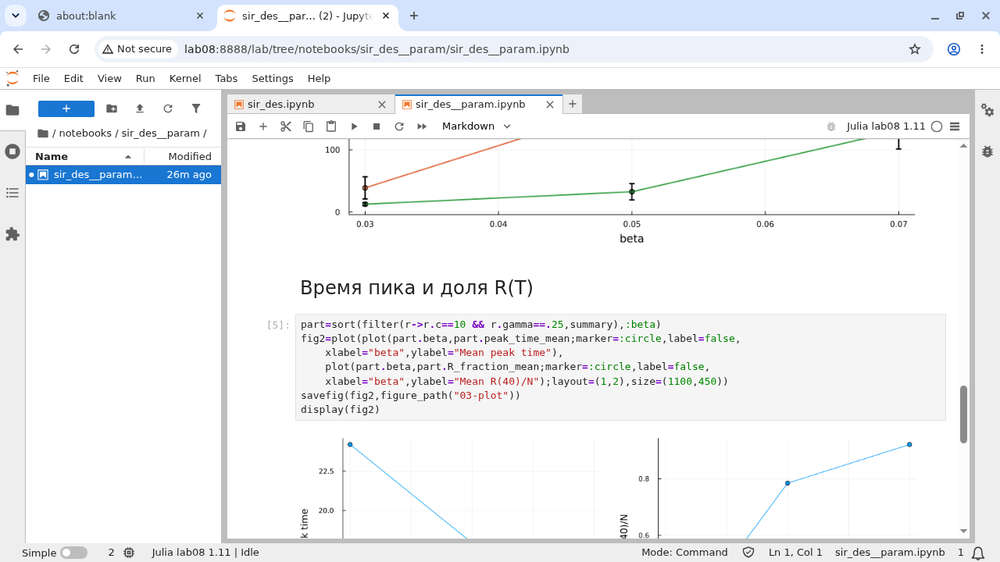{#fig-scan-final width=92%}

## Фиксированная длительность инфекции

В §8.5.2 экспоненциальное ожидание заменено ровно четырьмя днями.
Сохранены оба режима модели. Выполнены 20 повторов каждого режима:
первый с seed=1234, остальные с seed=3002:3020. Сопоставление одинаковых
seed обеспечивает определённые повторяемые запуски, но после расхождения
процессов не означает попарного совпадения всех случайных контактов.



Средние пики составили 166.25 для случайной длительности и 326.05 для
фиксированной, а средние времена пика — 18.66 и 11.21 дня соответственно.
Равное среднее время болезни не определяет всю динамику. В фиксированном
режиме нет немедленно выздоравливающих и очень долго заразных индивидов,
а начальные заразные выздоравливают синхронно в день 4.

На @fig-duration показаны первые траектории, на @fig-duration-law —
длительности завершённых инфекций. Они цензурированы горизонтом:
незавершённые болезни не включены, поэтому среднее этой выборки нельзя
принимать за несмещённую оценку заданного закона.

{#fig-duration width=90%}

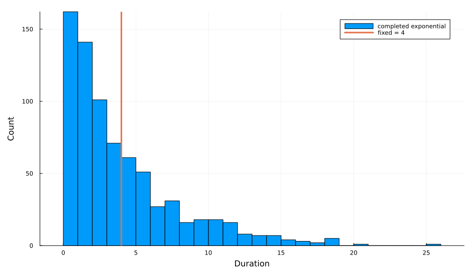{#fig-duration-law width=90%}

Расчёт и проверки фиксированных четырёх дней представлены на
@fig-duration-term, @fig-duration-nb, @fig-duration-result и @fig-duration-final.

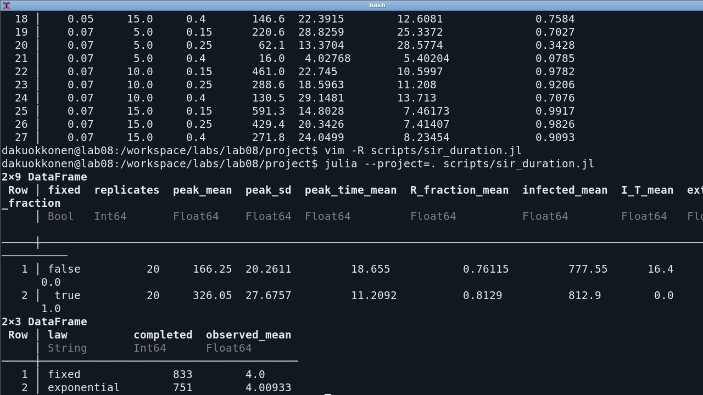{#fig-duration-term width=92%}

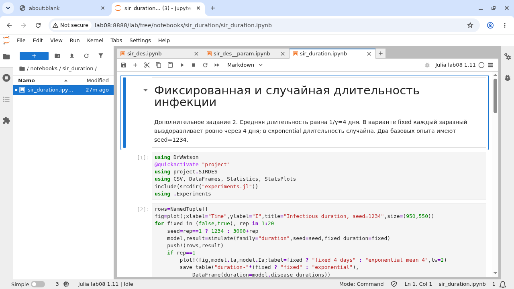{#fig-duration-nb width=92%}

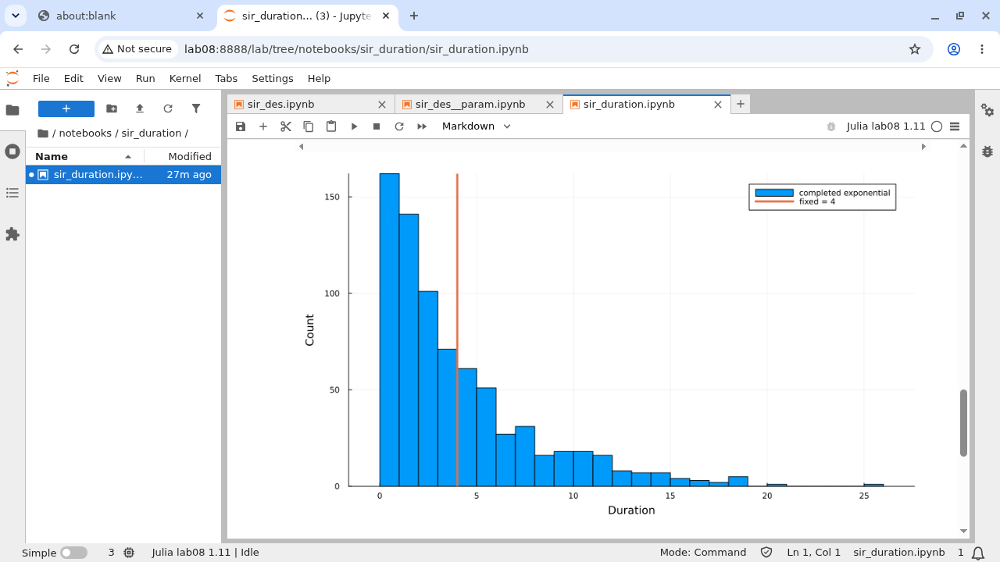{#fig-duration-result width=92%}

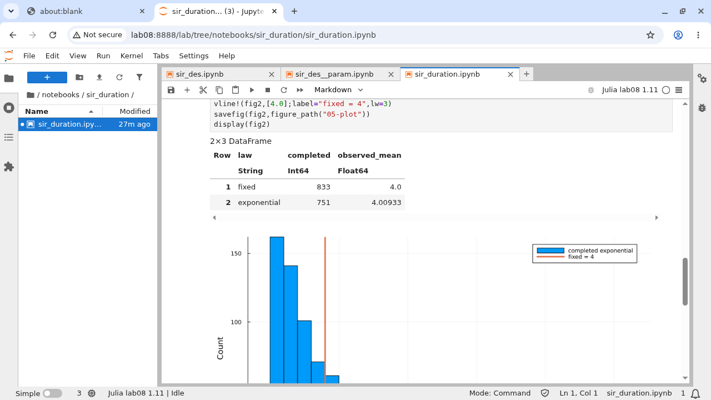{#fig-duration-final width=92%}

## Производительность

По §8.5.3 измерен `sir_run` для N=10000. Для сравнения добавлен N=1000,
начальная доля заразных в обоих случаях 1%, горизонт 40. На каждое N
приходится 10 образцов после прогрева. Конструктор и активация выполняются
в `setup`, `evals=1`: завершённая модель не используется повторно.
Именно это исправляет некорректность прямого бенчмарка уже выполненного объекта.



| N | Образцов | Медиана, мс | Минимум, мс | Выделено, МБ | Число выделений |
|--:|--:|--:|--:|--:|--:|
| 1000 | 10 | 141.64 | 139.35 | 113.64 | 4 257 812 |
| 10000 | 10 | 1836.21 | 1759.23 | 1172.01 | 44 228 347 |

: Измерение `sir_run` в среде Linux ARM64, МБ=10⁶ байт {#tbl-bench}

Рост N в десять раз увеличил медианное время примерно в 12.96 раза
(@fig-benchmark). Выделенная память — суммарный объём аллокаций за вызов,
а не пиковый RSS. Время зависит от компьютера и нагрузки, поэтому эти
числа не являются гарантией для другой системы.

Таблица и график используют сохранённые измерения блокнота. На снимке
терминала (@fig-bench-term) показан отдельный повтор: медианы 177.806 и
1950.34 мс. Это другие замеры той же процедуры при иной текущей нагрузке,
а не значения, по которым построена таблица.

Существенные затраты создают контакты без заражения и очередь планировщика.
Счётчики и удаление индивида уже имеют стоимость O(1). Возможные дальнейшие
оптимизации: резервирование массивов журнала, сокращение сохраняемых полей
при измерении, параллельное выполнение независимых повторов. Их ускорение
не измерялось. Замена индивидуальных контактов агрегированными интенсивностями
потребовала бы отдельного сравнения алгоритмов.

{#fig-benchmark width=90%}

Постановка измерения и вывод BenchmarkTools видны на @fig-bench-term,
@fig-bench-nb, @fig-bench-result и @fig-bench-final.

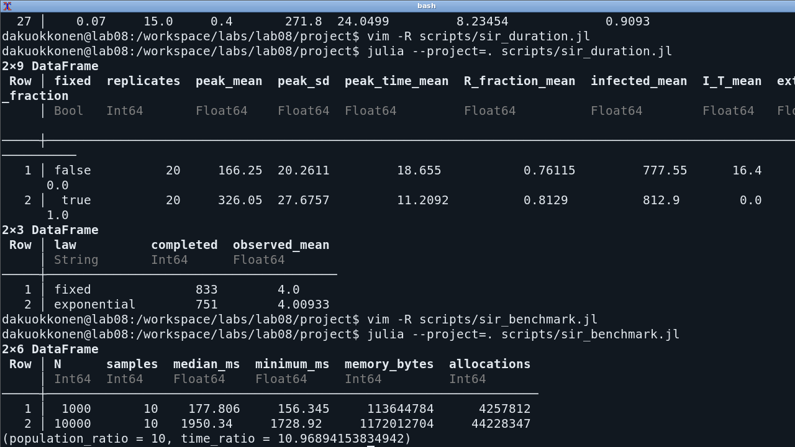{#fig-bench-term width=92%}

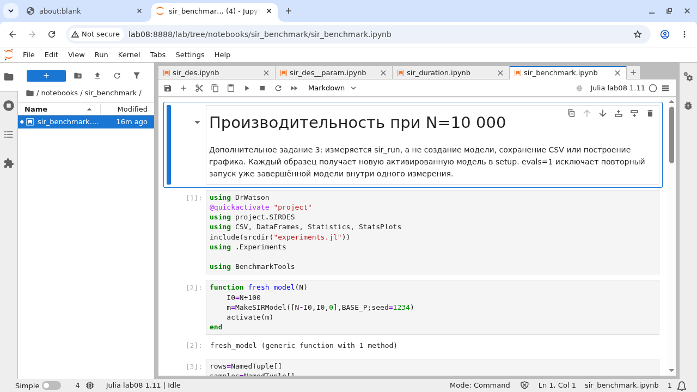{#fig-bench-nb width=92%}

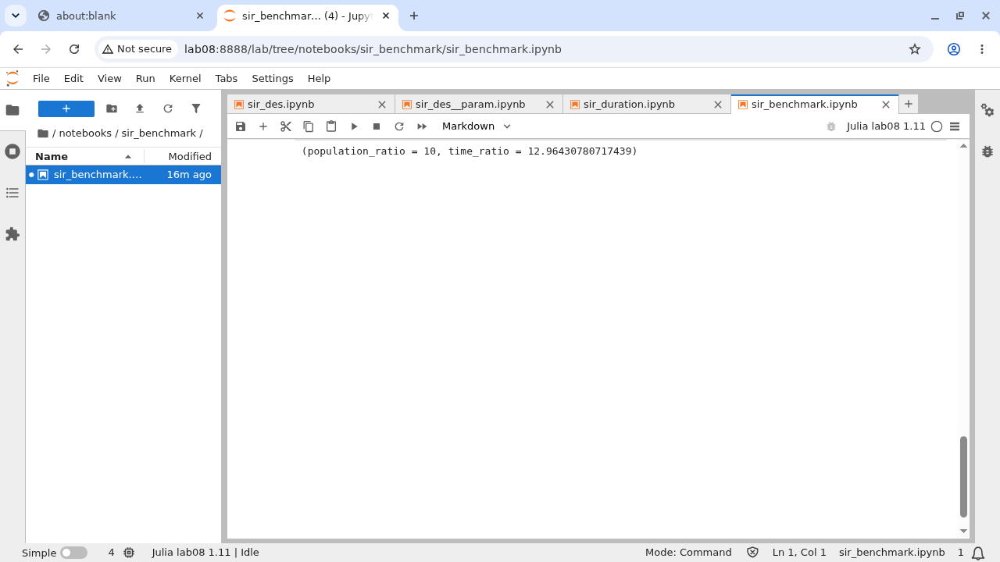{#fig-bench-result width=92%}

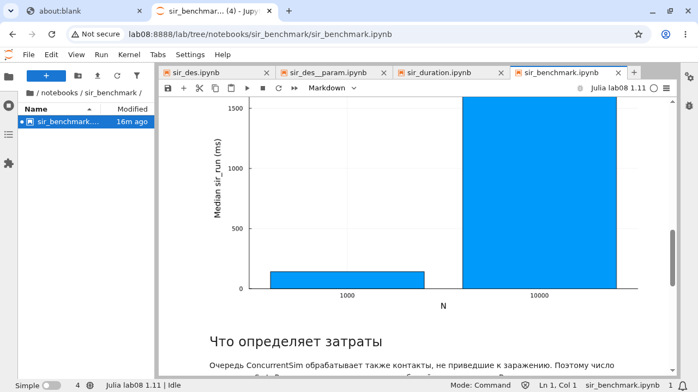{#fig-bench-final width=92%}

## Сохранение и независимый анализ CSV

По §8.5.4 каждый опыт сохраняет журнал в `data/sims`. Имя включает семью
эксперимента, начальные численности, параметры, горизонт и seed. Получены
488 траекторий и 25 таблиц анализа. Общие параметры базового опыта в разных
семьях могут совпадать; такие прогоны не считаются дополнительными заданиями.

`sir_csv_report.jl` читает ранее записанные файлы без повторной симуляции.
Метрики журнала сопоставляются с `baseline.csv`. Для сетки 0:0.5:40
используется последняя запись, время которой не больше времени наблюдения.
Это правосторонне непрерывная ступенчатая функция, а не линейное смешивание
целочисленных состояний.



Проверка воспроизвела пик 174 и итоговые S/I/R. Регулярная сетка содержит
81 точку. На @fig-csv видно, что события сохраняют более подробную временную
структуру, чем сетка. В частности, точное время максимума берётся из журнала.
Работа с сохранёнными данными показана на @fig-csv-nb, @fig-csv-result и
@fig-csv-final.

{#fig-csv width=90%}

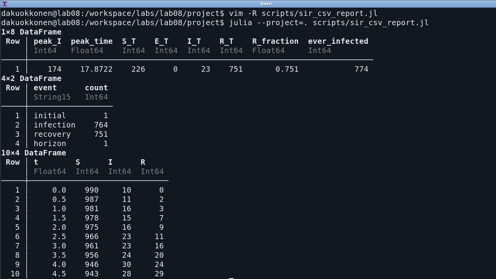{#fig-csv-term width=92%}

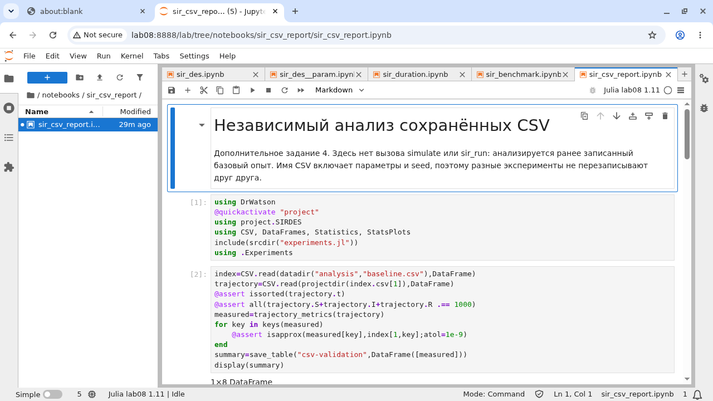{#fig-csv-nb width=92%}

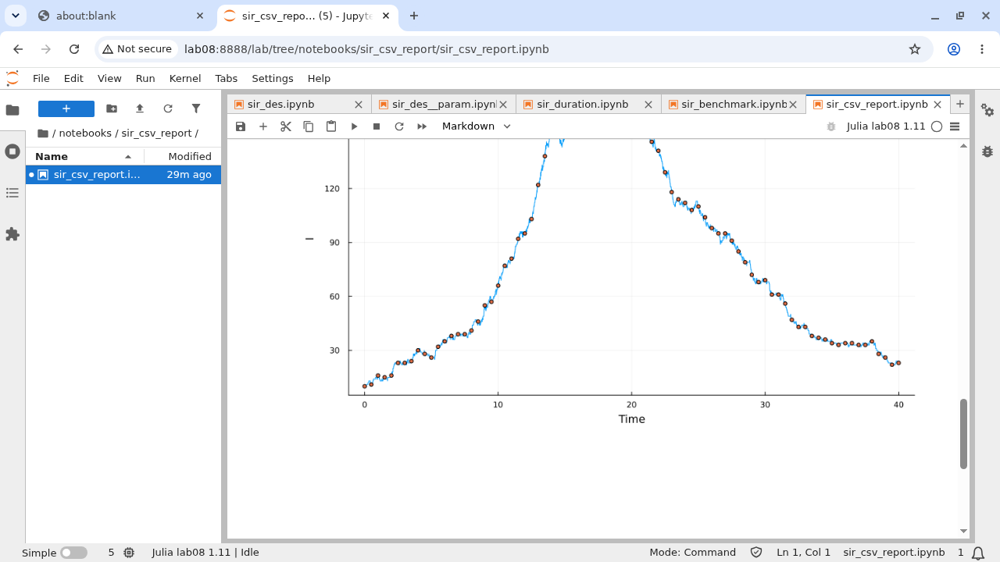{#fig-csv-result width=92%}

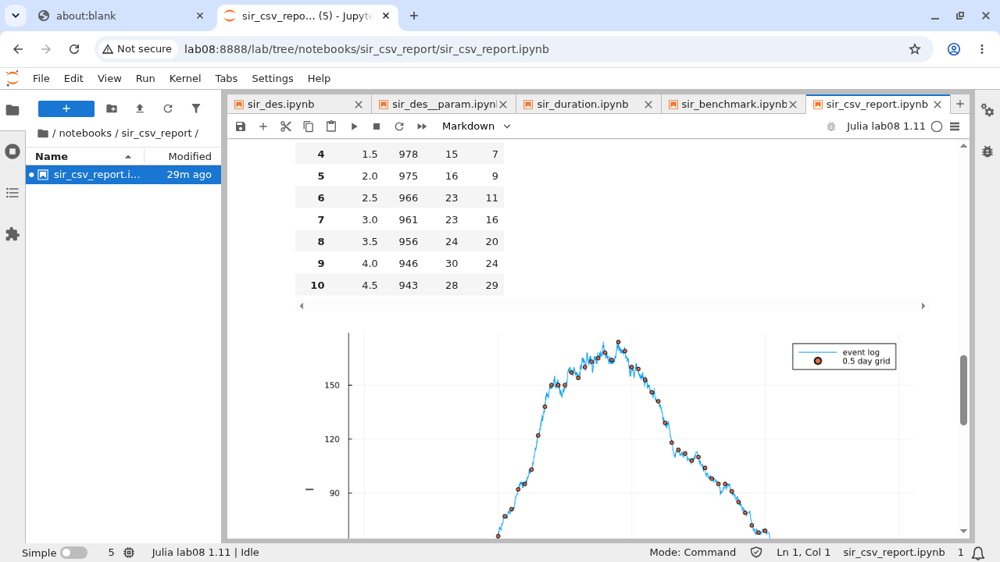{#fig-csv-final width=92%}

## Демографические события

Для §8.5.5 выбраны $\mu\in\{0.01,0.02,0.05\}$,
$b=\mu N_0$, T=400 и по пять повторов с seed=4001:4005.
Каждый журнал проверяет (@eq-balance). Для приблизительного хвостового
среднего берётся регулярная сетка 200:0.5:400; усреднение по номерам событий
дало бы смещение в сторону периодов с высокой активностью.

В приближении среднего поля $N_{\mathrm{eq}}=b/\mu=N_0$,
$S_{\mathrm{eq}}=(\gamma+\mu)(N_0-1)/(\beta c)$ и
$I_{\mathrm{eq}}=(b-\mu S_{\mathrm{eq}})/(\gamma+\mu)$ при положительном числителе.
Эти величины служат ориентиром и не гарантируют сохранение инфекции
в конечной случайной популяции.



| μ | Среднее I на сетке 200–400 | ОДУ I* | Вымираний к T=400 |
|--:|--:|--:|--:|
| 0.01 | 0.00 | 18.48 | 5 из 5 |
| 0.02 | 10.79 | 34.11 | 4 из 5 |
| 0.05 | 64.88 | 66.77 | 0 из 5 |

: Демографическая серия {#tbl-demography}

При μ=0.05 хвостовое среднее близко к детерминированному ориентиру.
При меньших μ преобладает вымирание, несмотря на положительное I*.
Если I=0, рождения добавляют только S, поэтому инфекция сама не возвращается.
Пять реализаций характеризуют проведённый опыт, но недостаточны для точной
оценки вероятности редкого вымирания. @fig-demo и @fig-demo-compare
показывают обе стороны этого сравнения.

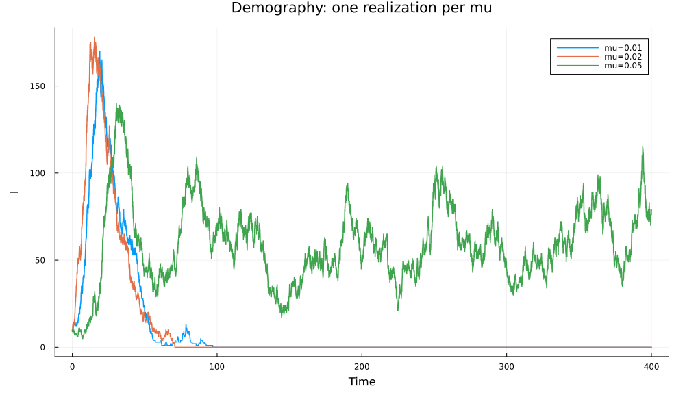{#fig-demo width=90%}

{#fig-demo-compare width=90%}

Программная проверка и блокнот приведены на @fig-demo-term,
@fig-demo-nb, @fig-demo-result и @fig-demo-final.

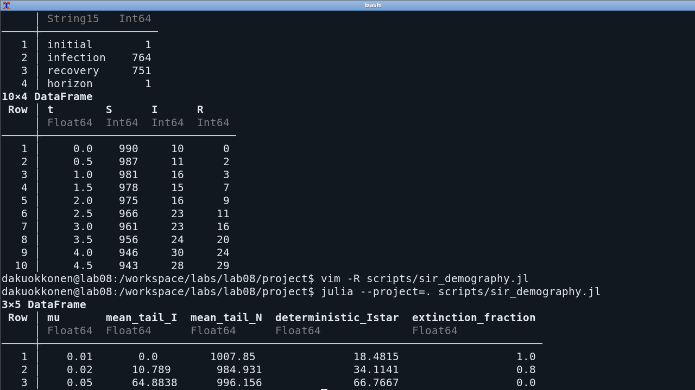{#fig-demo-term width=92%}

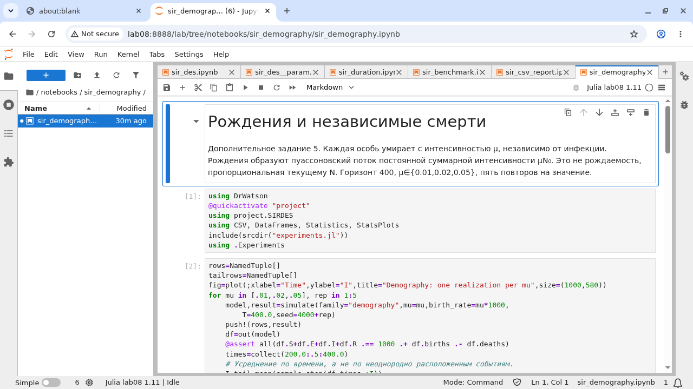{#fig-demo-nb width=92%}

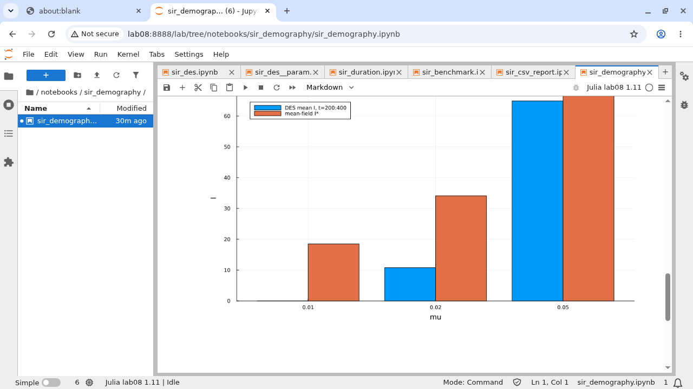{#fig-demo-result width=92%}

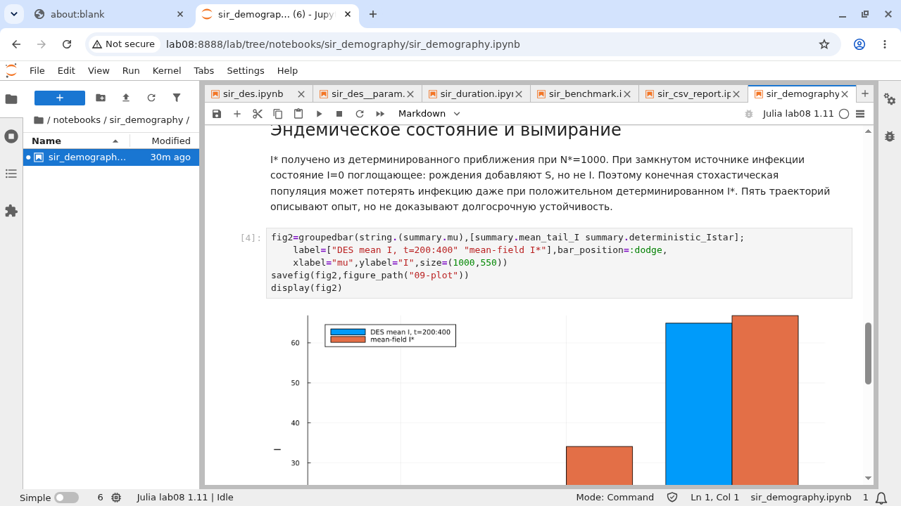{#fig-demo-final width=92%}

## Вакцинация

В §8.5.6 выбран вариант с таймером. В дни 0 или 10 мгновенно вакцинируются
доли 0,0.25,0.5,0.6,0.75 текущих восприимчивых. Эффективность принята 100%.
Для каждой стратегии выполнены 10 повторов с seed=5001:5010, всего 100.
Критерий начального роста среднего поля после ранней вакцинации даёт

$$
f_{\mathrm{crit}}=1-\frac{\gamma(N-1)}{\beta cS_0}
\approx0.49545.
$$ {#eq-vaccine}

Это порог снижения эффективного репродуктивного числа ниже единицы,
а не гарантия отсутствия вторичных заражений.



| Доля текущих S | Заразились к T=40, вакцина в день 0 | Вакцина в день 10 |
|:--:|:--:|:--:|
| 0 | 787.2 | 787.2 |
| 0.25 | 414.1 | 497.8 |
| 0.50 | 78.8 | 296.8 |
| 0.60 | 35.4 | 248.3 |
| 0.75 | 16.6 | 202.9 |

: Среднее число когда-либо заражённых, включая начальные I₀ {#tbl-vaccination tbl-colwidths="25,40,35"}

Ранняя вакцинация 75% текущих S снижает среднее число заражённых с 787.2
до 16.6, то есть примерно на 97.9%. При той же доле в день 10 результат
равен 202.9: вмешательство уже не отменяет произошедших заражений.
На @fig-vaccine видны отдельные траектории, а @fig-vaccine-compare
сравнивает стратегии по средним. Рост R после вакцинации не равен росту
заболеваемости, поэтому использован отдельный счётчик инфекций.

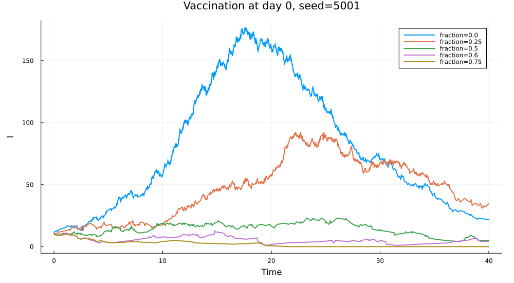{#fig-vaccine width=90%}

{#fig-vaccine-compare width=90%}

Расчёт стратегии и проверка порога показаны на @fig-vaccine-term,
@fig-vaccine-nb, @fig-vaccine-result и @fig-vaccine-final.

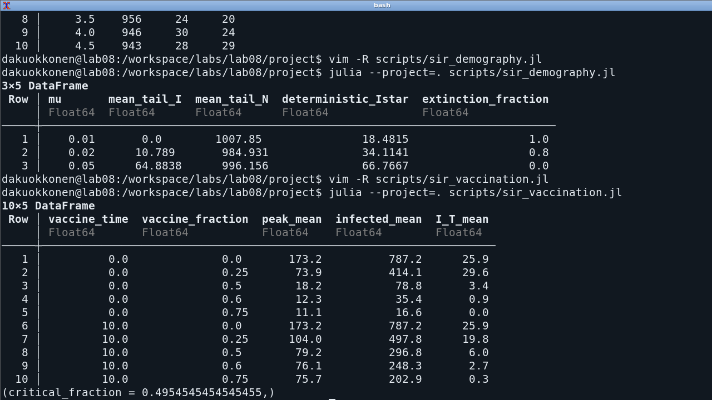{#fig-vaccine-term width=92%}

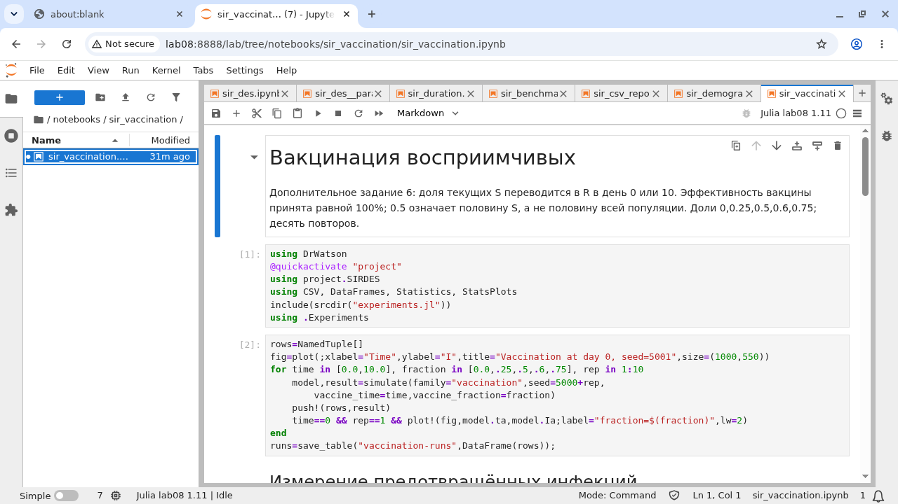{#fig-vaccine-nb width=92%}

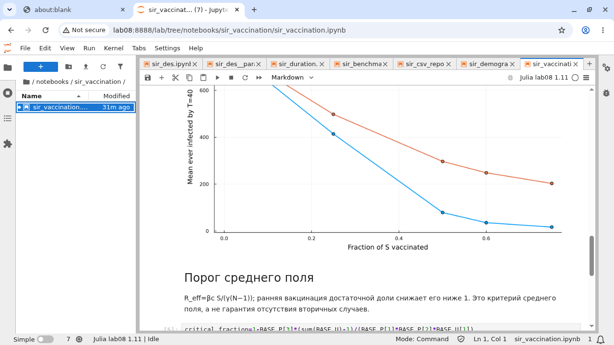{#fig-vaccine-result width=92%}

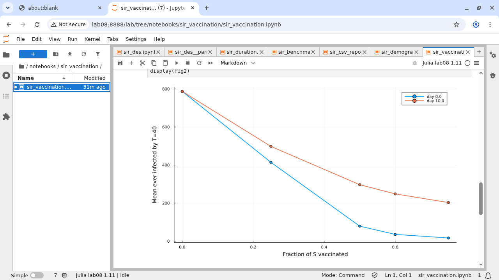{#fig-vaccine-final width=92%}

## Латентная стадия SEIR

В §8.5.7 после заражения вводится состояние E. Такой человек ещё не
передаёт инфекцию. Переход E в I ожидает Exp(1/σ), а болезнь отсчитывается
с начала I. Сравниваются SIR и σ=0.25,0.5,1 при прежних β,c,γ,T.
На каждый вариант приходятся 10 повторов с seed=6001:6010.



| Вариант | Средний пик I | Среднее время пика | R(40)/N |
|:--|--:|--:|--:|
| SIR | 167.2 | 18.87 | 0.7505 |
| SEIR, σ=0.25 | 84.0 | 35.59 | 0.3647 |
| SEIR, σ=0.5 | 115.9 | 33.52 | 0.5370 |
| SEIR, σ=1 | 132.5 | 25.64 | 0.6847 |

: Сравнение SIR и SEIR на горизонте 40 {#tbl-seir}

Латентная стадия задерживает передачу инфекции, снижая наблюдаемый пик
и сдвигая его вправо (@fig-seir). При σ=0.25 средний пик находится близко
к концу расчёта. Часть процессов к T ещё не завершилась, поэтому таблица
не доказывает различие окончательных размеров эпидемий. @fig-seir-states
отдельно показывает все четыре состояния при σ=0.5.

{#fig-seir width=90%}

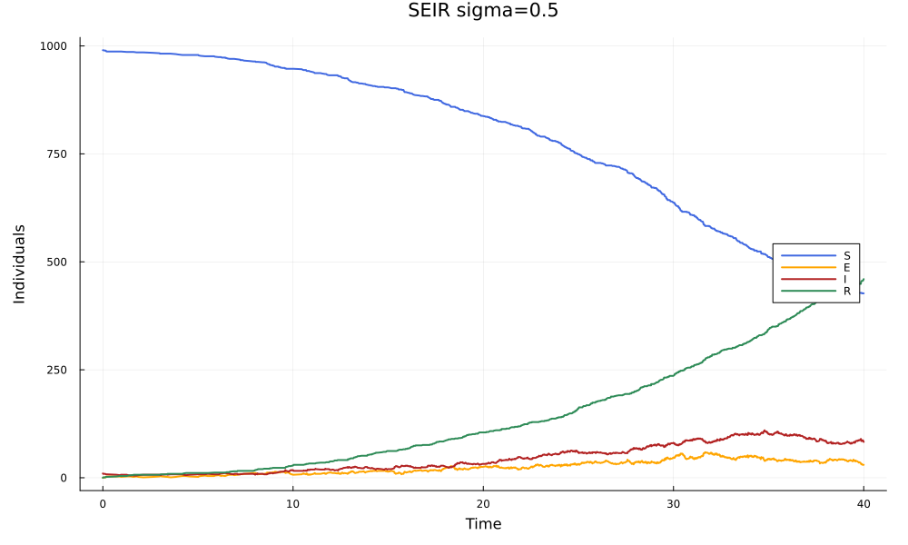{#fig-seir-states width=90%}

Проверки SEIR представлены на @fig-seir-term, @fig-seir-nb,
@fig-seir-result и @fig-seir-final.

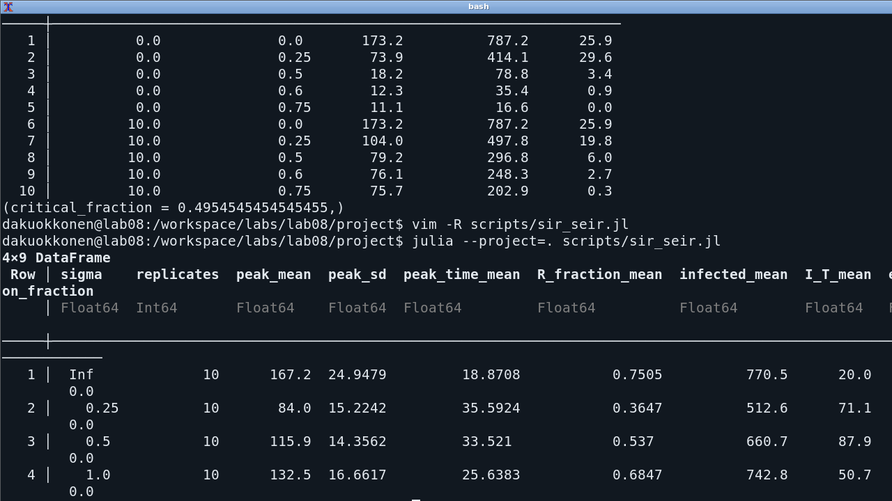{#fig-seir-term width=92%}

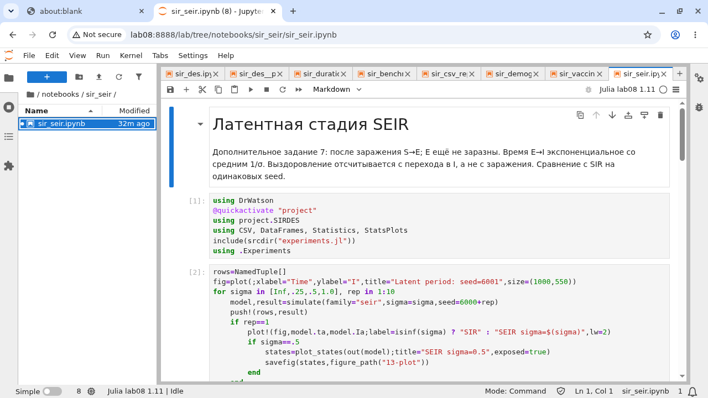{#fig-seir-nb width=92%}

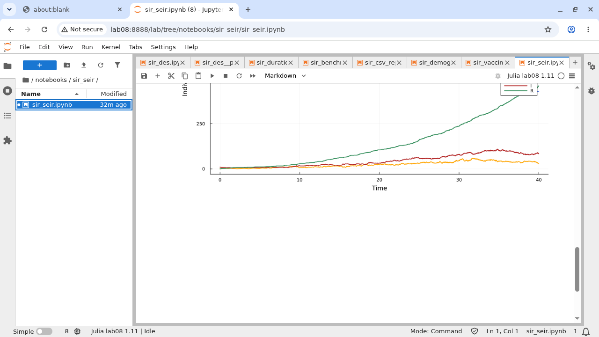{#fig-seir-result width=92%}

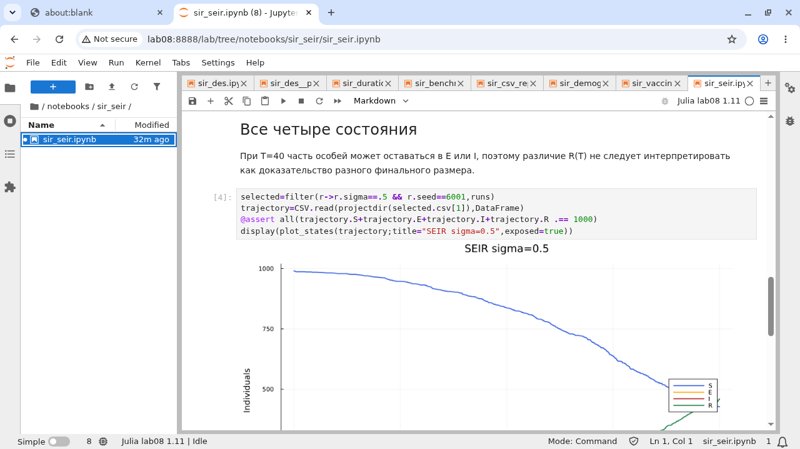{#fig-seir-final width=92%}

## Сравнение с ОДУ

Уравнения (@eq-ode) решены RK4 с шагами 0.02 и 0.01. Максимальное
расхождение на общей сетке составило $1.089\cdot10^{-9}$.
Ансамбль состоит из 20 DES-прогонов с seed=7001:7020. Для его сопоставления
с ОДУ использована ступенчатая интерполяция на сетку 0:0.5:40.



Пик ОДУ равен 158.793 при t=17.49 на сетке 0.01. Среднее индивидуальных
DES-пиков равно 160.4, но пик средней кривой только 141.95. Эти показатели
различаются, поскольку случайные траектории достигают максимумов в разные
моменты. Операции усреднения и максимизации не перестановочны.

На @fig-ode полоса 10–90% описывает разброс траекторий. Отличие среднего
от ОДУ связано как с конечным числом повторов, так и с замыканием среднего
поля. Малое расхождение двух шагов RK4 подтверждает численную сходимость
решателя, но не делает детерминированное приближение точной стохастической моделью.

{#fig-ode width=90%}

Код и итоговые показатели доступны на @fig-ode-term, @fig-ode-nb,
@fig-ode-result и @fig-ode-final.

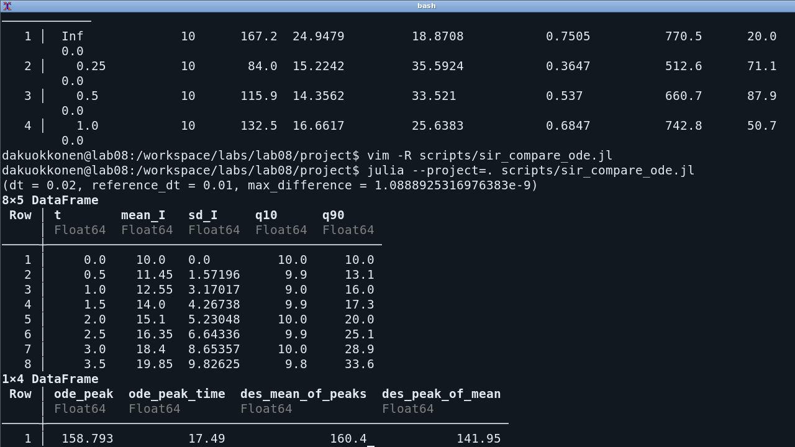{#fig-ode-term width=92%}

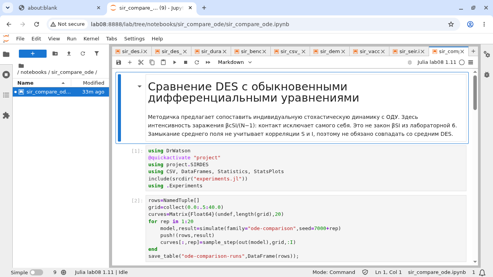{#fig-ode-nb width=92%}

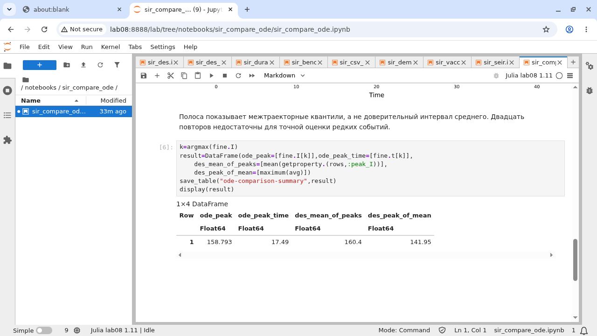{#fig-ode-result width=92%}

{#fig-ode-final width=92%}

# Производные форматы и проверка результатов

## Литературная документация

Все девять сценариев написаны в литературном стиле. `Literate.script`
создаёт чистый код, `Literate.notebook` — IPYNB, `Literate.markdown` — QMD.
Девять блокнотов содержат 42 выполненные кодовые ячейки без ошибок.
HTML-документация собрана из выполненных блокнотов без повторного расчёта.

В листинге 3 показано создание документации для отчёта из `scripts/tangle.jl`.
Статический вариант заменяет исполняемые блоки обычными Julia-листингами
и углубляет заголовки. Смысл и код сценария при этом сохраняются.

```julia
Literate.markdown(source,dest;name,flavor=Literate.QuartoFlavor(),
    credit=false)
Literate.markdown(source,dest;name="$(name)-report",
    flavor=Literate.QuartoFlavor(),credit=false,
    postprocess=text->replace(
        replace(text,"\x60\x60\x60{julia}"=>"\x60\x60\x60julia"),
        r"^(#+) "m=>s"##\1 "))
```

Листинг 3. Получение QMD-фрагментов из литературного исходника.

Этот отчёт подключает все девять `*-report.qmd` в соответствующих разделах,
включая параметрический опыт. Поэтому документация реально интегрирована,
а не только перечислена в каталоге. Изображения находятся в едином `image`
и связаны с пояснениями и результатами через перекрёстные ссылки.

## Автоматические проверки

Набор `test/runtests.jl` содержит 13 248 успешных проверок.
Проверяются ограничения параметров, баланс численности, монотонность времени,
согласованность журнала, повторяемость seed, фиксированная болезнь,
смерти и вакцинация во время ожидания, SEIR, сходимость ОДУ и сохранённые CSV.
Результат запуска показан на @fig-tests.

```julia
df=out(m)
@test issorted(df.t)
@test all(Matrix(df[:,[:S,:E,:I,:R]]) .>= 0)
@test all(df.S+df.E+df.I+df.R .==
    sum(m.initial) .+ df.births .- df.deaths)
```

Листинг 4. Фрагмент `check_model` в `test/runtests.jl`.

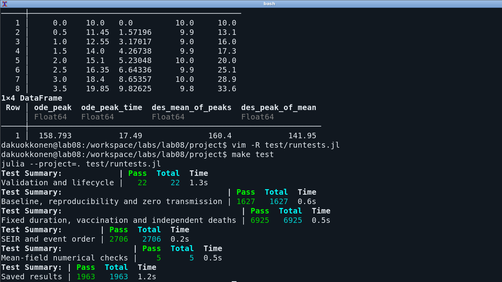{#fig-tests width=92%}

Пройденные тесты дополняют проверку задания, но не заменяют её. Для каждого
из девяти сценариев сопоставлены фактические данные, выполненные ячейки,
графики и раздел отчёта. Отдельно проверено чтение сохранённого CSV без
моделирования. Для бенчмарка не смешиваются создание модели и измерение
`sir_run`, а время запуска не переносится на другую машину как константа.

## Сборка документов

Исходник отчёта имеет формат QMD. Команда Quarto использует стили
`reference.docx`, после чего LibreOffice создаёт PDF того же документа.
Оба итоговых формата имеют страницу A4. Презентация собирается Quarto
в HTML, затем браузер печатает раскладку Reveal в PDF.

```bash
cd ../report
make
cd ../presentation
make
```

# Выводы

Индивидуальная SIR реализована через календарь событий и реальные процессы
ConcurrentSim. Базовые условия методички дали пик 174 и состояние
226/23/751 на 40-й день. Факторный план подтвердил рост интенсивности
распространения при увеличении β и c и снижение пика при увеличении γ.

Равная средняя длительность болезни не делает фиксированный и случайный
режимы эквивалентными: их средние пики составили 326.05 и 166.25.
Для N=10000 медиана `sir_run` составила 1.836 с в использованном окружении.
Сохранённые CSV позволяют отдельно восстановить метрики и сравнить
событийные моменты с регулярной сеткой.

Демографическая модель показала возможность вымирания при положительном
детерминированном равновесии. Ранняя вакцинация оказалась эффективнее
задержанной для выбранных стратегий, а латентная стадия SEIR отложила рост
числа заразных. Сравнение с ОДУ выявило различие среднего пика и пика
среднего. Выводы относятся к указанным параметрам, числу повторов и горизонтам.

Выполнены основная часть, семь дополнительных заданий и литературное
оформление §8.6 с включением базовой и параметрической документации в отчёт.
Модули, данные, девять выполненных блокнотов и проверки сохраняют связь
между алгоритмом, запуском и полученным результатом.

# Источники {.unnumbered}

1. Королькова А. В., Кулябов Д. С. *Имитационное моделирование. Практикум*.
   Редакция от 22.05.2026. Глава 8, с. 221–234.
2. *Исходники и результаты лабораторной работы № 8*.
   `src/sir_model.jl`, `src/experiments.jl`, `scripts`, `data/analysis`.
   Julia 1.11.9, расчёты от 04.09.2026.
3. *Закреплённое окружение лабораторной работы № 8*.
   `Project.toml`, `Manifest.toml`; определения распределений и процессов
   применены в соответствии с примером главы 8 практикума.
